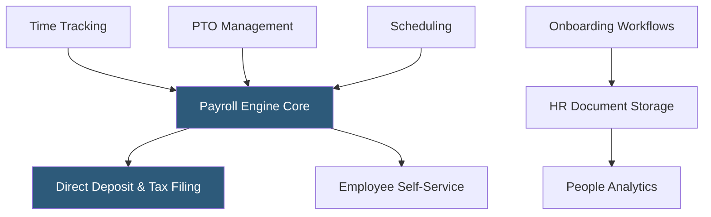

**Category:** Payroll Platforms
**Difficulty:** Beginner
**Reading time:** 5 min read

---

Gusto Complete is the mid-tier plan in Gusto's product lineup, adding time tracking, PTO management, project tracking, and team management tools on top of the Core payroll foundation. Complete targets growing small businesses that have hired beyond the founder team and need to manage schedules, time-off policies, and basic HR workflows. It represents the most popular tier for businesses with 5–50 employees managing hourly and salaried staff together.

- **Time Tracking Integration** — employees clock in and out via the Gusto mobile app or web portal, with hours automatically flowing into payroll calculations
- **PTO Management** — configurable paid time-off policies with automatic accrual calculations, balance tracking, and manager approval workflows
- **Scheduling** — shift scheduling tools for businesses managing hourly workers across multiple days
- **Org Chart** — an automatically generated organizational chart built from Gusto's employee data
- **HR Documents** — a document library for storing signed offer letters, I-9s, and other employee paperwork
- **Onboarding Checklists** — customizable task lists assigned to new hires and managers to streamline the first-day experience
- **People Analytics** — basic workforce reporting showing headcount, turnover, and compensation trends
- **Certified HR Pros (add-on)** — optional access to HR professionals for on-demand guidance available as a paid add-on

Gusto Complete builds on the Core payroll foundation by integrating time and attendance data directly into the payroll run. Employees track their hours through the Gusto mobile app or a browser-based time clock. When a payroll run is initiated, logged hours for hourly workers are automatically pulled into the pay calculation without manual entry, reducing errors and saving administrative time.

PTO management allows HR administrators to configure multiple leave policies — vacation, sick, personal days — with different accrual rules (per pay period, annual lump sum, or tenure-based). Employees submit time-off requests through their self-service portals, managers approve via email notifications or the Gusto dashboard, and approved absences automatically adjust payroll calculations.

The onboarding workflow feature sends new hires a personalized checklist before their start date, guiding them through completing tax forms, setting up direct deposit, reviewing company policies, and signing offer letters — all within the Gusto platform. Completed documents are stored in the employee's digital file.

Scheduling tools allow managers to build weekly shift schedules and publish them to employees. The system tracks schedule vs. actual hours and flags discrepancies before payroll is processed. People analytics dashboards surface headcount by department, turnover rates by quarter, and average compensation by role to help managers understand workforce trends.

- Growing businesses adding hourly workers who need time tracking integrated with payroll
- Companies with multiple PTO policies needing automated accrual and balance management
- Organizations formalizing onboarding processes as they scale past 10 employees
- Managers who need scheduling visibility alongside payroll in a single platform
- Small HR teams who want self-service analytics without building custom reports

| Advantage | Disadvantage |
|-----------|--------------|
| Time tracking integrated with payroll eliminates manual entry | More expensive per employee than Core; costs add up as headcount grows |
| Self-service time-off requests reduce manager interruptions | Scheduling features are basic compared to dedicated workforce management tools |
| Onboarding workflows improve new hire experience | Analytics depth limited compared to enterprise HCM platforms |
| Org chart and people analytics visible to managers | Advanced HR features like performance management require Concierge tier |

- [Gusto Core Plan](gusto-core-plan.md)
- [Gusto Concierge Plan](gusto-concierge-plan.md)
- [Rippling Payroll & HR](rippling-payroll-hr.md)

---
*Part of the [Payroll Platforms](index.md) category · [Back to Master Index](../../index.md)*
