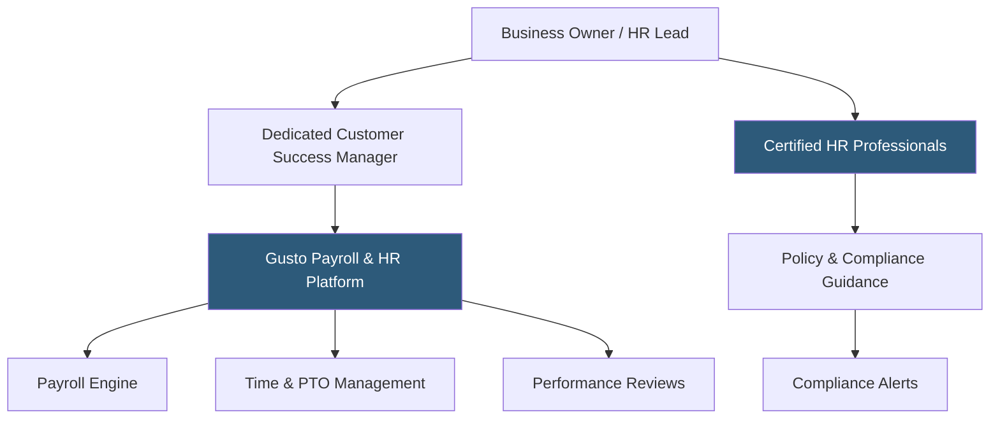

**Category:** Payroll Platforms
**Difficulty:** Intermediate
**Reading time:** 5 min read

---

Gusto Concierge is the premium tier of Gusto's platform, adding certified HR professionals, a dedicated customer success manager, and advanced HR tools to the Complete tier's payroll and workforce management capabilities. It targets businesses that want the simplicity of Gusto's interface but need human HR expertise available on demand, similar to what a PEO provides but without the co-employment structure. Concierge is Gusto's answer to companies that have grown past basic payroll needs but aren't ready to build an in-house HR function.

- **Certified HR Professionals** — licensed HR advisors available for live consultation on employment law, terminations, performance issues, and policy questions
- **Dedicated Customer Success Manager** — a named Gusto representative responsible for the client relationship and proactive platform guidance
- **HR Resource Center** — a curated library of compliant HR templates including offer letters, performance improvement plans, and separation agreements
- **Compliance Alerts** — automated notifications when employment laws change in states where the business has employees
- **Priority Support** — faster response times and direct access to senior support agents for Concierge-tier clients
- **Full-Service Migration** — Gusto assists with importing historical payroll data from prior systems when onboarding Concierge clients
- **Performance Reviews** — built-in tools for conducting structured employee performance evaluations within Gusto
- **Hiring & Onboarding Suite** — expanded offer letter templates, background check integrations, and document e-signing capabilities

Gusto Concierge operates on the same underlying platform as Complete, with the primary additions being human expertise and expanded HR tooling. When a business owner faces an employment situation that requires legal or HR knowledge — a complex termination, a harassment complaint, a question about exempt vs. non-exempt classification — they can reach a certified HR professional by phone or message within the platform.

The HR professional team is staffed by PHR/SPHR-certified practitioners who stay current on federal and state employment law changes. They review specific situations, help draft documentation, and provide recommendations — but they serve as advisors, not agents, meaning the employer retains decision-making authority. This distinguishes Concierge from a PEO, where the PEO takes on certain employer responsibilities.

Compliance alerts proactively notify clients when new laws take effect in their states. For example, when a state passes mandatory paid sick leave legislation, Gusto sends an alert with a summary of the requirement and a template policy update, reducing the risk of inadvertent non-compliance.

The dedicated customer success manager conducts periodic business reviews, helps configure new features as the business grows, and serves as an escalation path if issues arise with the support team. This relationship continuity is a key differentiator from the standard support model at Core and Complete tiers.

- Small businesses with 20–100 employees that want on-demand HR expertise without hiring an HR director
- Companies in industries with complex employment law environments (healthcare, finance, staffing)
- Organizations that have experienced employee relations incidents and want proactive HR guidance
- Fast-growing startups formalizing HR practices and needing documentation support
- Businesses that value a named account relationship rather than anonymous support

| Advantage | Disadvantage |
|-----------|--------------|
| On-demand certified HR advice without full-time HR hire | Highest per-employee cost in Gusto's lineup |
| Proactive compliance alerts reduce legal exposure | HR advisors are consultants, not agents — client retains all decisions and liability |
| Dedicated CSM provides continuity and proactive support | Still lacks the benefits buying power of a true PEO arrangement |
| Full-service migration support for platform switchers | Performance management tools less robust than dedicated platforms |

- [Gusto Complete Plan](gusto-complete-plan.md)
- [Gusto Core Plan](gusto-core-plan.md)
- [Justworks PEO Platform](justworks-peo-platform.md)

---
*Part of the [Payroll Platforms](index.md) category · [Back to Master Index](../../index.md)*
