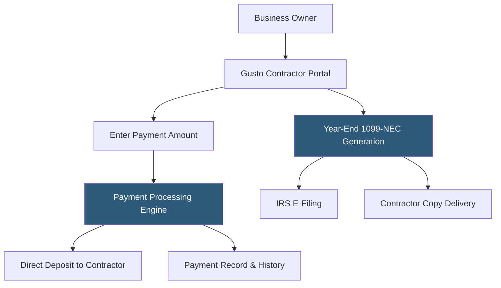

**Category:** Payroll Platforms
**Difficulty:** Beginner
**Reading time:** 5 min read

---

Gusto Contractor Payments is a standalone service for businesses that only pay independent contractors and don't have W-2 employees, offered at a lower price point than full payroll plans. It handles domestic and international contractor payments, automated 1099-NEC generation, and contractor self-onboarding — all without the overhead of a full payroll platform. Businesses with a mix of contractors and employees can add contractor management to any Gusto payroll plan at no additional per-contractor charge.

- **1099-NEC** — the IRS form used to report non-employee compensation paid to independent contractors; Gusto generates and files these automatically
- **Contractor Self-Onboarding** — contractors enter their own payment and tax information (W-9 details) through a secure Gusto portal
- **International Contractor Payments** — support for paying contractors outside the US in their local currency via Gusto Global
- **Direct Deposit** — electronic payment to contractor bank accounts with configurable payment schedules
- **Reimbursements** — expense reimbursements can be included alongside contractor payments in the same transaction
- **Payment History** — contractors access a self-service portal showing all payments, useful for their own bookkeeping
- **1099 E-Filing** — Gusto files 1099-NECs directly with the IRS and sends copies to contractors electronically
- **Misclassification Risk** — the legal exposure companies face if workers classified as contractors are found to meet employee legal tests

Gusto Contractor Payments works by inviting contractors to complete their own onboarding. Each contractor receives an email invitation to create a Gusto account, where they submit their legal name, business name (if applicable), address, SSN or EIN, and direct deposit banking information. This self-service approach eliminates the need to collect and manually enter W-9 data.

Once set up, paying contractors is straightforward: the business owner enters payment amounts for one or multiple contractors, selects the payment date, and approves the run. Gusto initiates ACH transfers, with funds typically arriving in contractor accounts within 2–4 business days.

Throughout the year, Gusto tracks cumulative payments to each contractor. At year-end, it automatically generates 1099-NEC forms for any contractor paid $600 or more. Gusto files these electronically with the IRS by the January 31 deadline and delivers digital copies to contractors via their Gusto accounts. Contractors who don't have Gusto accounts receive forms by mail.

For international contractors, Gusto Global handles cross-border payments by converting USD to local currencies and routing payments through international transfer networks. This eliminates the need for wire transfers or third-party services like Wise or PayPal for international freelancer payments.

- Businesses built entirely on freelance or contract labor with no W-2 employees
- Agencies managing payments to a large network of independent contractors
- Startups in early stages paying contractors before making full-time hires
- Companies supplementing a small employee team with contract specialists
- Organizations needing automated 1099 filing to eliminate year-end manual work

| Advantage | Disadvantage |
|-----------|--------------|
| Very low cost for contractor-only businesses ($6/contractor/month) | Does not handle W-2 payroll; separate plan needed if hiring employees |
| Automated 1099-NEC filing eliminates year-end tax scramble | No guidance on contractor vs. employee classification compliance |
| Contractor self-onboarding saves time and reduces data entry errors | Limited reporting compared to full payroll plans |
| International contractor payments in local currencies | Currency conversion fees apply for international payments |

- [Gusto Core Plan](gusto-core-plan.md)
- [1099 Contractor Management](1099-contractor-management.md)
- [Contractor Payment Platforms](contractor-payment-platforms.md)

---
*Part of the [Payroll Platforms](index.md) category · [Back to Master Index](../../index.md)*
