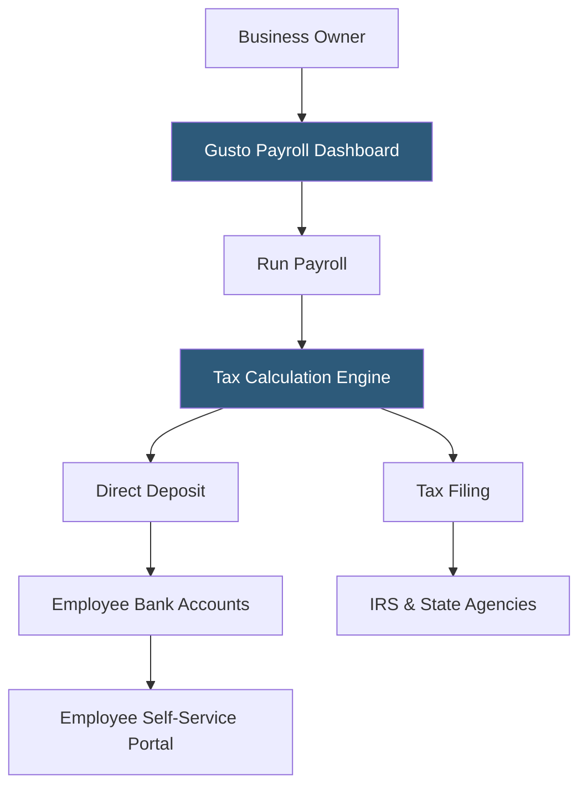

**Category:** Payroll Platforms
**Difficulty:** Beginner
**Reading time:** 5 min read

---

Gusto Core is the entry-level tier of Gusto's payroll platform, designed for small businesses running basic payroll for W-2 employees and 1099 contractors. It includes automated payroll runs, tax filing, direct deposit, and employee self-service at a straightforward per-employee monthly pricing model. Core is the starting point for businesses new to Gusto and provides the essential payroll engine that higher tiers build upon.

- **Unlimited Payroll Runs** — Core allows as many payroll runs per month as needed at no additional cost, useful for off-cycle bonuses
- **Automated Tax Filing** — Gusto files federal and state payroll tax forms and makes tax deposits automatically on the employer's behalf
- **Self-Onboarding** — employees complete their own W-4, I-9, and direct deposit setup through the Gusto employee portal
- **New Hire Reporting** — Gusto automatically reports new hires to state agencies as required by law
- **Pay Stubs & W-2s** — employees access digital pay stubs and year-end W-2 forms through their Gusto account
- **Gusto Wallet** — a free employee financial account feature for savings goals and early wage access (available to Core employees)
- **Contractor Payments** — Core supports paying 1099 contractors alongside W-2 employees in the same payroll run
- **Benefits Integration** — Core can connect with Gusto's optional benefits add-ons for health insurance at additional cost

Gusto Core is built around simplicity. After initial setup — entering company details, tax identification numbers, and employee information — running payroll takes fewer than five minutes for most small businesses. Gusto's interface guides users through confirming hours or salaries, reviewing deductions, and approving the run with a single click.

The tax engine handles all FICA calculations (Social Security and Medicare), federal income tax withholding based on W-4 elections, and state and local taxes for all states where the business has employees. Gusto maintains its own tax compliance team that monitors and implements tax table changes before they take effect.

Payroll processing operates on a 4-day lead time by default, meaning direct deposits land in employee accounts four banking days after the payroll is approved. Gusto offers 2-day processing at no additional charge once the account establishes a consistent payroll history.

Employees receive an invitation to set up their own Gusto accounts, where they can view pay history, download W-2s, update direct deposit information, and manage their Gusto Wallet. This self-service capability significantly reduces HR administration time for business owners.

At year-end, Gusto automatically generates W-2s for employees and 1099-NEC forms for contractors, filing them with the IRS and distributing copies to workers electronically.

- Sole proprietors and micro-businesses running their first payroll system
- Small businesses with straightforward payroll (few employees, simple pay structures)
- Companies paying a mix of W-2 employees and 1099 contractors
- Business owners who value a modern, self-service UI over phone-based support
- Startups looking for low per-employee pricing that scales with headcount

| Advantage | Disadvantage |
|-----------|--------------|
| Simple, intuitive interface with minimal training required | No dedicated support representative; relies on online support |
| Transparent per-employee pricing with no setup fees | Time tracking and HR features require upgrade to higher tiers |
| Employee self-onboarding reduces admin burden | Less suitable for complex payroll scenarios (union rules, garnishments) |
| Automated year-end W-2 and 1099 generation | Some state tax support limitations compared to ADP or Paychex |

- [Gusto Payroll Platform](gusto-payroll-platform.md)
- [Gusto Complete Plan](gusto-complete-plan.md)
- [OnPay Payroll Service](onpay-payroll-service.md)

---
*Part of the [Payroll Platforms](index.md) category · [Back to Master Index](../../index.md)*
