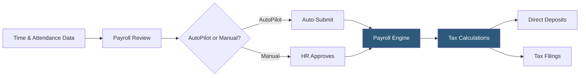

**Category:** Payroll Platforms
**Difficulty:** Beginner
**Reading time:** 5 min read

---

Gusto is a cloud-native payroll and HR platform purpose-built for small and medium-sized businesses, offering automated payroll runs, benefits administration, and onboarding tools in a highly approachable interface. It handles federal and state tax filings automatically, including new hire reporting, year-end W-2s, and 1099 forms for contractors. Gusto's tiered plans (Simple, Plus, Premium) allow businesses to scale features as they grow.

- **AutoPilot** — a Gusto feature that runs payroll automatically on schedule without manual initiation each pay period
- **Contractor Payments** — Gusto's ability to pay 1099 contractors alongside W-2 employees and auto-generate year-end 1099-NEC forms
- **Benefits Broker Network** — Gusto offers access to health insurance plans directly within the platform, acting as an authorized broker in many states
- **Lifetime Accounts** — former employees retain read-only access to their pay stubs and tax documents via a personal Gusto account
- **R&D Tax Credit** — Gusto can calculate and file the R&D tax credit as an add-on service for eligible startups
- **New Hire Reporting** — automatic state agency reporting of new employees as required by federal law within days of hire
- **Synced Time Tracking** — built-in or integrated time tracking that flows directly into payroll calculations
- **State Tax Registration** — Gusto's service to register employers in new states when hiring remote workers

Gusto processes payroll through a streamlined web interface that guides payroll administrators through each pay period. Administrators enter or confirm hours worked, bonuses, and deductions before submitting the payroll run. Gusto's engine then computes gross pay, applies all applicable federal (FICA, FUTA) and state (SUI, SDI) taxes, processes any voluntary deductions (401k, health premiums), and calculates net pay.

The platform initiates ACH direct deposits 4 business days in advance (or 2 days on faster plans), pulling funds from the employer's linked bank account. Simultaneously, it remits tax payments to the IRS and relevant state agencies and queues quarterly and annual tax returns for filing. The system tracks all filings in a compliance calendar visible to administrators.

Gusto's onboarding module sends new hires digital I-9 and W-4 forms before their start date, auto-populating payroll records upon completion. Benefits elections made during onboarding feed directly into payroll deduction schedules. The platform integrates with major accounting software (QuickBooks, Xero, FreshBooks) via direct connections that post payroll journal entries automatically after each run.

For businesses hiring across state lines, Gusto handles multi-state payroll complexity by maintaining tax tables for all 50 states and assisting with state tax ID registration.

- Startups and small businesses (1–200 employees) running their first formal payroll system
- Tech companies paying a mix of W-2 employees and 1099 contractors
- Small business owners who want payroll to run automatically without weekly oversight
- Companies in multiple states seeking automated multi-state tax compliance
- HR teams wanting an integrated benefits broker to simplify health insurance administration

| Advantage | Disadvantage |
|-----------|--------------|
| Intuitive interface requires minimal payroll expertise | Not ideal for companies over 500 employees with complex needs |
| Flat per-employee pricing is predictable | Limited customization for complex pay structures |
| Automated tax filing reduces compliance risk | International payroll limited to US only (global requires Gusto Global add-on) |
| Lifetime accounts reduce post-employment HR requests | Customer support is chat-based; phone support only on Premium |

- [ADP Workforce Now](adp-workforce-now.md)
- [Rippling Payroll & HR](rippling-payroll-hr.md)
- [OnPay Payroll Service](onpay-payroll-service.md)

---
*Part of the [Payroll Platforms](index.md) category · [Back to Master Index](../../index.md)*
