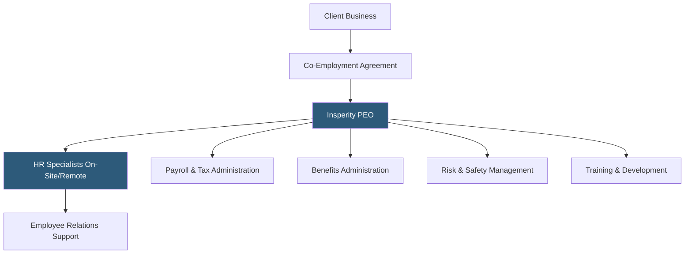

**Category:** Payroll Platforms
**Difficulty:** Advanced
**Reading time:** 6 min read

---

Insperity is one of the largest Professional Employer Organizations in the United States, providing comprehensive HR outsourcing through a co-employment model that covers payroll, benefits, HR administration, risk management, and training for small and mid-sized businesses. Insperity differentiates through a high-touch service delivery model pairing its software platform with dedicated HR specialists assigned to each client, targeting businesses that want outsourced HR expertise alongside technology tools.

- **Workforce Optimization** — Insperity's comprehensive service model covering the full employee lifecycle from recruiting through retirement planning
- **Insperity Workforce Acceleration** — a premium tier with enhanced HR support for rapid-growth companies
- **HR Specialist Team** — dedicated HR professionals assigned to each client location for ongoing advisory and administrative support
- **Benefits Portfolio** — access to Fortune 500-level health, dental, vision, life, and supplemental insurance through Insperity's large-group plans
- **Risk Management** — workers' compensation insurance, unemployment claims management, and EPLI coverage
- **Training Programs** — online and instructor-led employee development and compliance training resources included in the PEO service
- **Recruiting Services** — optional recruitment support including job posting, candidate screening, and onboarding
- **Insperity Premier** — the self-service HR software platform for managing employee data, payroll, and HR workflows

Insperity's PEO model operates on the standard co-employment structure but with a notably high service-to-software ratio compared to tech-forward PEOs. Each Insperity client is assigned a dedicated HR service team that includes a specialist handling day-to-day HR transactions and a strategic HR consultant for longer-term planning questions. The relationship often resembles having an embedded HR department rather than a software vendor.

Payroll processing runs through Insperity's platform with all taxes calculated, deposited, and filed under Insperity's EIN. The platform handles direct deposit, wage garnishments, multi-state withholding, and year-end W-2 distribution. Insperity has CPEO certification from the IRS, preserving clients' ability to claim business tax credits in the co-employment relationship.

The benefits program is a major value driver. Insperity's pooled group of 300,000+ co-employed workers enables negotiation of health plans with major carriers at rates unavailable to individual small businesses. Benefits administration — managing open enrollment, qualifying life events, carrier invoicing, and COBRA — is handled entirely by Insperity's team.

Risk management services include workers' compensation coverage under Insperity's master policy with active claims management, OSHA recordkeeping assistance, workplace safety program development, and unemployment claims response. The HR team handles employment practices investigations and assists with complex terminations.

- Mid-market businesses (50–500 employees) wanting outsourced HR with high-touch service
- Companies in high-risk industries benefiting from active safety program support
- Organizations wanting outsourced recruiting alongside HR and payroll
- Businesses needing regular on-site HR support at multiple locations
- Companies seeking to offload complex benefits administration entirely

| Advantage | Disadvantage |
|-----------|--------------|
| High-touch dedicated HR specialists feel like an internal team | Higher cost than technology-forward PEOs with lower service ratios |
| CPEO status preserves tax credit access for co-employed businesses | Less modern software interface compared to Justworks or Rippling |
| Active safety and risk management programs reduce liability | Minimum company size requirements limit access for very small businesses |
| Comprehensive recruiting services available as needed | Co-employment exit is complex after deep integration |

- [ADP TotalSource PEO](adp-totalsource-peo.md)
- [TriNet PEO Services](trinet-peo-services.md)
- [Justworks PEO Platform](justworks-peo-platform.md)

---
*Part of the [Payroll Platforms](index.md) category · [Back to Master Index](../../index.md)*
