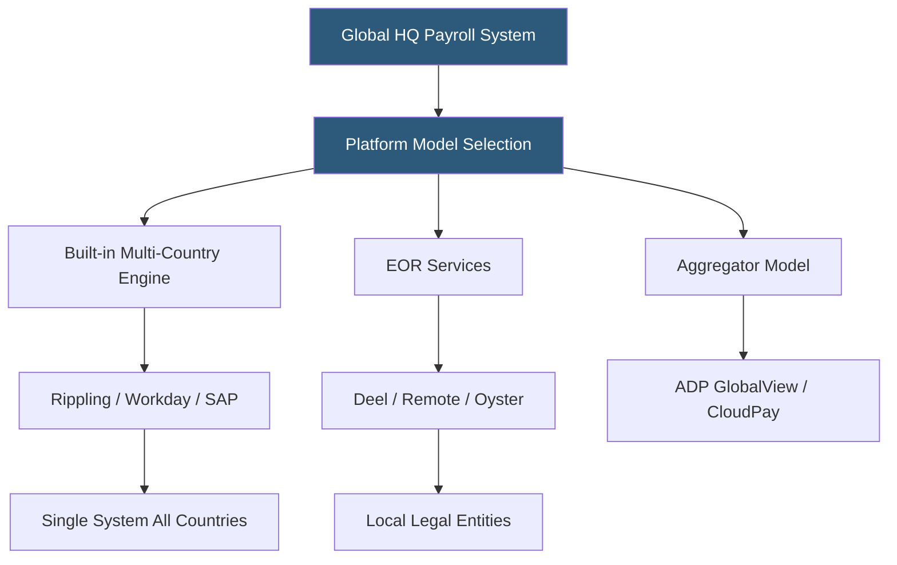

**Category:** Payroll Platforms
**Difficulty:** Advanced
**Reading time:** 7 min read

---

International payroll platforms enable organizations to pay employees and contractors across multiple countries, each with distinct tax laws, statutory deductions, filing deadlines, and currency requirements. The market divides between full-stack global HCM platforms with built-in international payroll engines (Rippling, Workday, SAP), Employer of Record (EOR) services that handle local employment without requiring the company to establish foreign entities (Deel, Remote, Oyster), and aggregator models that coordinate local payroll providers through a single interface (ADP GlobalView, CloudPay).

- **Employer of Record (EOR)** — a third-party legal entity that employs workers in a foreign country on behalf of a client company, handling all local compliance
- **In-Country Payroll Engine** — a payroll processor built specifically for a country's tax and statutory requirements, as opposed to a generic system adapting to local rules
- **GDPR Compliance** — the EU's data privacy regulation requiring strict controls on employee data handling, including payroll data for European workers
- **Social Insurance** — country-specific mandatory contributions (UK National Insurance, French cotisations sociales, German Sozialversicherung) deducted from and matched by employers
- **Currency Hedging** — financial strategies to manage exchange rate risk when payroll costs are incurred in one currency but reported in another
- **Tax Equalization** — the process of ensuring employees on international assignments pay neither more nor less tax than they would at home
- **Local Statutory Benefits** — mandatory employee benefits required by country law (13th month pay in Philippines, mandatory vacation in EU countries, etc.)
- **Shadow Payroll** — a parallel payroll calculation for tax tracking purposes for internationally mobile employees

Organizations with international workforces face a fundamental choice: establish legal entities in each country where they have employees (enabling direct employment), use an EOR to employ workers without entities, or use an aggregator platform that coordinates local payroll providers.

With established entities, full-stack platforms like Workday or Rippling connect their HCM to country-specific payroll engines. Each engine handles local statutory deductions: VAT registration is irrelevant to payroll, but income tax, social insurance, and mandatory pension contributions must be calculated and remitted according to each country's rules. Tax filing deadlines vary — UK payroll requires RTI submissions with every pay run, while German payroll requires monthly electronic submissions to ELSTER.

EOR services like Deel or Remote eliminate entity requirements. The EOR is the legal employer; the client company controls the work. EOR fees typically run 15–30% above base salary cost. This model is common for early-stage international expansion or for hiring in countries where entity setup costs ($50,000–$200,000) are prohibitive for small teams.

Aggregator models maintain relationships with vetted local payroll providers in each country, presenting a unified interface to HR administrators while routing actual processing to local experts. ADP GlobalView serves multinational enterprises managing payroll in 40+ countries through ADP's owned and partner network.

Currency management is a constant consideration — payroll budgets typically set in the company's home currency must account for exchange rate fluctuations affecting actual costs in foreign currencies.

- Multinational enterprises managing payroll across 10+ countries from a central HR function
- Remote-first companies hiring globally without establishing foreign legal entities
- Companies expanding to new countries and evaluating EOR vs. entity setup
- HR leaders consolidating previously fragmented country-by-country payroll systems
- Finance teams needing consolidated global payroll cost reporting for budgeting

| Advantage | Disadvantage |
|-----------|--------------|
| EOR enables rapid global hiring without entity setup cost and timeline | EOR fees add 15–30% overhead; cost-inefficient at scale versus owned entities |
| Aggregator models provide single interface for multi-country payroll | Aggregator quality depends on local provider network; inconsistency possible |
| Full-stack platforms provide data consistency across all countries | Full-stack platforms require significant implementation for multi-country configuration |
| In-country engines provide faster compliance updates than generic adapters | No single platform covers all countries; gaps require additional solutions |

- [Rippling Global Payroll](rippling-global-payroll.md)
- [Multi-State Payroll Processing](multi-state-payroll-processing.md)
- [Workday HCM Payroll](workday-hcm-payroll.md)

---
*Part of the [Payroll Platforms](index.md) category · [Back to Master Index](../../index.md)*
