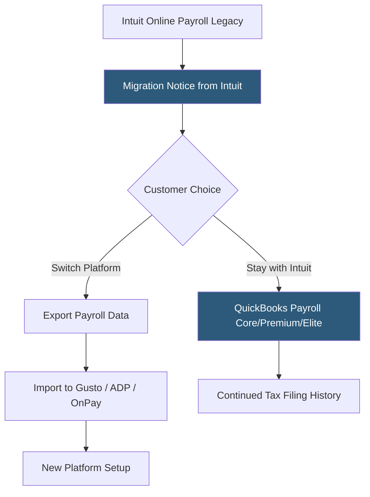

**Category:** Payroll Platforms
**Difficulty:** Beginner
**Reading time:** 5 min read

---

Intuit Online Payroll was an earlier Intuit payroll product that has been sunset in favor of QuickBooks Payroll. Originally offered as a standalone payroll service for small businesses, Intuit migrated existing customers to QuickBooks Payroll as part of a product consolidation strategy. Understanding Intuit Online Payroll is relevant for businesses migrating off legacy systems and for accountants whose clients are still on older Intuit payroll products.

- **Product Sunset** — Intuit officially ended Intuit Online Payroll as a standalone product, transitioning users to QuickBooks Payroll
- **Migration Path** — existing Intuit Online Payroll customers were offered migration assistance to QuickBooks Payroll Core, Premium, or Elite
- **Historical Payroll Data** — tax records, pay histories, and W-2s from Intuit Online Payroll are accessible through QuickBooks Payroll after migration
- **Intuit Enhanced Payroll** — a related legacy product (desktop-based) also subject to Intuit's cloud-first migration strategy
- **Tax Filing Continuity** — migrated businesses retain their tax filing history and year-over-year reporting continuity
- **Third-Party Integrations** — the migration affects customers who had connected Intuit Online Payroll to accounting platforms other than QuickBooks
- **Payroll Data Export** — businesses migrating to non-Intuit platforms can export payroll history as CSV or PDF files
- **IRS EIN Records** — employer identification numbers and filing history carry over transparently during platform migrations

Intuit Online Payroll was offered in Basic (self-service tax filing), Enhanced (employer-filed taxes with Intuit preparation), and Full Service tiers. It processed payroll through the same Intuit tax engine and provided employee self-service for pay stub and W-2 access.

As Intuit consolidated its payroll offerings, customers received migration notices directing them to QuickBooks Payroll. The migration path preserved existing payroll data — employee records, year-to-date withholding figures, tax filing history, and prior W-2s — by importing it into the QuickBooks Payroll environment.

For businesses that chose to leave Intuit entirely during this migration, the export process involved downloading payroll reports in CSV format and sourcing W-2 PDFs for historical records. Migrating to platforms like Gusto, ADP RUN, or OnPay required re-entering employee data, setting up new direct deposit authorizations, and establishing new tax filing relationships with the IRS and state agencies.

The key practical consideration for legacy Intuit Online Payroll users is understanding that the product no longer receives updates or new customer support — any lingering issues should be resolved by completing migration to an active platform.

- Businesses identifying they are still on legacy Intuit Online Payroll needing to migrate
- Accountants auditing clients' payroll setup for outdated platform use
- Companies needing to access historical payroll data from the Intuit Online Payroll era
- Businesses planning payroll platform migrations who want to understand transition processes
- HR professionals documenting payroll system history for compliance records

| Advantage | Disadvantage |
|-----------|--------------|
| Historical data preserved during migration to QuickBooks Payroll | Product is sunset; no longer actively maintained or supported |
| Well-documented migration path to QuickBooks Payroll tiers | Transition adds operational work regardless of destination platform |
| Platform history familiar to accountants who supported clients on it | Businesses on non-QuickBooks accounting platforms face more complex migration |
| Export tools allow portability to alternative payroll providers | No new features or improvements given product end-of-life status |

- [QuickBooks Payroll](quickbooks-payroll.md)
- [QuickBooks Payroll Core](quickbooks-payroll-core.md)
- [Gusto Payroll Platform](gusto-payroll-platform.md)

---
*Part of the [Payroll Platforms](index.md) category · [Back to Master Index](../../index.md)*
