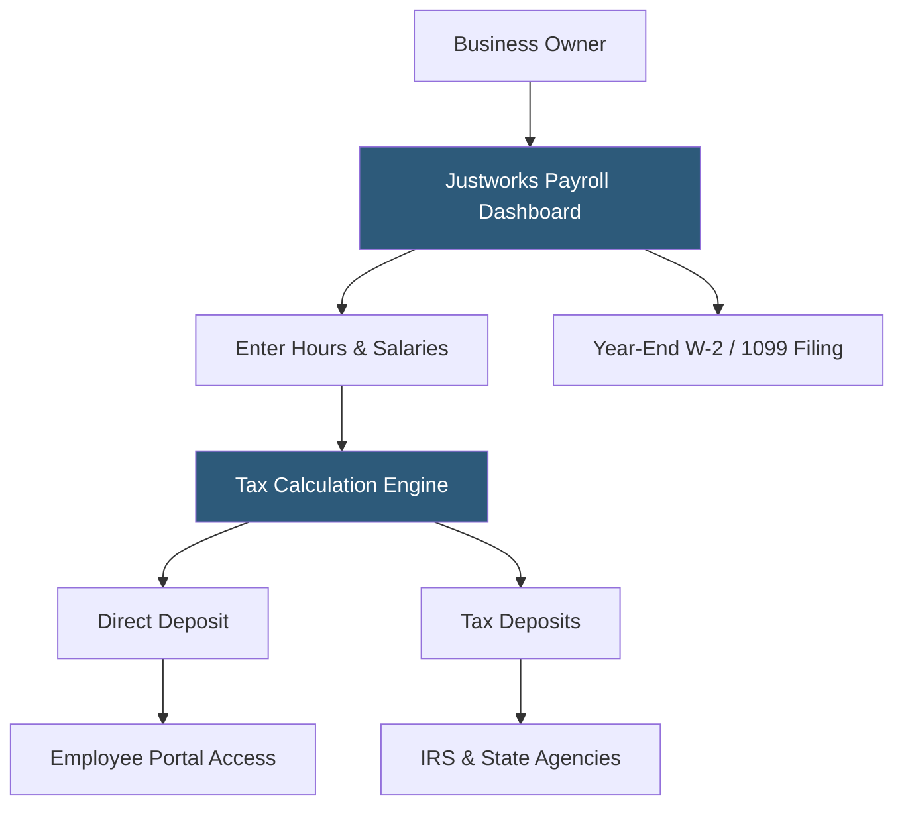

**Category:** Payroll Platforms
**Difficulty:** Beginner
**Reading time:** 5 min read

---

Justworks Payroll is the standalone payroll-only tier of Justworks, launched to serve businesses that want Justworks's clean payroll interface and tax filing automation without entering a full PEO co-employment relationship. It handles domestic payroll processing, tax filings, and contractor payments at a lower price point than the full PEO service, while keeping the option to upgrade to PEO benefits available as the business grows.

- **Standalone Payroll** — payroll processing without co-employment; the client remains the sole employer of record
- **Automated Tax Filing** — Justworks handles all federal and state payroll tax calculations, deposits, and form filings
- **Contractor Payments** — support for paying 1099 contractors alongside W-2 employees with automated 1099-NEC generation
- **Off-Cycle Payroll** — ability to run additional payroll runs for bonuses or corrections outside the standard pay schedule
- **Direct Deposit** — next-day or two-day ACH transfers to employee bank accounts
- **Pay Stubs** — digital pay stubs accessible through the employee self-service portal
- **Year-End Processing** — automated W-2 and 1099-NEC generation and IRS filing
- **Upgrade Path** — the ability to add PEO benefits (health insurance, workers' comp, etc.) without changing platforms

Justworks Payroll operates as a full-service payroll provider without the co-employment overlay. The business remains the employer of record, and Justworks acts as a payroll processor and tax filing agent, similar to Gusto or OnPay in the market.

Setup involves entering company information, federal and state tax IDs, employee data, and banking details for direct deposit. Justworks configures the tax filing relationship to pull tax deposits and remit them to the appropriate agencies on the employer's behalf. The dashboard makes running payroll straightforward: confirm wages and hours, review a pre-submission summary, and approve.

The platform supports standard payroll scenarios including salaried and hourly workers, multiple pay groups with different pay schedules, benefits deductions, garnishments, and reimbursements. Contractor payments can be processed in the same interface, with Justworks tracking year-to-date contractor payments and generating 1099-NEC forms automatically at year-end.

A key design principle of Justworks Payroll is the upgrade path. Companies that start with standalone payroll can layer on health benefits, workers' comp coverage, and HR compliance support by upgrading to the PEO tier without migrating to a new platform. This makes it a natural starting point for companies planning to add benefits as they grow.

- Small businesses that want Justworks's interface without committing to co-employment
- Companies evaluating PEO services but wanting to try Justworks payroll first
- Businesses with straightforward payroll needing automated tax filing
- Startups paying a mix of employees and contractors from the same platform
- Companies planning to add benefits later and wanting seamless upgrade capability

| Advantage | Disadvantage |
|-----------|--------------|
| Clean modern interface with intuitive payroll workflow | Fewer features than Justworks PEO and lacks benefits administration |
| Clear upgrade path to full PEO without platform migration | More expensive per employee than Gusto or OnPay for equivalent features |
| Handles both W-2 employees and 1099 contractors | Limited HR features compared to complete HRIS solutions |
| No co-employment complexity for businesses not ready for PEO | Less widely used than Gusto or ADP RUN, smaller support knowledge base |

- [Justworks PEO Platform](justworks-peo-platform.md)
- [Gusto Core Plan](gusto-core-plan.md)
- [OnPay Payroll Service](onpay-payroll-service.md)

---
*Part of the [Payroll Platforms](index.md) category · [Back to Master Index](../../index.md)*
