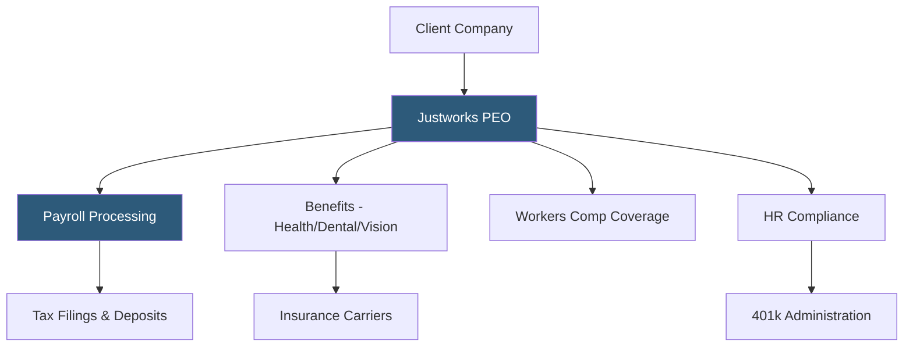

**Category:** Payroll Platforms
**Difficulty:** Intermediate
**Reading time:** 6 min read

---

Justworks is a Professional Employer Organization (PEO) platform targeting small and mid-sized businesses that combines payroll processing, benefits administration, HR compliance, and access to large-group benefits under a transparent per-employee monthly pricing model. Unlike legacy PEOs that often have opaque fee structures, Justworks publishes flat per-employee rates and provides a modern software interface alongside its PEO services. It is particularly popular with New York-based startups and venture-backed companies that want Fortune 500-caliber benefits for their teams.

- **Co-Employment** — the legal arrangement where Justworks becomes the employer of record for tax purposes while the client company retains operational control
- **Large-Group Benefits** — health, dental, and vision insurance purchased through Justworks's pooled buying power, available to companies of any size
- **COBRA Administration** — Justworks manages COBRA continuation coverage for terminated employees automatically
- **PTO Policy Management** — configurable time-off policies with Justworks handling accrual tracking within the platform
- **401(k) through Justworks** — a small-business 401(k) plan available to Justworks clients with employer contribution options
- **Workers' Compensation** — coverage provided through Justworks's insurance arrangement, eliminating the need for clients to source their own policy
- **Health Reimbursement Arrangement (HRA)** — options for employer-funded health reimbursements for teams not on Justworks's group health plans
- **Employer of Record (EOR)** — Justworks's service for hiring full-time international employees without the client needing a local legal entity

Justworks operates the co-employment model through a clean software interface that feels more like a modern SaaS product than a traditional PEO. When a company joins Justworks, it signs a Client Service Agreement establishing the co-employment relationship. Justworks then becomes the legal employer of record for payroll taxes and benefits purposes, while the company retains full control over who it hires, manages, and terminates.

The benefits experience is a primary selling point. By pooling thousands of Justworks client employees into a single large-group plan, Justworks negotiates health insurance rates that would be unavailable to a 20-person company independently. Employees choose from multiple plan options during open enrollment, and deductions sync automatically with payroll.

Payroll runs through the Justworks dashboard on a standard schedule. The platform handles all tax calculations, makes federal and state tax deposits under Justworks's EIN, files quarterly and annual returns, and issues W-2s at year-end. Off-cycle payments for bonuses and commissions are straightforward through the interface.

Compliance management includes proactive notifications of state law changes affecting clients, assistance with workplace investigations, and access to HR advisors for employee relations questions. Justworks's compliance team monitors changes across all states where client employees work.

The transparent pricing model — one flat rate per employee for the Basic tier, a higher rate for the Plus tier with richer benefits — is a significant differentiator from legacy PEOs that often charge variable percentages of payroll.

- Startups and venture-backed companies wanting competitive benefits to attract talent
- Small businesses (10–200 employees) wanting a modern PEO experience with transparent pricing
- Companies wanting to eliminate the overhead of managing multiple insurance policies
- New York, Boston, and San Francisco businesses where benefits competitiveness is critical for recruiting
- Companies exploring international hiring through Justworks's EOR service

| Advantage | Disadvantage |
|-----------|--------------|
| Transparent flat per-employee pricing unlike legacy PEO percentage models | Co-employment structure requires legal understanding and has exit complexity |
| Access to large-group benefits rates regardless of company size | Less configurable than building a custom benefits package independently |
| Modern software interface versus legacy PEO platforms | Fewer integration options than standalone payroll platforms |
| Built-in compliance management and HR advisor access | Platform scales with difficulty for companies over 500 employees |

- [ADP TotalSource PEO](adp-totalsource-peo.md)
- [TriNet PEO Services](trinet-peo-services.md)
- [Gusto Concierge Plan](gusto-concierge-plan.md)

---
*Part of the [Payroll Platforms](index.md) category · [Back to Master Index](../../index.md)*
