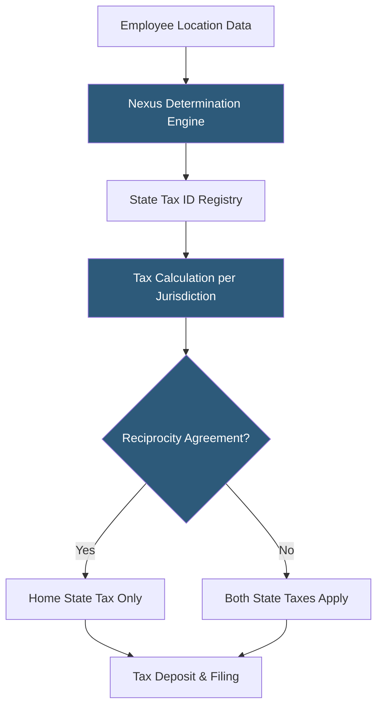

**Category:** Payroll Platforms
**Difficulty:** Advanced
**Reading time:** 7 min read

---

Multi-state payroll processing addresses the legal and computational complexity of paying employees who live or work in different states, each with independent tax rates, filing requirements, wage and hour laws, and unemployment insurance programs. The proliferation of remote work has made multi-state payroll the default challenge for growing companies rather than the exception. Employers must navigate nexus determination, reciprocity agreements, and the risk of triggering tax obligations in states where they previously had no presence.

- **Nexus** — a sufficient physical or economic presence in a state that triggers the obligation to register for taxes, collect state income tax from employees, and file returns
- **Reciprocity Agreement** — a bilateral agreement between two states allowing employees who live in one state and work in another to only pay taxes in their home state
- **SUI (State Unemployment Insurance)** — employer-paid unemployment tax assessed by each state where employees work; rates vary by state and employer history
- **Work State vs Residence State** — an employee may owe taxes to both states absent a reciprocity agreement; the work state typically has primary withholding obligation
- **State Tax ID Registration** — each state where an employer has payroll tax obligations requires separate registration with that state's department of revenue and labor
- **Apportionment** — dividing an employee's income between states based on days worked in each for accurate state withholding
- **SUTA (State Unemployment Tax Act) Dumping** — fraudulent practice of manipulating employee transfers to achieve lower SUI rates; subject to penalties
- **Local Income Tax** — some cities and counties (Philadelphia, New York City, certain Ohio cities) levy their own income taxes separate from state taxes

Multi-state payroll begins with nexus determination — identifying which states the employer has tax obligations in. Historically, nexus required physical presence (an office, warehouse, or employee regularly working in-state). Today, many states assert economic nexus based on payroll thresholds, making a single remote employee sufficient to create full payroll tax obligations.

Once nexus is established, the employer must register for a State Tax ID (withholding account) and a separate SUI account in each state. Many payroll platforms offer registration assistance services to streamline this process, which typically takes 4–8 weeks per state.

The payroll system must correctly identify each employee's work state and residence state. For remote workers, the work state is typically the state where the employee's home office is located. The system checks the reciprocity agreement database to determine if a credit or exemption applies. For example, Virginia and Maryland have a reciprocity agreement, so a Maryland resident working for a Virginia employer only pays Maryland taxes.

SUI calculations are especially complex because rates vary by state, by employer experience rating, and can change quarterly. Each state sets its own wage base (the maximum annual wages subject to SUI, ranging from $7,000 in some states to $62,500+ in others). Payroll systems track year-to-date SUI wages per employee per state to stop withholding once the wage base is reached.

Year-end W-2 production for multi-state employees requires Box 15-17 entries for each state, showing taxable wages and taxes withheld per state — automated by modern payroll platforms.

- Companies hiring remote workers across multiple states for the first time
- Businesses expanding operations into new states requiring payroll registration
- Companies auditing their current multi-state compliance posture
- Organizations evaluating payroll software capable of handling 10+ state configurations
- HR teams managing employees who travel and work in multiple states throughout the year

| Advantage | Disadvantage |
|-----------|--------------|
| Enables compliant hiring of talent in any state | Registration and ongoing compliance costs increase with each state |
| Automated tax table updates keep filings current | Incorrect nexus determination exposes employer to back taxes and penalties |
| Reciprocity agreements reduce double-taxation for employees | Local income taxes add another layer beyond state compliance |
| Modern platforms handle most complexity automatically | Payroll cost per employee increases with multi-state configurations |

- [ADP Workforce Now](adp-workforce-now.md)
- [Rippling Payroll & HR](rippling-payroll-hr.md)
- [International Payroll Platforms](international-payroll-platforms.md)

---
*Part of the [Payroll Platforms](index.md) category · [Back to Master Index](../../index.md)*
