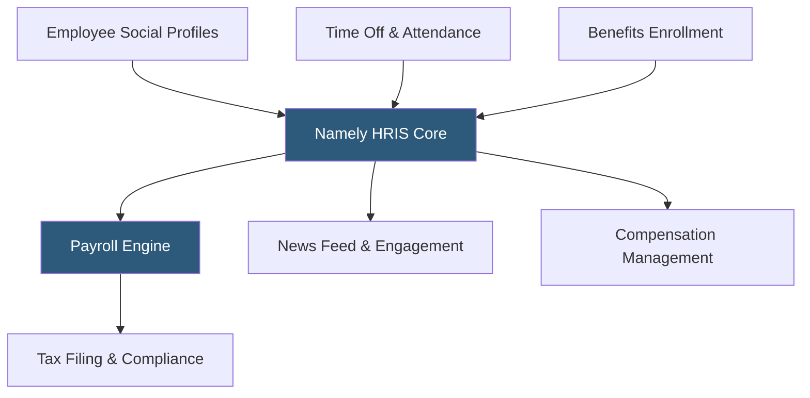

**Category:** Payroll Platforms
**Difficulty:** Intermediate
**Reading time:** 5 min read

---

Namely is an HRIS and payroll platform designed for mid-sized companies with 50–1,000 employees, offering a LinkedIn-inspired social interface that makes HR data more engaging than traditional enterprise platforms. Namely combines payroll processing, benefits administration, time management, and HR data management with a focus on usability and employee adoption. The platform targets knowledge-worker organizations in sectors like media, technology, and professional services.

- **People Management** — Namely's core HRIS layer storing employee profiles with social features like profile photos, manager relationships, and company news feeds
- **Namely Payroll** — the built-in payroll engine handling wages, deductions, tax filing, and direct deposit for US employees
- **Benefits Administration** — health, dental, vision, and voluntary benefits enrollment and administration with carrier connections
- **Time Off Management** — configurable PTO policies with accrual tracking, request workflows, and payroll integration
- **Namely Managed Services** — an optional service tier where Namely's HR specialists handle HR administration tasks on behalf of clients
- **News Feed** — a social-style company communication hub within the HR platform for announcements and recognition
- **Compensation Management** — salary review cycle tools with approval workflows and pay equity reporting
- **ACA Compliance** — automated tracking and 1095-C form generation for applicable large employers

Namely's platform is built around the employee profile, which serves as both an HR record and a social presence within the company. Each employee's profile shows their role, department, reporting chain, work anniversary, and a photo — similar in feel to a professional social network. This approach increases employee platform engagement and makes organizational data visually accessible.

Payroll runs from the same platform, drawing employee compensation, deduction, and classification data from the HR record without separate entry. The payroll engine processes federal and state taxes automatically, with Namely's compliance team managing tax table updates. Direct deposit runs on standard ACH timelines, with pay stub delivery through employee self-service portals.

Benefits administration connects to insurance carriers via electronic data interchange, processing enrollments, life events, and terminations. The open enrollment experience guides employees through plan comparisons before elections are transmitted to carriers and synced to payroll deductions.

Namely Managed Services is available for organizations that want HR professionals to handle day-to-day administration — processing changes, managing open enrollment coordination, and running payroll on the client's behalf. This creates a hybrid technology-plus-service model.

- Media, creative, and professional services companies wanting a modern HRIS with social features
- Mid-market companies replacing aging HRIS platforms with a more intuitive alternative
- Organizations focused on employee experience and wanting a consumer-grade HR interface
- HR teams wanting managed service options to supplement internal capacity
- Companies needing combined HRIS, payroll, and benefits in one platform

| Advantage | Disadvantage |
|-----------|--------------|
| Modern social interface drives higher employee adoption than traditional HRIS | Has experienced product development challenges and ownership changes |
| Combined HRIS, payroll, and benefits reduces integration complexity | Less suitable for complex enterprise payroll scenarios than ADP or Paycom |
| Managed services tier provides flexibility between self-service and outsourced HR | Higher price point than pure-payroll alternatives for equivalent headcount |
| Pay equity reporting and compensation management included | Customer support quality has been inconsistent historically |

- [BambooHR Payroll Integration](bamboohr-payroll-integration.md)
- [Paylocity Payroll & HCM](paylocity-payroll-hcm.md)
- [Zenefits Payroll Services](zenefits-payroll-services.md)

---
*Part of the [Payroll Platforms](index.md) category · [Back to Master Index](../../index.md)*
