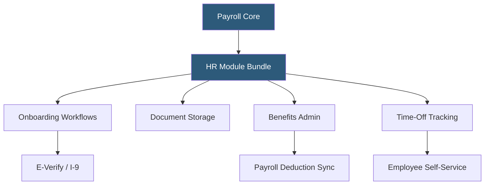

**Category:** Payroll Platforms
**Difficulty:** Beginner
**Reading time:** 5 min read

---

OnPay includes a suite of HR features bundled with its base payroll pricing, covering onboarding, document management, and basic HR administration without requiring a separate HRIS. Unlike platforms that charge separately for HR features, OnPay treats them as part of the core product, making it a strong value proposition for small businesses that need functional HR tools alongside payroll. The HR capabilities range from offer letter templates to benefits administration support.

- **Onboarding Workflows** — automated checklist-based processes guiding new hires through completing tax forms, direct deposit setup, and company document review
- **Document Storage** — a secure digital repository for employee documents including signed offer letters, I-9s, and performance records
- **Employee Handbook Builder** — a template-based tool for creating compliant employee handbooks customized to state-specific requirements
- **Org Chart** — an automatically generated organizational structure visualization based on employee reporting relationships in OnPay
- **Benefits Administration** — support for entering health, dental, vision, and 401(k) deductions that sync with payroll calculations
- **Time-Off Tracking** — basic PTO policy configuration with accrual rules and balance tracking visible to employees
- **E-Verify Integration** — automated I-9 employment eligibility verification for new hires meeting federal contractor requirements
- **HR Compliance Library** — curated resources covering federal and state employment law topics relevant to small business HR

When a new employee is added to OnPay, the system triggers an onboarding workflow that sends the employee an email with secure links to complete their W-4, state withholding forms, direct deposit authorization, and I-9 documentation. Each step is tracked with completion status visible to the HR administrator. Documents signed electronically are stored in the employee's digital file automatically.

The benefits administration module handles deduction setup for health insurance, dental, vision, FSA/HSA contributions, and 401(k) deferrals. Administrators enter plan details and employee elections, and the system calculates both employee and employer contribution amounts, reflecting them in each payroll run. While OnPay doesn't function as a full benefits broker, it coordinates with the company's existing insurance carriers.

PTO management allows administrators to configure multiple leave policies with different accrual rates — hourly accrual, per-pay-period accrual, or annual lump-sum grants. Employees see their current balances and can submit time-off requests. Approved time off automatically appears as a deduction in payroll calculations when applicable.

The HR compliance library provides articles and templates covering topics like the FLSA, ADA, FMLA, state-specific leave laws, and hiring documentation requirements. While not a substitute for legal counsel, it helps small business owners navigate common HR compliance questions without an HR specialist on staff.

- Small businesses wanting HR fundamentals without purchasing a separate HRIS
- Companies formalizing onboarding documentation for the first time
- Organizations configuring benefits deductions that sync automatically with payroll
- Businesses with simple PTO policies wanting automated accrual tracking
- HR-light companies that need a compliance resource library

| Advantage | Disadvantage |
|-----------|--------------|
| Included at no extra charge with payroll subscription | HR features are basic compared to dedicated HRIS platforms like BambooHR |
| Onboarding automation reduces new hire administrative workload | No performance management, succession planning, or learning management |
| Document storage eliminates physical file management | Benefits administration support is informational, not brokerage services |
| HR compliance library provides accessible guidance | PTO management lacks advanced scheduling integration |

- [OnPay Payroll Service](onpay-payroll-service.md)
- [Gusto Complete Plan](gusto-complete-plan.md)
- [BambooHR Payroll Integration](bamboohr-payroll-integration.md)

---
*Part of the [Payroll Platforms](index.md) category · [Back to Master Index](../../index.md)*
