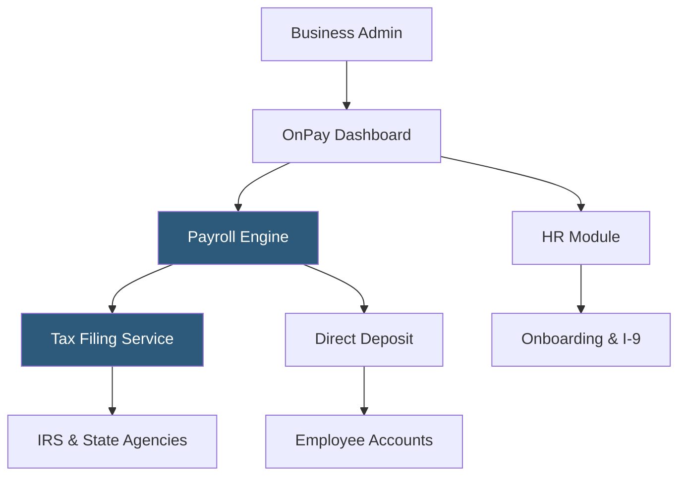

**Category:** Payroll Platforms
**Difficulty:** Beginner
**Reading time:** 5 min read

---

OnPay is a cloud-based payroll platform targeting small businesses with 1–100 employees, known for transparent all-inclusive pricing that bundles payroll, tax filing, and HR features into a single flat monthly fee without add-on charges for common features. It supports all 50 states, handles complex payroll scenarios including agricultural workers, nonprofits, and restaurants, and offers a clean interface that both business owners and accountants find accessible. OnPay consistently ranks among the most cost-effective full-service payroll platforms for small businesses.

- **All-Inclusive Pricing** — a single monthly fee per employee that covers payroll, tax filing, HR, and benefits administration without upselling add-ons
- **Multi-Entity Support** — ability to manage payroll for multiple business entities under one account
- **Payroll Tax Accuracy Guarantee** — OnPay's commitment to cover penalties and interest if a tax error occurs due to their system
- **Accountant Access** — free accountant partner accounts with multi-client dashboards for bookkeepers and CPAs managing multiple small business clients
- **Industry-Specific Compliance** — built-in handling for tip credit calculations, piece-rate pay, agricultural worker rules, and nonprofit payroll
- **Pay Schedules** — support for multiple simultaneous pay frequencies (weekly, bi-weekly, semi-monthly, monthly) within one account
- **Workers' Comp Integration** — pay-as-you-go workers' compensation insurance tied to actual payroll data
- **Electronic I-9 Verification** — E-Verify integration for new hire employment eligibility verification

OnPay's payroll engine supports a full range of earnings types: regular wages, overtime, tips, commissions, bonuses, reimbursements, and contractor payments. The platform handles multi-state payroll for employees working in different states, calculating the appropriate withholding and filing in each jurisdiction.

Tax filing is fully automated. OnPay calculates and deposits federal and state payroll taxes according to the employer's required deposit schedule and files all required returns — 941 quarterly reports, 940 annual FUTA, W-2s, and state equivalents. The tax accuracy guarantee provides financial protection against errors attributable to OnPay's calculations.

The HR module included at no extra cost provides offer letter templates, an employee handbook builder, org chart generation, and document storage. These features give small businesses foundational HR infrastructure without requiring a separate HRIS subscription.

OnPay's accountant program is notable for its depth: CPAs and bookkeepers get free partner accounts with white-glove onboarding support, multi-client dashboards, and the ability to run payroll on behalf of clients. This makes OnPay popular in the accountant channel as a platform to recommend to small business clients.

Workers' comp integration with AP Intego (an insurance marketplace) eliminates large upfront premium payments by tying monthly premiums to actual payroll data — a significant cash flow benefit for seasonal businesses.

- Small businesses wanting transparent pricing without surprise add-on fees
- Accountants and bookkeepers managing payroll for multiple small business clients
- Agricultural businesses, nonprofits, and restaurants needing industry-specific compliance
- Companies running multi-state payroll for a small distributed workforce
- Businesses wanting payroll accuracy guarantees with financial backing

| Advantage | Disadvantage |
|-----------|--------------|
| All-inclusive pricing eliminates bill surprise | No dedicated specialist support (unlike Paychex or ADP small business plans) |
| Tax accuracy guarantee provides financial protection | Scales awkwardly above 100 employees; enterprise features limited |
| Strong accountant program for bookkeeper-managed businesses | Mobile app less polished than Gusto's |
| Industry-specific payroll rules for agriculture, restaurants, nonprofits | Fewer third-party integrations than larger platforms |

- [Gusto Payroll Platform](gusto-payroll-platform.md)
- [QuickBooks Payroll](quickbooks-payroll.md)
- [Patriot Payroll](patriot-payroll.md)

---
*Part of the [Payroll Platforms](index.md) category · [Back to Master Index](../../index.md)*
