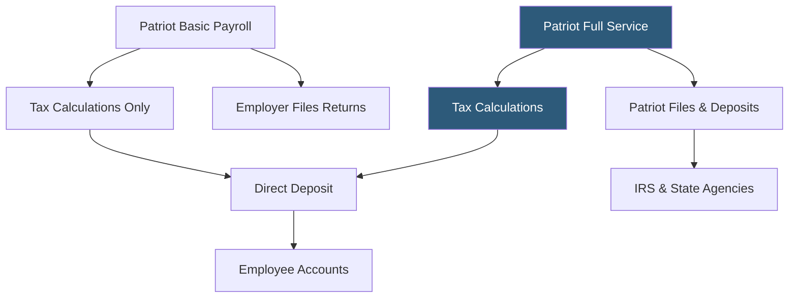

**Category:** Payroll Platforms
**Difficulty:** Beginner
**Reading time:** 5 min read

---

Patriot Payroll is a US-based payroll service designed for small businesses wanting straightforward, affordable payroll processing with transparent pricing. Patriot offers two tiers: Basic Payroll (where the employer handles tax filings) and Full Service Payroll (where Patriot handles all tax filings and deposits). Patriot is notable for its extremely competitive pricing, strong US-based customer support rated highly by small business users, and clean interface that is accessible to non-payroll specialists.

- **Basic Payroll** — Patriot's lower-cost tier where Patriot calculates taxes but the employer remits deposits and files returns
- **Full Service Payroll** — Patriot's full-service tier handling all tax calculations, deposits, and filings on the employer's behalf
- **Accounting Integration** — Patriot's own Patriot Accounting software (or integration with QuickBooks) for journal entry posting
- **Free Employee Onboarding** — Patriot includes a free new hire onboarding module even at the Basic tier
- **Direct Deposit** — ACH payment to employee bank accounts; 2-day processing at the Basic tier, same-day available as add-on
- **Free HR Software** — a basic HR module included at no charge covering employee documents and time-off tracking
- **Contractor Payments** — 1099 contractor support with automated 1099-NEC generation included
- **Time and Attendance** — optional add-on for employee time tracking integrated with payroll

Patriot Payroll's Basic tier is one of the most affordable full-featured payroll calculators available for small businesses. Patriot calculates all federal and state payroll taxes — income tax withholding, FICA, FUTA, and SUTA — providing the employer with precise amounts to deposit. The employer then uses those figures to make deposits through IRS EFTPS and state agency portals. Patriot generates completed tax forms ready to submit, reducing the work to logging in and submitting.

Full Service upgrades to complete hands-off compliance: Patriot's team handles all deposits and form submissions, including 941 quarterly returns, 940 annual FUTA, W-2s, and state equivalents. This tier operates similarly to Gusto or OnPay in terms of tax service but at a lower price point.

Processing payroll involves entering or importing hours for hourly employees, confirming salaries for salaried staff, and approving the run. The system handles multiple pay schedules (weekly, bi-weekly, semi-monthly, monthly) and multiple pay types (regular, overtime, commission, reimbursements).

The free HR software module provides employee records, document storage, and a basic time-off tracking tool. While not a substitute for an HRIS, it covers the basic administrative needs of businesses with fewer than 25 employees.

Patriot's customer support is a genuine differentiator — US-based support with consistently high satisfaction ratings across review platforms, accessible by phone, chat, and email.

- Very small businesses (1–25 employees) prioritizing cost over feature richness
- Business owners comfortable making their own tax deposits in exchange for Basic tier savings
- Companies already familiar with IRS EFTPS and state portals wanting calculation assistance
- Businesses wanting US-based customer support as a priority
- New businesses running payroll for the first time who want straightforward guidance

| Advantage | Disadvantage |
|-----------|--------------|
| Among lowest total cost at both Basic and Full Service tiers | Basic tier requires employer to handle tax deposits and filings manually |
| Highly-rated US-based customer support | Limited scalability for businesses growing past 50 employees |
| Free HR software included with payroll | Less feature-rich than Gusto or OnPay at comparable price points |
| Clean interface requiring minimal training | Limited third-party integrations outside QuickBooks |

- [Wave Payroll](wave-payroll.md)
- [OnPay Payroll Service](onpay-payroll-service.md)
- [SurePayroll by Paychex](surepayroll-by-paychex.md)

---
*Part of the [Payroll Platforms](index.md) category · [Back to Master Index](../../index.md)*
