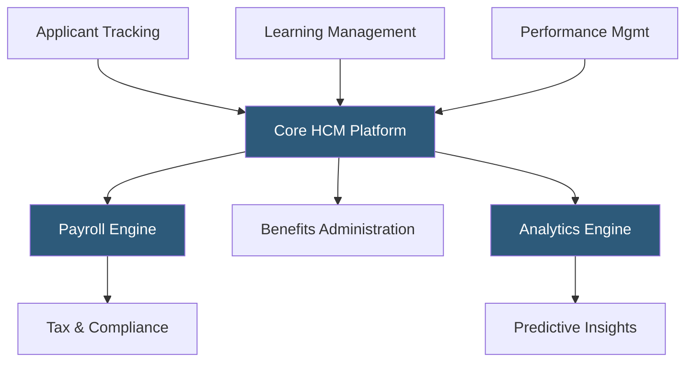

**Category:** Payroll Platforms
**Difficulty:** Advanced
**Reading time:** 6 min read

---

Paychex Flex Enterprise is the top tier of the Paychex Flex platform, designed for mid-to-large businesses that need comprehensive HCM capabilities including advanced analytics, full talent management, and deep customization options alongside core payroll. Enterprise adds applicant tracking, learning management, performance management, and custom analytics reporting on top of the core payroll and HR foundation. It includes a dedicated HR business partner alongside the payroll specialist relationship established at lower tiers.

- **HR Business Partner** — a senior Paychex HR consultant assigned to Enterprise clients, providing strategic HR guidance beyond transactional payroll support
- **Applicant Tracking System (ATS)** — integrated recruitment module for posting jobs, managing candidates, and onboarding new hires directly into payroll
- **Learning Management System (LMS)** — a training and compliance course library with tracking for required certifications and employee development programs
- **Performance Management** — goal-setting, review cycles, and performance rating tools that integrate with compensation management
- **Custom Report Builder** — a drag-and-drop reporting interface allowing HR and finance teams to build tailored workforce reports
- **Predictive Analytics** — machine learning models that surface turnover risk scores and engagement insights from payroll and HR data
- **Position Management** — organizational chart tools tracking budgeted vs. filled positions for workforce planning
- **Compensation Planning** — merit increase cycle management with salary range benchmarking and manager approval workflows

Paychex Flex Enterprise extends the Flex platform with a full HCM suite. The applicant tracking module integrates with major job boards (Indeed, LinkedIn, ZipRecruiter) and manages the entire candidate pipeline from application through offer letter. Once a candidate accepts, onboarding workflows automatically generate I-9s, W-4s, and direct deposit authorizations, with completed data flowing directly into payroll records — eliminating duplicate data entry.

The LMS provides access to pre-built compliance courses (harassment prevention, OSHA safety, etc.) and allows organizations to upload custom training content. Completion tracking integrates with performance records, giving managers a complete view of each employee's development.

Performance management cycles are configurable for annual, semi-annual, or continuous review models. Ratings can trigger automatic compensation adjustment workflows, where managers submit merit recommendations within budget guardrails and approvals flow through defined hierarchies before posting to payroll.

Enterprise's analytics layer applies predictive models to flag employees at high turnover risk based on patterns in engagement survey data, tenure, compensation relative to market, and absence patterns. HR teams receive automated alerts with suggested interventions rather than waiting for a resignation.

- Mid-market companies (200–2,000 employees) wanting a full HCM suite with one vendor
- Organizations running formal performance review and compensation planning cycles
- Companies with significant recruiting volume needing ATS integrated with payroll
- HR teams wanting predictive analytics to proactively address retention
- Businesses requiring structured compliance training with completion tracking

| Advantage | Disadvantage |
|-----------|--------------|
| Full HCM suite from one vendor reduces integration complexity | Higher total cost than assembling best-of-breed point solutions |
| HR Business Partner provides strategic HR support | Implementation and configuration timeline can span several months |
| Predictive analytics surface retention risks proactively | UI depth can overwhelm smaller HR teams not ready for full HCM |
| Continuous data flow from recruit to retire eliminates reconciliation | Customization options less extensive than Workday or SAP |

- [Paychex Flex Payroll](paychex-flex-payroll.md)
- [Paychex Flex Select](paychex-flex-select.md)
- [Workday HCM Payroll](workday-hcm-payroll.md)

---
*Part of the [Payroll Platforms](index.md) category · [Back to Master Index](../../index.md)*
