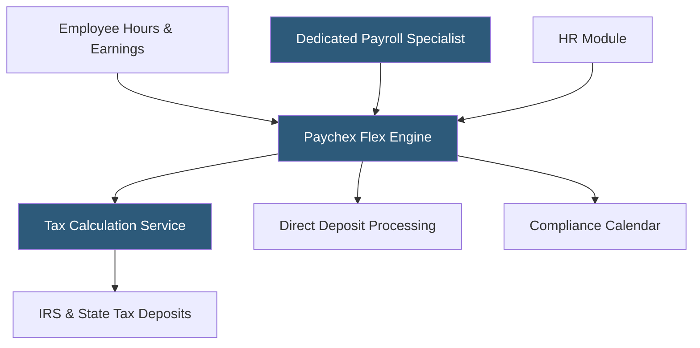

**Category:** Payroll Platforms
**Difficulty:** Intermediate
**Reading time:** 6 min read

---

Paychex Flex is a scalable cloud-based payroll and HR platform from Paychex serving businesses from 1 employee to enterprise scale, offering three plan tiers (Flex Essentials, Flex Select, Flex Enterprise) with increasing levels of HR functionality. It combines Paychex's decades of payroll compliance expertise with modern SaaS delivery, providing automated tax filing, dedicated payroll specialists, and integration with hundreds of third-party business applications. The platform's distinguishing feature is access to human payroll specialists alongside the self-service portal.

- **Dedicated Payroll Specialist** — each Paychex account is assigned a named human specialist for personalized support and compliance guidance
- **Paychex Flex Time** — integrated time and attendance module that feeds hours directly into payroll with manager approval workflows
- **Pre-check** — an employee self-review feature where workers verify their payroll data before the run finalizes, reducing corrections
- **Responsible Party Alerts** — automated notifications to administrators when tax payments or filings are due or completed
- **Paychex Insurance Agency** — in-house broker offering workers' compensation and business insurance alongside payroll
- **Learning Management** — Flex Enterprise includes an LMS for employee training with hundreds of pre-built courses
- **HR Analytics** — benchmarking dashboards comparing the company's compensation and turnover against industry peers
- **SUI (State Unemployment Insurance)** — state-level unemployment tax automatically calculated, remitted, and filed by Paychex

Paychex Flex runs payroll on a configurable schedule, aggregating hours from its native time module or imported from integrated time systems. The payroll calculation engine applies earnings codes, differential pay rates, shift premiums, and deductions before computing gross-to-net figures for each employee record.

Tax calculation leverages Paychex's proprietary tax compliance database, which is updated continuously to reflect changes in federal, state, and local tax laws. Paychex employs a dedicated government relations team that monitors legislative sessions in all 50 states to ensure the platform's tax tables remain current. The system calculates FICA withholding, federal income tax using IRS withholding tables, FUTA, state income tax, SUI, and any applicable local taxes.

The platform's Pre-check feature sends employees a notification 2–3 days before payday allowing them to review their expected net pay, deductions, and hours before the payroll is finalized. This proactive step significantly reduces the need for off-cycle corrections and retroactive adjustments that cost administrative time and bank fees.

After payroll runs, Paychex automatically drafts funds from the employer's account for tax deposits and remits them to the appropriate agencies on legally required schedules (semi-weekly or monthly for federal deposits depending on lookback period). Quarterly 941 filings and annual W-2 production and delivery are fully managed.

Paychex Flex integrates with 200+ business applications including QuickBooks, Xero, Microsoft Dynamics, and major benefit carriers via its Marketplace.

- Small businesses wanting payroll with a human expert on speed dial
- Companies with complex time and attendance requirements needing tight payroll integration
- Organizations seeking workers' compensation insurance alongside payroll administration
- Businesses in regulated industries needing robust compliance documentation
- Mid-market companies scaling through rapid headcount growth

| Advantage | Disadvantage |
|-----------|--------------|
| Dedicated specialist provides personalized compliance support | Higher price point than purely self-service alternatives |
| Pre-check feature reduces payroll correction rates | Setup and configuration requires working through a sales process |
| Strong compliance track record with 50+ years in payroll | Interface less modern than newer competitors like Gusto or Rippling |
| Scales from 1 employee to enterprise without platform migration | Pricing is quote-based and less transparent than flat-rate competitors |

- [ADP Workforce Now](adp-workforce-now.md)
- [Gusto Payroll Platform](gusto-payroll-platform.md)
- [OnPay Payroll Service](onpay-payroll-service.md)

---
*Part of the [Payroll Platforms](index.md) category · [Back to Master Index](../../index.md)*
