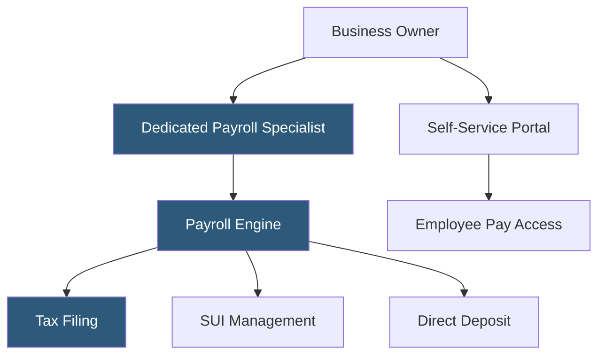

**Category:** Payroll Platforms
**Difficulty:** Beginner
**Reading time:** 5 min read

---

Paychex Flex Select is the mid-tier offering within the Paychex Flex product line, targeting growing small businesses that need more than basic payroll but aren't ready for full enterprise HR capabilities. It adds dedicated payroll specialist support and state unemployment insurance (SUI) management on top of the core payroll engine, along with access to HR resources and an employee self-service portal. Select sits between the entry-level Essentials and the full-featured Enterprise tier.

- **Dedicated Payroll Specialist** — a named Paychex representative who handles setup, answers questions, and assists with payroll runs for Select subscribers
- **SUI Management** — assistance managing state unemployment insurance registrations, rate notices, and claims responses across multiple states
- **Employee Self-Service Portal** — web and mobile access where employees view pay stubs, W-2s, and benefits information
- **HR Library** — a repository of compliance documents, job description templates, and HR policy guides included with Select
- **Paychex Preview** — the payroll review interface for verifying wages and deductions before final submission
- **General Ledger Service** — automated export of payroll data to accounting software as journal entries
- **Time & Attendance Integration** — optional add-on connecting time tracking to payroll to eliminate manual hour entry
- **Benefits Administration** — optional module for managing health, dental, and vision enrollments tied to payroll deductions

Paychex Flex Select operates on the same underlying Paychex Flex platform as other tiers but unlocks the dedicated specialist relationship as its primary differentiator. Unlike self-service payroll tools, Select clients are assigned a named payroll specialist who learns the business's payroll patterns, handles exception scenarios, and serves as the first point of contact for questions and issues.

During payroll runs, the business owner or office manager enters hours or confirms salaries through the Flex portal or mobile app. The payroll specialist is available to walk through the process, handle off-cycle runs like bonuses, and assist with corrections. The system calculates all taxes automatically and initiates ACH transfers for direct deposit.

SUI management adds meaningful value for businesses operating in multiple states. Paychex monitors SUI rate notices, assists with responding to unemployment claims, and helps maintain correct registration in each state where employees work. This proactive compliance support prevents rate increases from unchallenged claims.

The HR library provides document templates and a compliance hotline, giving small businesses access to basic HR guidance without hiring HR staff. Reports on labor cost, turnover, and pay history are accessible through the Flex dashboard at any time.

- Small businesses with 10–50 employees who want a human point of contact for payroll questions
- Companies processing payroll across multiple states needing SUI management assistance
- Business owners who prefer guided payroll over fully self-service platforms
- Growing companies that anticipate needing more HR resources as they scale
- Organizations transitioning off manual payroll who want setup support

| Advantage | Disadvantage |
|-----------|--------------|
| Dedicated specialist reduces errors for non-payroll experts | Higher cost than self-service platforms like Gusto or OnPay |
| SUI management prevents unnecessary rate increases | Specialist availability can vary during peak tax seasons |
| Scales up to Paychex Flex Enterprise without platform migration | Less modern UI compared to newer cloud-native payroll tools |
| Access to HR library for compliance guidance | Some advanced features require upgrading to Enterprise tier |

- [Paychex Flex Payroll](paychex-flex-payroll.md)
- [Paychex Flex Enterprise](paychex-flex-enterprise.md)
- [OnPay Payroll Service](onpay-payroll-service.md)

---
*Part of the [Payroll Platforms](index.md) category · [Back to Master Index](../../index.md)*
