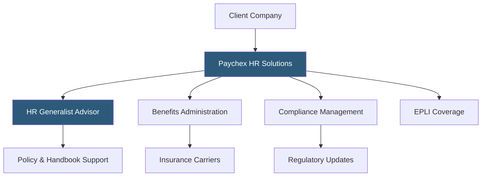

**Category:** Payroll Platforms
**Difficulty:** Intermediate
**Reading time:** 5 min read

---

Paychex HR Solutions is the standalone HR services arm of Paychex, offering PEO (Professional Employer Organization) and ASO (Administrative Services Organization) models that layer HR expertise, compliance management, and benefits administration onto existing payroll operations. Businesses can engage Paychex HR Solutions without migrating payroll, making it suitable for companies with established payroll systems who need expert HR support. The service ranges from on-demand HR consulting to fully outsourced HR administration.

- **ASO (Administrative Services Organization)** — an HR outsourcing model where the provider administers HR functions but the client remains the sole employer of record, unlike PEO co-employment
- **HR Generalist Support** — access to certified HR professionals who advise on employee relations, policy development, and compliance questions
- **Employee Handbook Builder** — a tool for creating legally compliant handbooks customized to state-specific requirements
- **EPLI (Employment Practices Liability Insurance)** — coverage protecting employers against claims of wrongful termination, discrimination, and harassment
- **Safety & Compliance Audits** — periodic reviews of workplace safety practices, OSHA compliance, and HR documentation
- **Benefits Marketplace** — access to group health, dental, vision, and voluntary benefits negotiated through Paychex's pooled buying power
- **Termination Support** — guidance and documentation templates for managing layoffs, separations, and COBRA notifications
- **HR Compliance Hotline** — a staffed phone line for immediate guidance on employment law questions

Paychex HR Solutions operates independently from payroll processing, meaning companies can use it alongside any payroll platform. Under the ASO model, Paychex administers HR functions while the client retains full employer-of-record status — a key distinction from PEO arrangements that alter the legal employment relationship.

Each client is assigned an HR generalist who learns the business and serves as an ongoing advisor for employee relations issues, handbook updates, and compliance questions. When a state passes new employment law (paid sick leave, salary transparency, predictive scheduling), the HR generalist proactively notifies the client and provides updated policy templates.

Benefits administration involves Paychex managing carrier relationships, processing enrollments and qualifying life events, reconciling insurance bills, and handling ACA compliance reporting. The pooled buying power across Paychex's client base can produce more competitive rates than an individual company could negotiate directly.

EPLI coverage, which protects against employment-related lawsuits, is bundled into some HR Solutions packages. This is particularly valuable for small to mid-sized businesses that lack in-house legal counsel. When a claim arises, Paychex provides guidance through the investigation and response process.

- Companies with established payroll systems needing add-on HR expertise without migrating platforms
- Small businesses wanting HR support without hiring a full-time HR director
- Organizations in regulated industries needing proactive compliance monitoring
- Companies facing rapid headcount growth that outpaces internal HR capabilities
- Businesses wanting professional guidance during sensitive employee relations situations

| Advantage | Disadvantage |
|-----------|--------------|
| Works alongside existing payroll platforms without migration | Additional cost layer on top of existing payroll expense |
| ASO model preserves employer-of-record status unlike PEO | Less integrated than a full HCM suite from a single vendor |
| Proactive compliance updates from dedicated HR generalists | HR advisor relationships can vary in quality and responsiveness |
| EPLI coverage reduces legal exposure | Not a substitute for in-house HR for complex organizations |

- [Paychex Flex Payroll](paychex-flex-payroll.md)
- [ADP TotalSource PEO](adp-totalsource-peo.md)
- [Justworks PEO Platform](justworks-peo-platform.md)

---
*Part of the [Payroll Platforms](index.md) category · [Back to Master Index](../../index.md)*
