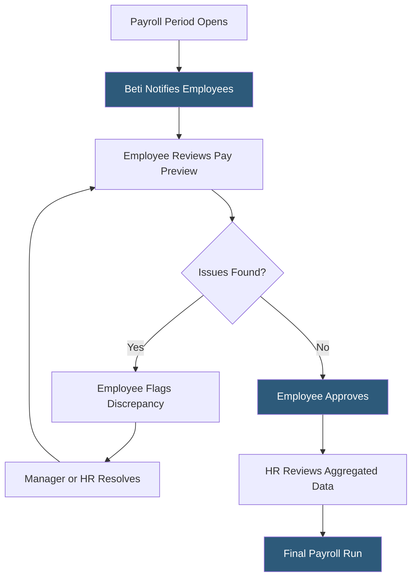

**Category:** Payroll Platforms
**Difficulty:** Intermediate
**Reading time:** 5 min read

---

Beti (Be the Employee) is Paycom's patented employee-driven payroll feature that prompts employees to review, verify, and approve their own payroll data before HR finalizes the pay run. By catching errors at the source — before the payroll engine runs its final calculations — Beti reduces payroll corrections, off-cycle adjustments, and compliance issues. The system surfaces issues directly to the employee who can correct them immediately, fundamentally changing who is responsible for payroll accuracy.

- **Employee-Driven Payroll** — a paradigm where employees take an active role in verifying payroll inputs rather than HR reviewing employee data
- **Pre-Payroll Preview** — a projected pay stub showing the employee what they will receive based on current data, before final processing
- **Guided Correction Workflow** — step-by-step prompts guiding employees to review each component of their pay and flag discrepancies
- **Error Resolution Flags** — automated alerts to employees when their data has potential issues such as missing hours, incorrect deductions, or outdated tax withholding
- **Payroll Audit Trail** — a log recording which employees reviewed their data, what changes were made, and when approvals were submitted
- **Deadline Notifications** — automated reminders sent to employees who haven't completed their Beti review as the payroll deadline approaches
- **Manager Escalation** — automatic escalation to manager when employee-identified discrepancies require HR or manager resolution
- **ROI Measurement** — Paycom tracks and reports the number of errors caught by Beti vs. post-payroll corrections to quantify the feature's value

Beti operates continuously throughout the pay period rather than at period-end. As hours are worked, deductions are processed, and data changes are made, Beti maintains a running projected pay stub visible to each employee. The system sends notifications — via the Paycom mobile app and email — prompting employees to check their data at defined intervals before the payroll deadline.

When employees access their Beti review, they see a projected pay stub with each component clearly labeled: regular hours, overtime, deductions by category, employer contributions, and projected net pay. The system highlights items requiring attention — hours that haven't been approved, deductions that have changed from the previous period, or withholding elections that appear inconsistent with the employee's life situation.

Employees can review and confirm data that looks correct, or flag items for correction. When they flag an issue, Beti routes it to the appropriate person — a missed timesheet approval goes to the employee's manager, a benefits deduction question goes to HR, a tax withholding question prompts the employee to update their W-4. The workflow ensures corrections happen before the payroll run rather than as post-payroll adjustments.

From HR's perspective, Beti provides a completion dashboard showing how many employees have reviewed their data, what issues have been flagged and resolved, and which employees haven't completed their review. This gives HR visibility into potential issues before running payroll.

- Organizations with high rates of payroll corrections and off-cycle check requests
- Companies with distributed hourly workforces where missed punches are common
- HR teams looking to reduce the administrative burden of investigating and correcting payroll errors
- Organizations wanting documentation that employees verified their own payroll data
- Finance teams needing predictable payroll costs without frequent after-the-fact adjustments

| Advantage | Disadvantage |
|-----------|--------------|
| Catches errors before payroll runs, reducing costly corrections | Requires employee adoption and compliance with review prompts |
| Shifts accountability to employees who have direct knowledge of their data | Some employees find the additional step burdensome compared to passive payroll |
| Provides an audit trail of employee data verification | Effectiveness depends on employee engagement with the Paycom mobile app |
| Reduces HR time spent on post-payroll investigations | Only available within the Paycom ecosystem; not available as a standalone tool |

- [Paycom Payroll Platform](paycom-payroll-platform.md)
- [Paylocity Payroll & HCM](paylocity-payroll-hcm.md)
- [Workday HCM Payroll](workday-hcm-payroll.md)

---
*Part of the [Payroll Platforms](index.md) category · [Back to Master Index](../../index.md)*
