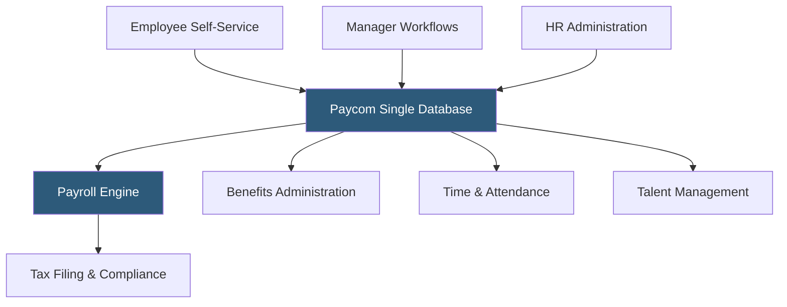

**Category:** Payroll Platforms
**Difficulty:** Intermediate
**Reading time:** 6 min read

---

Paycom is a cloud-based HCM platform built on a single-database architecture where all HR functions — payroll, time, benefits, talent, and analytics — share one system of record, eliminating integrations between modules. Targeting mid-market and enterprise companies with 50–10,000 employees, Paycom differentiates through its employee-usage model that shifts routine HR tasks to employees themselves, reducing HR administrative burden. Its proprietary Beti system is the most prominent example of this philosophy, allowing employees to verify and approve their own payroll before submission.

- **Single-Database Architecture** — one database serving all Paycom modules, ensuring all data is immediately consistent without synchronization
- **Beti (Be the Employee)** — Paycom's employee-driven payroll feature where employees review and correct their own payroll data before submission
- **GONE** — Paycom's time-off management system using AI to approve or flag time-off requests based on coverage requirements
- **Direct Data Exchange** — Paycom's integration framework connecting its single database to external systems via API
- **Manager on-the-Go** — a mobile app allowing managers to approve time cards, time-off requests, and HR actions from their phones
- **Ask Here** — an internal HR communication tool within Paycom for employees to submit HR questions and receive responses
- **Tax Rate Notifications** — Paycom's proactive alerts when state or local tax rates change requiring employer action
- **Paycom Learning** — an integrated LMS supporting compliance training and employee skill development

Paycom's single-database design means every HR transaction updates the same system of record immediately. When an employee updates their address, the change is available to payroll, benefits, and compliance modules instantly — there is no nightly sync or integration delay. This architecture eliminates an entire category of errors that multi-system HCM suites face.

The Beti feature inverts the traditional payroll approval process. Rather than HR running payroll and employees reviewing pay stubs after the fact, Beti prompts employees during the pay period to verify their hours, deductions, and personal data. Employees see a preview of their upcoming paycheck and are prompted to flag discrepancies before the payroll run is finalized. This shifts error detection earlier in the process, when corrections are easier and less costly.

The GONE (Get Out and Never Error) time-off system applies business rules to time-off requests: checking coverage thresholds by shift, department, and date to automatically approve requests that meet criteria and flag those requiring manager review. This reduces the manager burden of manually reviewing every request while maintaining appropriate staffing levels.

Paycom assigns dedicated service representatives to each client and provides a single point of contact for all questions across payroll, benefits, and HR — unlike platforms where different modules have separate support channels. Implementation is handled by a Paycom team and typically runs 3–6 months depending on configuration complexity.

- Mid-market organizations frustrated with data inconsistencies across multi-vendor HCM ecosystems
- HR teams wanting to reduce administrative time through employee self-service
- Companies with complex time and attendance scenarios (multiple shifts, overtime rules, schedules)
- Organizations wanting integrated learning management alongside payroll
- Finance teams that need real-time payroll cost data without waiting for reconciliation

| Advantage | Disadvantage |
|-----------|--------------|
| Single-database eliminates sync errors between HR modules | Higher price point than modular alternatives at comparable employee counts |
| Beti reduces payroll errors through employee pre-verification | Requires employee adoption; effectiveness depends on staff engagement with the tool |
| Dedicated service representative provides consistent support | Less flexible for organizations wanting best-of-breed point solutions |
| Real-time data consistency across all HR functions | Implementation complexity for organizations migrating from multi-system setups |

- [Paycom Beti Employee-Driven Payroll](paycom-beti-employee-driven-payroll.md)
- [Paylocity Payroll & HCM](paylocity-payroll-hcm.md)
- [ADP Workforce Now](adp-workforce-now.md)

---
*Part of the [Payroll Platforms](index.md) category · [Back to Master Index](../../index.md)*
