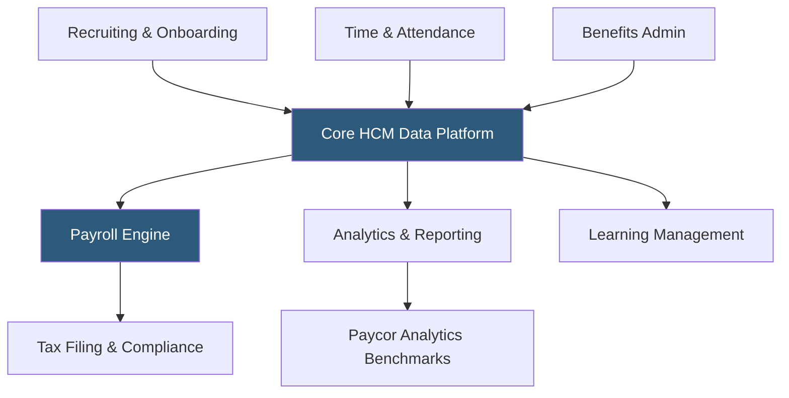

**Category:** Payroll Platforms
**Difficulty:** Intermediate
**Reading time:** 6 min read

---

Paycor is a human capital management platform targeting mid-market businesses with 50–1,000 employees, offering payroll processing, workforce management, talent acquisition, and analytics through a modular suite that companies can configure to their specific needs. Known for its strong time and attendance capabilities and focus on frontline workforce management, Paycor is particularly popular in healthcare, manufacturing, retail, and food service industries. The platform competes directly with ADP Workforce Now and Paylocity in the mid-market segment.

- **HCM Suite** — an integrated stack covering recruiting, onboarding, payroll, time and attendance, benefits, performance, and analytics
- **Workforce Management** — tools for scheduling, time tracking, and labor cost management for hourly and shift-based workforces
- **Paycor Analytics** — embedded predictive analytics and benchmark reporting built on workforce data
- **Compliance Dashboard** — a centralized view of compliance deadlines, filing statuses, and regulatory alerts
- **Paycor Recruiting** — an integrated ATS with job board distribution, candidate communication, and offer letter management
- **On-Demand Pay** — Paycor's earned wage access feature allowing employees to access earned wages before payday
- **Learning Management** — a training module for compliance courses and employee skill development
- **Tax Filing Service** — automated federal, state, and local tax calculations, deposits, and filings

Paycor's platform architecture connects all HR and payroll modules through a shared data model, eliminating manual transfers between systems. When a candidate is hired through Paycor Recruiting, their data flows into onboarding workflows, then into payroll records with no re-entry required. When an employee clocks in via Paycor's time tracking (web, mobile, kiosk, or biometric readers), those hours flow directly into the payroll calculation.

The payroll engine handles complex pay scenarios including overtime rules by state, shift differentials, piece-rate pay, tip credits for hospitality workers, and union contract rules. Multi-state payroll is supported with automatic allocation of wages and taxes across jurisdictions when employees work in multiple states.

Paycor Analytics applies machine learning to HR data, producing turnover predictions, compensation benchmarks against industry peers, and workforce cost projections. These insights are presented through role-specific dashboards — executives see cost and headcount trends, while frontline managers see scheduling compliance and overtime exposure.

On-demand pay through Paycor allows employees to access earned wages between pay periods via a Paycor prepaid card or transfer to their bank. The feature runs as an advance against earned wages, with the advance recovered automatically on the next payroll run, avoiding the regulatory complexity of true early wage access.

- Healthcare organizations with complex scheduling and nurse/clinician credentialing
- Retail and food service companies managing shift-based hourly workforces
- Manufacturing companies with piece-rate pay and safety compliance tracking needs
- Mid-market companies (50–500 employees) wanting full HCM in a modular structure
- Organizations wanting predictive analytics on workforce costs without separate BI tools

| Advantage | Disadvantage |
|-----------|--------------|
| Strong workforce management for hourly and shift-based industries | Implementation can be complex for organizations with intricate pay rules |
| Integrated recruiting-to-payroll workflow eliminates data re-entry | Customer support responsiveness varies by account size |
| On-demand pay supports employee financial wellness | Less recognized brand than ADP or Paychex reduces IT familiarity |
| Embedded predictive analytics without additional BI tools | Mobile app quality has lagged desktop experience historically |

- [ADP Workforce Now](adp-workforce-now.md)
- [Paycom Payroll Platform](paycom-payroll-platform.md)
- [Paylocity Payroll & HCM](paylocity-payroll-hcm.md)

---
*Part of the [Payroll Platforms](index.md) category · [Back to Master Index](../../index.md)*
