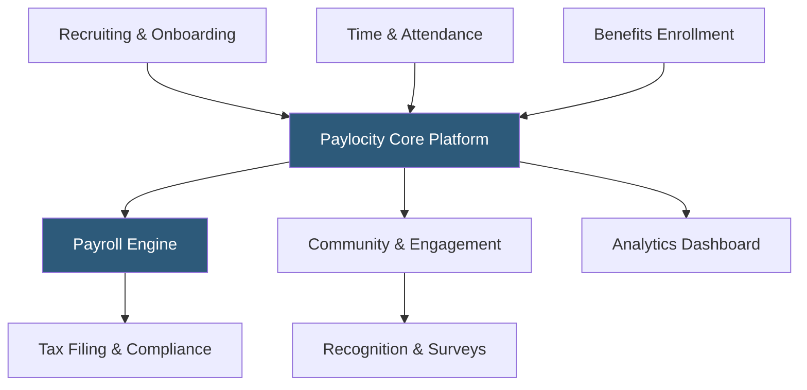

**Category:** Payroll Platforms
**Difficulty:** Intermediate
**Reading time:** 6 min read

---

Paylocity is a cloud-based HCM and payroll platform targeting mid-market companies with 20–1,000 employees, known for strong employee experience features including a social collaboration tool (Community) and an on-demand pay product alongside its core payroll and HR capabilities. Paylocity differentiates from competitors by focusing on employee engagement alongside HR administration, embedding recognition, communication, and learning features directly into the payroll platform.

- **Community** — Paylocity's social collaboration feature enabling company-wide announcements, peer recognition, and team communication within the HCM platform
- **On Demand Payment** — an earned wage access feature allowing employees to withdraw a portion of earned wages before payday
- **Modern Workforce Index** — Paylocity's employee sentiment measurement tool that tracks engagement through brief periodic surveys
- **Paylocity Self-Service** — employee portal for viewing pay stubs, updating personal information, submitting time off, and accessing benefits
- **Data Insights** — Paylocity's analytics layer providing HR and finance dashboards with workforce cost, headcount, and compliance metrics
- **Benefits Administration** — open enrollment management, carrier connections, ACA tracking, and COBRA administration
- **Recruiting & Onboarding** — integrated ATS with job board distribution and automated onboarding checklists
- **LMS** — learning management system for compliance training and employee development

Paylocity's platform connects recruiting, payroll, benefits, and engagement through a unified employee record. When a candidate accepts an offer, their data moves from the ATS directly into onboarding workflows, eliminating re-entry when transitioning from applicant to employee. Onboarding checklists guide new hires through required documentation while managers receive task lists for equipment ordering and first-day orientation.

The payroll engine handles standard and complex scenarios: hourly and salaried employees, multiple pay groups, shift differentials, garnishments, multi-state withholding, and contractor payments. Tax calculations update automatically when the Paylocity compliance team implements regulatory changes, and tax deposits and filings are handled on the employer's behalf.

Community is Paylocity's distinctive feature — a LinkedIn-like social feed embedded in the HCM platform. HR teams can post announcements with photos and videos, managers can recognize employees publicly, and employees can share updates. This increases platform engagement and ensures employees check Paylocity regularly rather than only at payday, creating a natural distribution channel for HR communications.

The Modern Workforce Index sends brief pulse surveys to employees on a regular cadence, aggregating results into engagement scores by department. These scores appear on manager dashboards alongside traditional HR metrics like turnover and absenteeism, giving managers a holistic view of team health.

On Demand Payment allows employees to transfer earned wages to a Paylocity-issued card or their bank account during the pay period, with the advance recovered on the next regular paycheck.

- Mid-market companies wanting employee engagement tools alongside HR and payroll
- Organizations investing in employee experience and recognition programs
- HR teams wanting pulse survey data connected to workforce analytics
- Companies with high hourly turnover that benefit from on-demand pay as a retention tool
- Businesses wanting a modern social collaboration layer within their HCM platform

| Advantage | Disadvantage |
|-----------|--------------|
| Community feature increases HCM platform engagement and HR communication reach | More expensive than standalone payroll tools for companies that don't need engagement features |
| Pulse surveys provide real-time engagement data connected to workforce metrics | Implementation timeline and complexity comparable to other mid-market HCM platforms |
| On-demand pay as a benefits-in-kind differentiator for recruiting | Less customizable for very complex enterprise payroll scenarios |
| Strong integration between recruiting, payroll, and engagement | Community adoption varies widely by organization culture |

- [Paycom Payroll Platform](paycom-payroll-platform.md)
- [Paycor Payroll & HCM](paycor-payroll-hcm.md)
- [ADP Workforce Now](adp-workforce-now.md)

---
*Part of the [Payroll Platforms](index.md) category · [Back to Master Index](../../index.md)*
