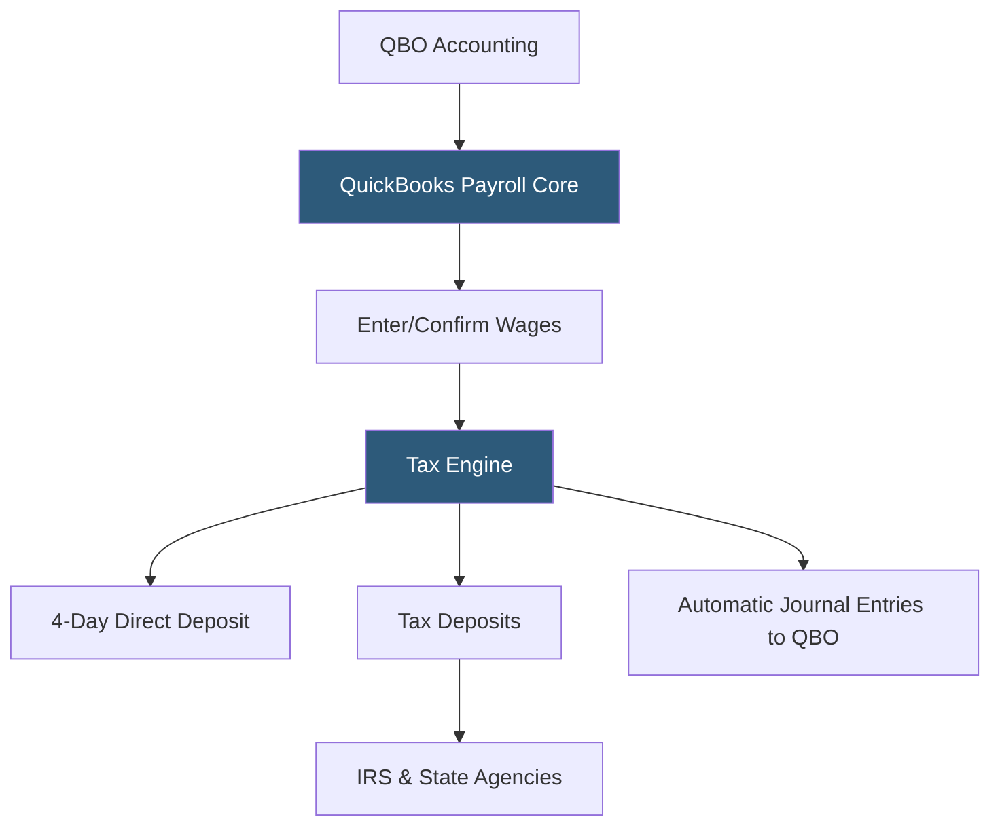

**Category:** Payroll Platforms
**Difficulty:** Beginner
**Reading time:** 5 min read

---

QuickBooks Payroll Core is the entry-level tier of Intuit's payroll service, offering automated payroll processing, full-service tax filing, and direct deposit at the lowest price point in the QuickBooks Payroll lineup. Core is designed for small businesses running straightforward payroll for a small team of employees, with all taxes handled automatically and payroll integrated directly into QuickBooks Online accounting. It includes 4-day direct deposit processing and employee self-service access to pay stubs and W-2s.

- **Full-Service Tax Filing** — Core handles all federal, state, and local payroll tax calculations, deposits, and form submissions automatically
- **4-Day Direct Deposit** — standard processing time where employee funds are deposited four banking days after payroll approval
- **Automatic Payroll** — Core's ability to process recurring payroll for salaried employees automatically on a defined schedule
- **QuickBooks Online Sync** — automatic posting of payroll journal entries to QuickBooks Online after each payroll run
- **QuickBooks Workforce** — the employee self-service portal for viewing pay stubs, W-2s, and updating personal information
- **Workers' Comp** — access to pay-as-you-go workers' comp insurance through AP Intego integration
- **1099 Contractor Filing** — Core processes contractor payments and generates and files 1099-NEC forms annually
- **Basic Reporting** — payroll cost, tax liability, and employee earnings reports accessible from the dashboard

QuickBooks Payroll Core processes payroll through a guided three-step workflow: review employees and their pay, preview the payroll totals, and submit. For salaried employees enrolled in automatic payroll, Core runs without requiring any action from the business owner — it processes on schedule and sends an email confirmation when complete.

Tax calculations use current federal and state withholding tables maintained by Intuit's compliance team. The system determines each employee's federal income tax withholding from their W-4 elections, calculates Social Security and Medicare (employee and employer sides), and computes state withholding for all states where the business has employees. All deposits go to the appropriate agencies on the required schedule.

After payroll processes, all transactions post automatically to QuickBooks Online. Wages appear in the appropriate expense accounts, tax liabilities record in liability accounts until deposits are made, and net pay records in the cash account. This integration means the QuickBooks profit-and-loss statement always reflects actual payroll costs without manual accounting entries.

Employees access their pay stubs and W-2s through QuickBooks Workforce, reducing inbound requests to the business owner. The portal also allows employees to update their direct deposit information and download copies of prior pay stubs independently.

The primary limitations of Core compared to higher tiers are the 4-day (rather than next-day) direct deposit, absence of HR advisor support, and no tax penalty protection guarantee.

- Very small businesses (1–10 employees) with simple salaried payroll
- QuickBooks Online users wanting the most affordable way to integrate payroll
- Solo entrepreneurs paying a small part-time staff
- Businesses where 4-day direct deposit timing is acceptable
- Companies without complex HR needs who just need payroll and tax filing

| Advantage | Disadvantage |
|-----------|--------------|
| Lowest price point in QuickBooks Payroll lineup | 4-day direct deposit slower than Premium/Elite tiers |
| Automatic payroll for salaried staff reduces admin time | No HR support access for employment law questions |
| Full tax filing included despite entry-level pricing | No tax penalty protection; employer assumes risk for errors |
| Native QBO integration handles all journal entries | Limited reporting compared to higher tiers |

- [QuickBooks Payroll](quickbooks-payroll.md)
- [QuickBooks Payroll Premium](quickbooks-payroll-premium.md)
- [Wave Payroll](wave-payroll.md)

---
*Part of the [Payroll Platforms](index.md) category · [Back to Master Index](../../index.md)*
