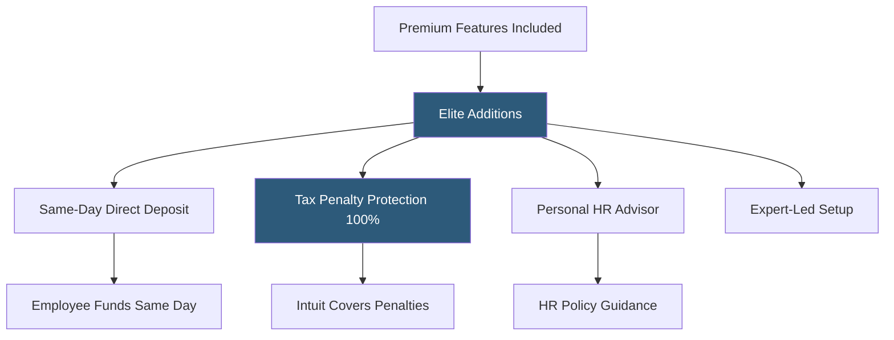

**Category:** Payroll Platforms
**Difficulty:** Intermediate
**Reading time:** 5 min read

---

QuickBooks Payroll Elite is the highest tier in Intuit's payroll lineup, adding same-day direct deposit, full tax penalty protection, a dedicated expert for setup and ongoing support, and personal HR advisory services to the Premium tier's capabilities. Elite is designed for businesses that want maximum convenience and protection — removing operational risk from payroll through guaranteed tax accuracy and giving employees the fastest possible access to their wages through same-day deposit processing.

- **Same-Day Direct Deposit** — payroll approved before 7 AM PT results in employee funds depositing the same business day
- **Tax Penalty Protection** — Intuit covers 100% of penalties and interest if a tax error results from QuickBooks Payroll's calculation
- **Personal HR Advisor** — a named HR advisor assigned to Elite subscribers for ongoing employment law and HR policy guidance
- **Expert Setup** — a dedicated payroll expert handles the initial setup configuration rather than the business owner doing it themselves
- **Personal Payroll Review** — optional service where a QuickBooks expert reviews each payroll run before submission to catch errors
- **Employee Offboarding** — HR advisor assistance with separation documentation, final paycheck requirements, and COBRA notices
- **Ongoing Support Priority** — Elite subscribers receive priority routing in support queues with access to senior agents
- **Compliance Monitoring** — proactive notifications of employment law changes affecting the client's states

QuickBooks Payroll Elite is structured as a maximum-service tier where Intuit takes on more operational responsibility than in lower tiers. The expert-led setup replaces the self-service configuration experience of Core and the expert-review-of-self-setup of Premium — an Intuit payroll specialist handles the entire initial configuration, reducing setup errors for new clients.

Same-day direct deposit requires payroll approval by 7 AM Pacific Time on the pay date. When this deadline is met, employees see funds in their accounts by end of business day — useful for businesses that discover they missed their regular payroll schedule or need to process an emergency payroll run.

The tax penalty protection guarantee is Elite's most financially significant feature. Unlike Core and Premium where the employer retains liability for IRS or state tax penalties even if caused by system errors, Elite shifts this liability to Intuit. If a tax calculation error results in a penalty, Intuit pays the penalty and interest directly. This protection requires the error to originate from QuickBooks Payroll's calculations — it does not cover errors in data the business owner entered incorrectly.

The personal HR advisor provides ongoing access to a named expert rather than the general support queue. This person can answer employment law questions, assist with creating or updating HR policies, help draft termination documentation, and guide compliance with new regulations. The relationship provides continuity that the on-demand HR support at lower tiers does not.

- Small businesses wanting zero tax liability risk from payroll calculation errors
- Business owners who want full-service setup rather than configuring payroll themselves
- Companies where employees need same-day pay access for financial wellness
- HR-light organizations needing a consistent named HR advisor for ongoing guidance
- Businesses in states with complex employment laws wanting proactive compliance monitoring

| Advantage | Disadvantage |
|-----------|--------------|
| Tax penalty protection eliminates financial risk from payroll calculation errors | Highest monthly cost per employee in the QuickBooks lineup |
| Same-day deposit serves employees needing immediate wage access | Same-day deposit requires 7 AM PT approval cutoff, limiting same-day flexibility for afternoon approvals |
| Expert-led setup reduces initial configuration errors | Named HR advisor is not a substitute for employment attorney in legal disputes |
| Personal HR advisor provides continuity for ongoing HR questions | Elite features add cost that may not justify for very simple payroll operations |

- [QuickBooks Payroll Premium](quickbooks-payroll-premium.md)
- [QuickBooks Payroll](quickbooks-payroll.md)
- [Gusto Concierge Plan](gusto-concierge-plan.md)

---
*Part of the [Payroll Platforms](index.md) category · [Back to Master Index](../../index.md)*
