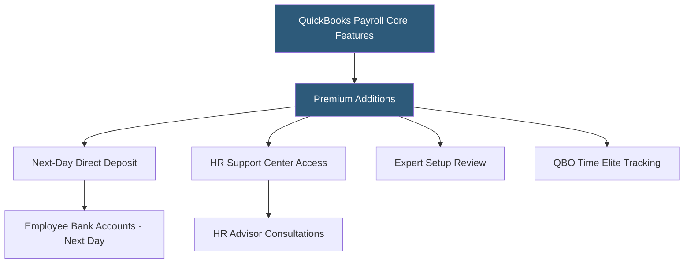

**Category:** Payroll Platforms
**Difficulty:** Beginner
**Reading time:** 5 min read

---

QuickBooks Payroll Premium is the mid-tier offering in Intuit's payroll lineup, adding next-day direct deposit, HR support access, expert setup review, and QuickBooks Time Elite time tracking to the Core tier's automated tax filing and QuickBooks integration. Premium targets growing small businesses that need faster direct deposit processing and occasional HR guidance but don't require the same-day deposit or full tax penalty protection available in the Elite tier.

- **Next-Day Direct Deposit** — employees receive funds in their bank accounts by the next banking day after payroll approval, faster than Core's 4-day processing
- **HR Support Center** — access to certified HR advisors for questions about employment law, handbook policies, and employee relations
- **Expert Review** — a Payroll Setup expert reviews the business's initial payroll configuration to check for common errors
- **QuickBooks Time Elite** — the premium tier of QuickBooks' time tracking app, included with Premium, supporting geofencing and project time tracking
- **Workers' Comp Administration** — pay-as-you-go workers' comp through AP Intego, tiered to actual payroll amounts
- **Same-Day Deposit Availability** — Premium subscribers can process same-day direct deposit for an additional per-transaction fee
- **Tax Payment Guarantee** — Intuit guarantees accurate tax filings; if an error occurs, they pay the penalty (Note: full penalty protection requires Elite)
- **24/7 Support** — Premium clients have access to extended support hours compared to Core

QuickBooks Payroll Premium builds directly on the Core foundation — all Core features are included, with the following enhancements active from subscription start.

Next-day direct deposit changes the operational timing significantly for businesses where cash flow is tight. Under Core, payroll must be approved four banking days before payday. Premium requires only one banking day lead time, giving business owners more flexibility to confirm hours and approve payroll closer to the pay date. This is particularly valuable for businesses with variable weekly hours.

The HR Support Center provides access to live HR advisors by phone or chat for questions about hiring, terminations, leave policies, and federal/state employment law compliance. While not a replacement for legal counsel in complex situations, this service answers the majority of practical HR questions small businesses encounter — for example, questions about required FMLA paperwork, final paycheck timing requirements, or whether a role should be classified as exempt or non-exempt.

QuickBooks Time Elite is the advanced tier of Intuit's time tracking application, supporting geofenced clock-in/out (ensuring employees are physically at work locations when clocking in), project-based time tracking for billing purposes, and mileage tracking. Employee time tracked in QuickBooks Time syncs automatically to QuickBooks Payroll for calculation.

The expert setup review is a one-time service where a payroll specialist reviews the initial configuration — checking tax IDs, pay schedules, deductions, and employee data — to catch errors before the first payroll run.

- Small businesses where 4-day lead time limits flexibility in confirming hours before payday
- Businesses with hourly employees needing project or location-based time tracking
- New businesses wanting a setup review to ensure correct initial configuration
- Companies that periodically need HR guidance without needing a full HR advisor relationship
- QuickBooks Time users who want the premium time tracking features included in their plan

| Advantage | Disadvantage |
|-----------|--------------|
| Next-day deposit provides flexibility for variable-hours businesses | Higher monthly cost than Core with incremental rather than transformative features |
| HR Support Center answers the majority of practical small business HR questions | HR advisors provide guidance, not representation; complex issues require attorneys |
| QuickBooks Time Elite included adds geofencing and project tracking | Tax penalty protection is still not fully covered (requires Elite tier) |
| Expert setup review prevents common initial configuration errors | Same-day deposit still incurs per-transaction fees at this tier |

- [QuickBooks Payroll Core](quickbooks-payroll-core.md)
- [QuickBooks Payroll Elite](quickbooks-payroll-elite.md)
- [OnPay Payroll Service](onpay-payroll-service.md)

---
*Part of the [Payroll Platforms](index.md) category · [Back to Master Index](../../index.md)*
