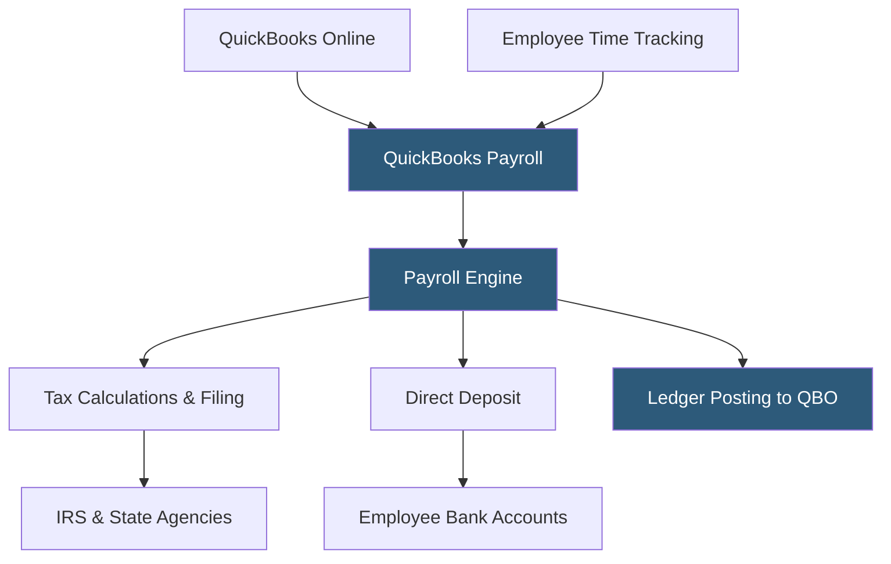

**Category:** Payroll Platforms
**Difficulty:** Beginner
**Reading time:** 5 min read

---

QuickBooks Payroll is Intuit's cloud-based payroll service that integrates natively with QuickBooks Online accounting software, making it a natural choice for the millions of small businesses already using QuickBooks for bookkeeping. It offers three service tiers — Core, Premium, and Elite — with automated tax filing, direct deposit, and employee self-service. The deep accounting integration means payroll transactions post automatically to QuickBooks ledger accounts, eliminating the journal entry work typically required when payroll and accounting are separate systems.

- **Automatic Payroll** — a feature that processes payroll automatically on a set schedule for employees with consistent salaries, with email notifications when runs complete
- **QuickBooks Integration** — bi-directional data sync where payroll transactions post as journal entries to QuickBooks Online automatically after each run
- **Next-Day Direct Deposit** — available on Premium and Elite tiers, ensuring funds reach employees by the next banking day
- **Same-Day Direct Deposit** — available on Elite tier, enabling funds to reach employee accounts the same business day payroll is approved
- **HR Support Center** — access to HR advisors (Premium and Elite) for guidance on employment law and HR questions
- **Tax Penalty Protection** — Elite tier coverage where Intuit handles any tax penalties caused by its own payroll calculation errors
- **Workers' Comp Administration** — pay-as-you-go workers' comp through AP Intego, available across tiers
- **Contractor Payments** — 1099 contractor payment processing with automated 1099-NEC generation and e-filing

QuickBooks Payroll's primary value is its native connection to QuickBooks Online. After each payroll run, all payroll transactions — wages, deductions, employer taxes, and net pay — post automatically to the appropriate accounts in QuickBooks with no manual journal entry required. This eliminates hours of bookkeeper time each payroll period and ensures the general ledger always reflects current payroll costs.

The payroll engine calculates gross wages, tax withholdings, and net pay for each employee. Automated payroll can process on schedule for salaried employees whose pay doesn't change, with Intuit notifying the business owner by email when the run completes. Variable-pay employees like hourly workers require manager review before approval.

All three tiers include automated federal and state tax filing. The Core tier offers standard 4-day direct deposit, while Premium and Elite offer next-day and same-day processing respectively. Elite adds the tax penalty protection guarantee, where Intuit assumes responsibility for penalties and interest if their system causes tax filing errors.

For businesses using QuickBooks Time (formerly TSheets) for employee time tracking, approved hours flow directly into payroll calculations without manual transfer. This completes an end-to-end time-to-paycheck workflow within the QuickBooks ecosystem.

Employee self-service allows workers to access pay stubs, W-2s, and update direct deposit information through their own QuickBooks Workforce accounts, accessible via web or mobile.

- Small businesses already using QuickBooks Online wanting integrated payroll-to-accounting
- Accountants and bookkeepers managing multiple small business clients on QuickBooks
- Businesses wanting to eliminate manual payroll journal entry work
- Companies using QuickBooks Time wanting direct time-to-payroll automation
- Small businesses wanting the option for same-day or next-day direct deposit

| Advantage | Disadvantage |
|-----------|--------------|
| Native QuickBooks integration eliminates payroll journal entries | Pricing increases significantly across tiers for same-day deposit and HR support |
| Trusted by millions of small businesses already in the Intuit ecosystem | Less competitive outside the QuickBooks accounting ecosystem |
| Automatic payroll for salaried employees reduces admin time | HR features less robust than dedicated HRIS platforms |
| Tax penalty protection on Elite tier provides financial security | Customer support can be slow for billing and complex payroll issues |

- [QuickBooks Payroll Core](quickbooks-payroll-core.md)
- [QuickBooks Payroll Premium](quickbooks-payroll-premium.md)
- [Gusto Payroll Platform](gusto-payroll-platform.md)

---
*Part of the [Payroll Platforms](index.md) category · [Back to Master Index](../../index.md)*
