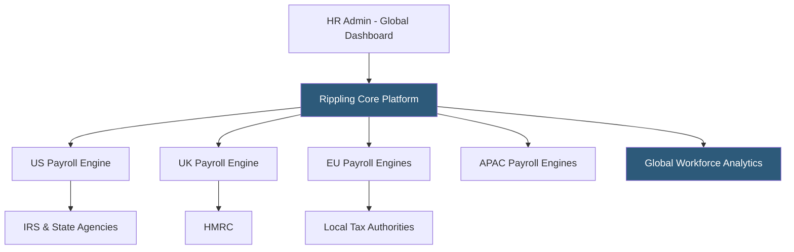

**Category:** Payroll Platforms
**Difficulty:** Advanced
**Reading time:** 6 min read

---

Rippling Global Payroll extends Rippling's unified workforce platform to support payroll processing for employees in multiple countries from a single interface, handling local tax compliance, statutory deductions, and currency conversion for each jurisdiction. Unlike multi-vendor international payroll approaches, Rippling maintains its own country-specific payroll engines rather than relying on third-party local partners, enabling consistent data and workflows across geographies. The platform supports employer-of-record (EOR) services for countries where the company doesn't have a legal entity.

- **Multi-Country Payroll** — processing payroll simultaneously across employees in different countries, each with its own tax rates, filing requirements, and statutory deductions
- **Employer of Record (EOR)** — a legal arrangement where Rippling employs workers in a country on behalf of the client company, enabling hiring without establishing a local entity
- **Statutory Deductions** — country-specific mandatory withholdings such as social insurance, national health contributions, and pension schemes
- **In-Country Payroll Engine** — Rippling's own locally compliant payroll processor (as opposed to outsourcing to a local partner), providing consistency and faster compliance updates
- **Currency Management** — automatic handling of payroll in local currencies with real-time exchange rate application
- **Shadow Payroll** — a parallel payroll calculation for employees on international assignments, used for tax equalization purposes
- **GDPR Compliance** — data handling requirements for European employee payroll data, including data residency and access controls
- **Global Reports** — consolidated workforce cost reports across all countries in a single dashboard view

Rippling Global Payroll operates from a single unified platform where HR administrators manage all employees — domestic and international — through the same interface. When an employee is hired in a new country, the system captures their location and automatically applies the correct compliance framework: statutory deduction rates, mandatory benefits, local holiday calendars, and filing schedules.

Each in-country payroll engine is built to the compliance standards of that jurisdiction. For UK payroll, Rippling handles PAYE (Pay As You Earn), National Insurance contributions, student loan repayments, and RTI (Real Time Information) reporting to HMRC. For Germany, it processes Lohnsteuer, Sozialversicherungsbeiträge, and interfaces with ELSTER for electronic tax filing.

The EOR service enables companies to hire in countries where they have no registered legal entity. Rippling employs the worker directly, handles all local compliance, and bills the client company — functionally enabling global expansion without entity setup costs that can run $50,000–$200,000 per country.

Global reports pull payroll cost data from all countries into consolidated dashboards, giving finance teams visibility into total labor costs by country, department, and cost center regardless of currency, enabling accurate global workforce planning.

- Remote-first companies hiring employees across multiple countries
- Startups expanding internationally without the resources to establish local entities
- Companies wanting a single platform for global headcount rather than multiple regional systems
- HR teams needing consolidated global workforce cost reporting for finance
- Organizations expanding to new markets using EOR before committing to entity formation

| Advantage | Disadvantage |
|-----------|--------------|
| Single platform for all countries eliminates data reconciliation | Premium pricing compared to domestic-only payroll platforms |
| In-country engines provide faster compliance updates than partner-reliant models | EOR fees add 15–25% overhead compared to having a local entity |
| EOR enables rapid hiring in new countries without entity setup | Not all countries are supported; coverage varies |
| Consolidated global reporting for finance | Data residency requirements in some countries can add complexity |

- [Rippling Payroll & HR](rippling-payroll-hr.md)
- [International Payroll Platforms](international-payroll-platforms.md)
- [Workday HCM Payroll](workday-hcm-payroll.md)

---
*Part of the [Payroll Platforms](index.md) category · [Back to Master Index](../../index.md)*
