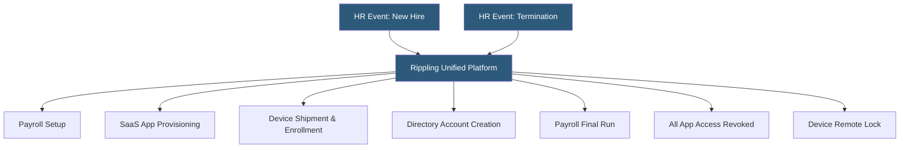

**Category:** Payroll Platforms
**Difficulty:** Intermediate
**Reading time:** 6 min read

---

Rippling IT Management is the device and application management layer of Rippling's unified workforce platform, enabling IT teams to provision and deprovision devices, manage SaaS application access, and enforce security policies from the same system used for payroll and HR. By connecting identity management to the HR record, Rippling automates IT workflows that typically require manual coordination between HR and IT when employees are hired, transferred, or terminated. This integration is a key differentiator from standalone payroll or HR platforms.

- **Device Management (MDM)** — Mobile Device Management capabilities for enrolling, configuring, and remotely wiping company laptops and phones
- **App Management** — provisioning and deprovisioning user accounts across SaaS applications (Slack, Google Workspace, Salesforce, etc.) based on HR triggers
- **HRIS-Driven Automation** — IT workflows triggered automatically by HR events such as new hire, role change, department transfer, or termination
- **Unified Directory** — a single employee identity record shared between HR, payroll, and IT systems, eliminating account synchronization issues
- **Zero-Touch Provisioning** — shipping a pre-configured laptop to a new hire that auto-enrolls in MDM when powered on, requiring no IT involvement
- **Role-Based Access Control (RBAC)** — access permissions assigned based on job role, department, and location rather than manually per person
- **Offboarding Automation** — simultaneous revocation of all system access, device lock, and HR separation processing triggered from one workflow
- **Security Policies** — enforced disk encryption, screen lock timeouts, and OS update requirements pushed to managed devices

Rippling's core architectural insight is that the HR record is the source of truth for every system an employee interacts with. When HR creates a new employee record and assigns them to a department and role, Rippling's automation engine looks up what applications, device configuration, and access levels correspond to that role and executes all provisioning steps in parallel.

For device management, Rippling integrates with Apple Business Manager and Microsoft Intune to apply configuration profiles, install required applications, and enforce security baselines before the device reaches the employee. Zero-touch provisioning means IT ships a sealed box to the employee's home address; when the employee powers it on, the device automatically enrolls in MDM and downloads all required software.

App provisioning covers 500+ pre-built integrations. When HR marks an employee as active, Rippling creates accounts in Google Workspace, Slack, Salesforce, and whatever other tools the role requires — with correct permission levels, group memberships, and license tiers. This process that typically takes IT 1–3 days of manual work completes in minutes.

Termination is equally powerful: a single action in Rippling triggers the final payroll run, deactivates all application accounts simultaneously, sends a remote lock command to the managed device, and creates an offboarding task checklist for the manager. This prevents the common security gap where terminated employees retain access to systems for days or weeks.

- Remote-first companies needing zero-touch device provisioning across distributed locations
- Fast-growing companies where manual IT provisioning can't keep pace with hiring
- IT teams wanting automated offboarding to prevent lingering access after terminations
- Organizations seeking to eliminate the HR-to-IT handoff delay for new hires
- Companies wanting SaaS license cost visibility tied to actual employee headcount

| Advantage | Disadvantage |
|-----------|--------------|
| Eliminates the HR-IT coordination gap for provisioning and offboarding | Requires committing the full IT stack to Rippling's ecosystem |
| Zero-touch provisioning reduces IT burden for remote hires | MDM capabilities less feature-rich than dedicated Jamf or Intune deployments |
| Single platform for HR, payroll, and IT reduces vendor count | Higher platform cost than assembling point solutions independently |
| Automated offboarding closes security gaps from day-one | Configuration complexity increases with organization size |

- [Rippling Payroll & HR](rippling-payroll-hr.md)
- [Rippling Global Payroll](rippling-global-payroll.md)
- [Gusto Complete Plan](gusto-complete-plan.md)

---
*Part of the [Payroll Platforms](index.md) category · [Back to Master Index](../../index.md)*
