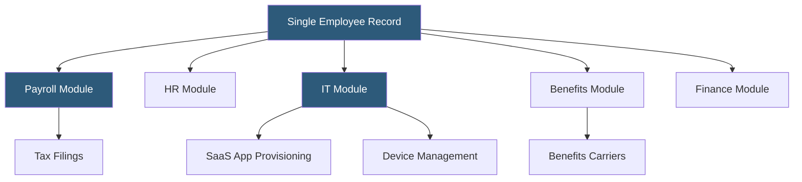

**Category:** Payroll Platforms
**Difficulty:** Intermediate
**Reading time:** 6 min read

---

Rippling is a workforce management platform that unifies payroll, HR, IT, and finance operations on a single employee record, enabling organizations to automate the entire employee lifecycle from onboarding to offboarding. Its compound architecture means that when a new employee is added, Rippling can simultaneously set up payroll, provision devices, assign software licenses, and enroll in benefits without separate data entry in each system. This tight integration distinguishes it from traditional payroll-only or HR-only tools.

- **Compound System** — Rippling's architecture where HR, payroll, IT, and finance share a single unified employee data model
- **Workflow Automations** — trigger-based rules (e.g., "when employee is promoted, update salary and notify IT to upgrade laptop")
- **PEO (Professional Employer Organization)** — Rippling's co-employment option where Rippling becomes the employer of record for benefits and compliance purposes
- **Device Management (MDM)** — Rippling's built-in mobile device management to provision, monitor, and remotely wipe company devices
- **App Management** — automatic provisioning and de-provisioning of SaaS app accounts (Slack, GitHub, Salesforce) based on employee role
- **Rippling Global Payroll** — multi-country payroll processing for international employees through a network of local partners
- **Unity Search** — a global search bar that queries across all Rippling modules simultaneously
- **Custom Report Builder** — drag-and-drop report creation pulling data from any Rippling module

Rippling's core innovation is its unified employee data model. Every piece of information about an employee — job title, department, location, compensation, start date — lives in one record. All modules (payroll, HR, IT, benefits) read from and write to this same record, eliminating the data synchronization issues that plague multi-vendor HR stacks.

When running payroll, Rippling's engine pulls current compensation from the employee record, applies applicable federal, state, and local taxes, processes deductions (benefits, 401k, FSA), and initiates ACH transfers. The platform supports unlimited pay schedules and pay types, including equity compensation tracking and commission calculations via integrations with CRM tools.

The workflow automation engine is particularly powerful: administrators define rules using an if-then logic builder. For example, when an employee's start date arrives, Rippling can automatically enroll them in payroll, send laptop shipping details, provision their email and Slack accounts, and schedule 30-60-90 day check-in meetings — all without HR touching five separate systems.

For global teams, Rippling partners with in-country payroll providers to process payroll in 50+ countries, with each country's records still visible within the same unified interface. Rippling handles currency conversion, local tax filings, and statutory benefits while maintaining a consistent administrative experience.

- Fast-growing tech companies that want to scale HR, IT, and payroll infrastructure simultaneously
- Organizations seeking to reduce the number of HR software vendors in their stack
- Companies with distributed workforces spanning multiple states or countries
- IT teams tired of manually provisioning SaaS tools for each new hire
- Businesses wanting deep automation across the entire employee lifecycle

| Advantage | Disadvantage |
|-----------|--------------|
| Single employee record eliminates cross-system sync errors | Pricing can be high when bundling all modules |
| Workflow automations save significant administrative time | Complexity of setup increases with more modules activated |
| Unified IT and HR reduces offboarding security risks | Some individual modules less feature-rich than best-of-breed alternatives |
| Strong global payroll coverage across 50+ countries | Contract lock-in makes switching vendors difficult |

- [ADP Workforce Now](adp-workforce-now.md)
- [Gusto Payroll Platform](gusto-payroll-platform.md)
- [Workday HCM Payroll](workday-hcm-payroll.md)

---
*Part of the [Payroll Platforms](index.md) category · [Back to Master Index](../../index.md)*
