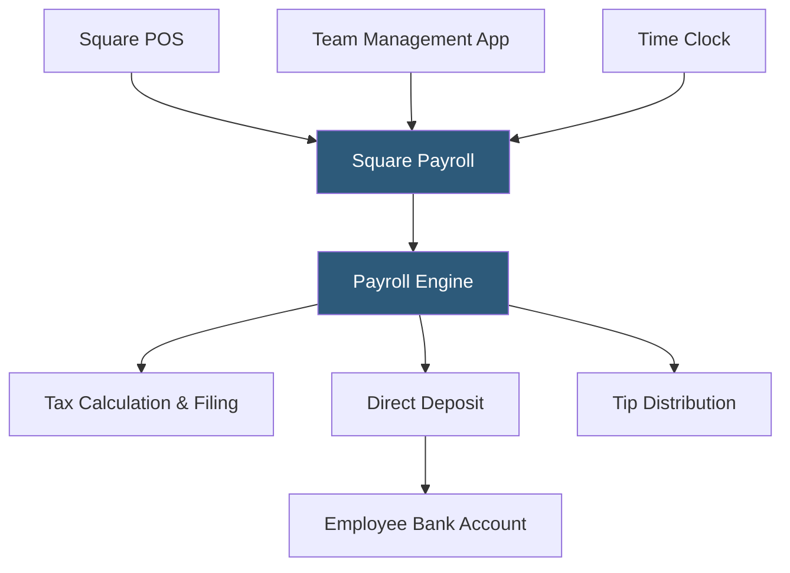

**Category:** Payroll Platforms
**Difficulty:** Beginner
**Reading time:** 5 min read

---

Square Payroll is a full-service payroll platform integrated with Square's point-of-sale and business management ecosystem, designed for small businesses — particularly restaurants, retail shops, and service businesses — that already use Square for payment processing. It handles automated payroll runs, tax filing, and both employee and contractor payments at a transparent per-employee monthly rate. The deep integration with Square's time tracking and tip management features makes it especially convenient for businesses managing hourly employees through the Square POS system.

- **Square POS Integration** — direct connection between Square's point-of-sale system and payroll, enabling tip data and clocked hours to flow automatically into payroll calculations
- **Tip Management** — automated calculation and distribution of credit card tips tracked through Square POS to employees in their paychecks
- **Team Management** — Square's employee scheduling and time clock system that feeds directly into Square Payroll
- **On-Demand Pay** — an earned wage access feature allowing eligible employees to access a portion of earned wages before payday
- **Automated Tax Filing** — full-service tax calculation, deposit, and filing for federal and state payroll taxes
- **Contractor Payments** — 1099 contractor payment processing with automated year-end 1099-NEC generation
- **Workers' Comp Integration** — partnership with NEXT Insurance for pay-as-you-go workers' compensation tied to payroll data
- **Instant Payments** — ability to pay certain employees instantly via the Cash App network

Square Payroll's differentiation is its tight integration with other Square products. When employees clock in and out using Square's Team Management app or the Square POS, those hours are recorded in the payroll system automatically. Tip amounts captured through Square's payment processing are also tracked per employee and automatically calculated into their paychecks based on configured tip distribution rules (hourly-based, point-based, or manual allocation).

Running payroll in Square requires only reviewing the auto-populated data and approving the run. The payroll engine calculates all wages, taxes, and tip amounts, then initiates ACH transfers for direct deposit. Tax deposits are made to the IRS and state agencies on the required schedule, and quarterly 941 returns, annual 940, W-2s, and state equivalents are filed automatically.

For contractors, Square Payroll allows payments via direct deposit or check, with the system tracking year-to-date payments and generating 1099-NEC forms for contractors receiving $600 or more annually.

The instant payment feature leverages Cash App infrastructure. Employees with Cash App accounts can receive payment instantly via the app rather than waiting for ACH settlement, useful for gig-like workers or situations where employees need funds quickly.

On-demand pay through Square gives eligible employees access to a portion of earned wages before their next payday, providing a financial wellness benefit that can improve retention for hourly workforces.

- Restaurants and cafes already using Square POS wanting integrated tip management in payroll
- Retail shops managing hourly employees with Square's time tracking wanting payroll consistency
- Small businesses that want one vendor for payments, POS, and payroll
- Service businesses paying both hourly employees and contractors from one platform
- Micro-businesses wanting transparent per-employee pricing with no hidden fees

| Advantage | Disadvantage |
|-----------|--------------|
| Seamless Square POS integration eliminates manual tip and hours entry | Limited features for complex payroll scenarios beyond straightforward hourly/salary |
| Transparent pricing with no base fee (pay per employee) | Less useful for businesses not already in the Square ecosystem |
| Tip management automation saves significant admin time for hospitality | Advanced HR features require separate Square HR or third-party tools |
| Instant pay via Cash App provides unique flexibility | Workers' comp and benefits integrations less comprehensive than ADP or Gusto |

- [Gusto Payroll Platform](gusto-payroll-platform.md)
- [QuickBooks Payroll](quickbooks-payroll.md)
- [Wave Payroll](wave-payroll.md)

---
*Part of the [Payroll Platforms](index.md) category · [Back to Master Index](../../index.md)*
