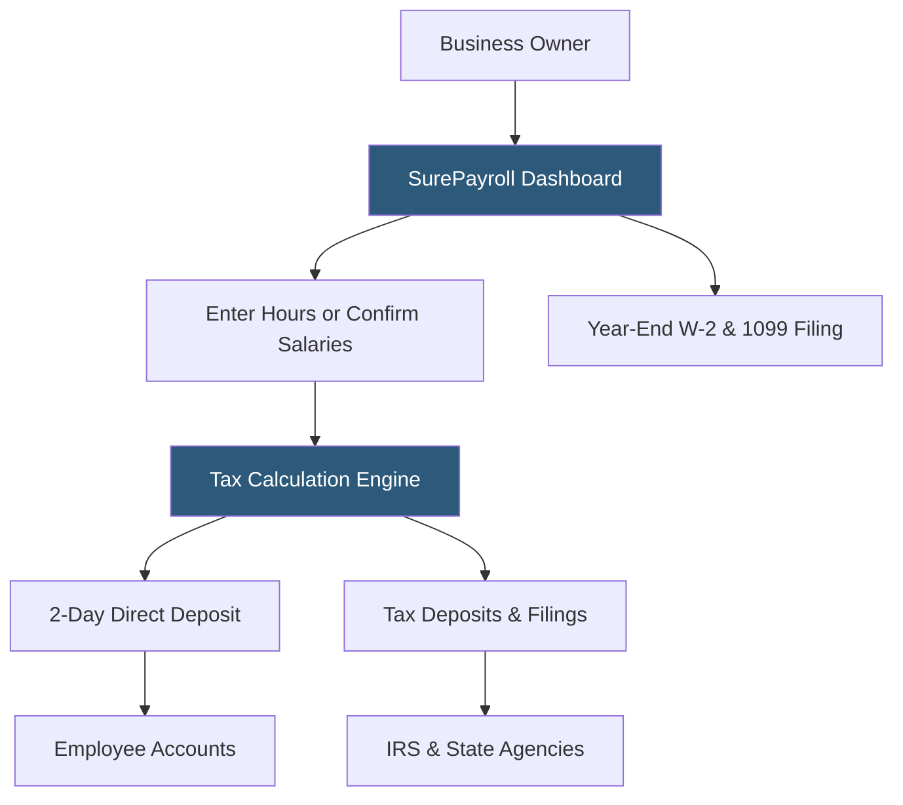

**Category:** Payroll Platforms
**Difficulty:** Beginner
**Reading time:** 5 min read

---

SurePayroll is a small business payroll service owned by Paychex, offering a self-service online payroll platform with full-service tax filing at competitive pricing. Originally founded as an independent company before Paychex acquisition, SurePayroll targets businesses with 1–100 employees that want simple automated payroll without the enterprise complexity of Paychex Flex. It also operates a nanny/household employee payroll service, making it one of the few platforms specifically supporting domestic employer payroll compliance.

- **Self-Service Platform** — employers manage all payroll configuration and run payroll through the SurePayroll website without assigned specialists
- **Full-Service Tax Filing** — SurePayroll calculates, deposits, and files all federal and state payroll taxes automatically
- **Household Payroll** — a dedicated service for families paying household employees (nannies, housekeepers, caregivers) with Schedule H filing support
- **No Base Fee** — SurePayroll's pricing is per-employee with no base platform fee, making it affordable for very small teams
- **Two-Day Direct Deposit** — standard ACH processing delivering funds two banking days after payroll approval
- **Workers' Comp Integration** — pay-as-you-go workers' comp available through SurePayroll's insurance partners
- **Mobile App** — iOS and Android apps for running payroll and viewing reports from mobile devices
- **New Hire Reporting** — automatic state new hire reporting for all employees as required by law

SurePayroll operates as a fully self-service platform, meaning employers configure and manage everything through the web portal without a dedicated representative. This self-service model is how SurePayroll maintains competitive pricing — there is no specialist cost baked into the subscription.

The payroll workflow is straightforward: the employer logs in on payroll day, reviews or enters hours for hourly employees, confirms salaried employees' pay, checks deductions, and clicks to run payroll. SurePayroll calculates all gross wages, withholds taxes based on current tables and employee W-4 elections, and initiates ACH transfers.

Tax compliance is fully automated. SurePayroll determines the correct deposit schedule based on the employer's tax liability (semi-weekly or monthly for FICA, and state-equivalent schedules), makes deposits automatically, and files 941 quarterly reports, 940 annually, and state returns on appropriate deadlines. W-2s are generated and distributed electronically by January 31 each year.

The household payroll service is a differentiated offering that handles the unique compliance requirements of domestic employers: Schedule H filing with the employer's personal tax return, state household employer registrations, and the specific tax rules for household employees including Social Security and Medicare obligations that apply when paying wages above federal thresholds.

As a Paychex subsidiary, SurePayroll benefits from Paychex's compliance infrastructure and tax tables, providing a degree of reliability beyond what independent small payroll providers offer.

- Very small businesses (1–20 employees) wanting full-service tax filing without a specialist relationship
- Families hiring household employees (nannies, caregivers) needing legally compliant payroll
- Business owners who prefer self-service over phone-based support interactions
- Companies wanting transparent per-employee pricing with no platform fees
- Businesses that previously used Intuit Online Payroll looking for a successor platform

| Advantage | Disadvantage |
|-----------|--------------|
| No base platform fee makes it extremely affordable for 1–3 employees | Self-service only; no dedicated payroll specialist available |
| Household payroll service covers a compliance need most platforms ignore | Less feature-rich than Gusto or OnPay at similar price points |
| Backed by Paychex compliance infrastructure | 2-day direct deposit slower than premium tiers at competing platforms |
| Simple interface appropriate for occasional payroll runs | Limited HR features and integration ecosystem |

- [Patriot Payroll](patriot-payroll.md)
- [Paychex Flex Payroll](paychex-flex-payroll.md)
- [Wave Payroll](wave-payroll.md)

---
*Part of the [Payroll Platforms](index.md) category · [Back to Master Index](../../index.md)*
