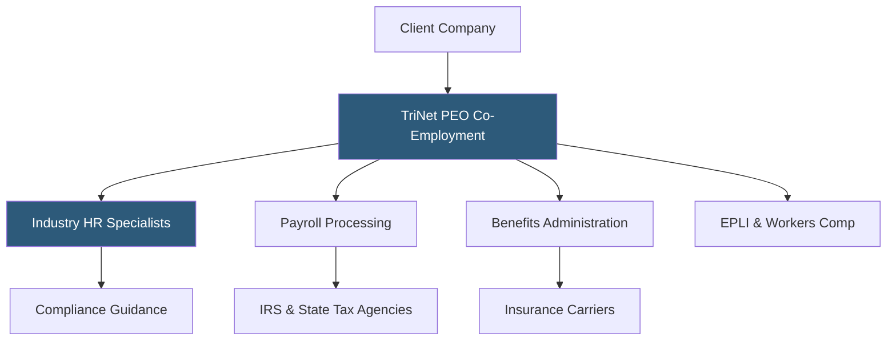

**Category:** Payroll Platforms
**Difficulty:** Advanced
**Reading time:** 6 min read

---

TriNet is a Professional Employer Organization that provides industry-specific PEO services across HR, payroll, benefits, and risk management, targeting small and mid-sized businesses in professional services, technology, financial services, and life sciences. Unlike generalist PEOs, TriNet organizes its service delivery around vertical industry teams with HR specialists who understand the regulatory and talent landscape for each sector. This vertical focus makes TriNet particularly attractive to knowledge-worker companies that need industry-aware compliance and benefits structuring.

- **Vertical Industry Teams** — dedicated HR specialists organized by industry (tech, finance, life sciences, nonprofits) rather than generalist HR support
- **Co-Employment Agreement** — the legal contract establishing TriNet as employer of record for tax and benefits purposes
- **TriNet Benefits Marketplace** — a curated selection of medical, dental, vision, and voluntary benefits negotiated at large-group rates
- **Risk Mitigation** — employment practices liability insurance (EPLI) and workers' compensation coverage bundled with PEO service
- **TriNet HR Platform** — the technology layer providing payroll, HR data management, and employee self-service
- **ESAC & IRS Certification** — TriNet holds both ESAC accreditation and IRS Certified PEO (CPEO) status, providing legal and financial protections
- **International Services** — EOR services for hiring employees outside the US through TriNet entities or partner networks
- **Compliance Calendar** — automated tracking of federal and state compliance deadlines for HR, benefits, and payroll filings

TriNet operates the standard PEO co-employment model but differentiates through its industry vertical structure. When a technology startup signs with TriNet, their account is managed by HR specialists with technology sector backgrounds who understand startup equity compensation, remote work compliance, and tech-industry salary benchmarking. Life sciences clients are served by specialists familiar with clinical trial employee classifications and biotech regulatory environments.

Once co-employment begins, TriNet assumes payroll tax obligations under its own EIN. The TriNet HR platform handles time tracking, expense management, and PTO. Employees are enrolled in TriNet's benefits plans, where the pooled buying power of TriNet's 345,000+ co-employed workers produces competitive rates from major carriers including Aetna, Cigna, Kaiser, and Blue Shield.

EPLI coverage protects clients against employment-related lawsuits. When a discrimination or wrongful termination claim arises, TriNet's risk team provides guidance through the investigation and, if necessary, legal response process. Workers' compensation is handled under TriNet's master policy, simplifying claims management.

TriNet's CPEO (IRS-Certified PEO) status is significant: it allows clients to claim certain tax credits (like R&D credits) even while in a co-employment relationship — a limitation that non-certified PEOs have. This matters particularly for technology companies relying on R&D tax credits.

- Technology startups wanting competitive benefits to compete with large tech employers for talent
- Professional services firms (law, accounting, consulting) wanting specialized HR support
- Life sciences companies with complex employee classification needs
- Financial services firms with regulatory compliance requirements affecting HR practices
- Companies wanting CPEO status to preserve access to tax credits in co-employment

| Advantage | Disadvantage |
|-----------|--------------|
| Industry-vertical HR specialists understand sector-specific needs | Premium pricing compared to generalist PEOs like Justworks |
| CPEO status preserves R&D and other tax credits for clients | Co-employment exit requires re-establishing independent employer accounts |
| Large benefits pool produces competitive rates across major carriers | Technology platform less modern than Justworks or Rippling |
| ESAC accreditation and financial transparency protections | Best suited for 10–1,000 employees; very large companies typically self-administer |

- [ADP TotalSource PEO](adp-totalsource-peo.md)
- [Justworks PEO Platform](justworks-peo-platform.md)
- [Insperity PEO](insperity-peo.md)

---
*Part of the [Payroll Platforms](index.md) category · [Back to Master Index](../../index.md)*
