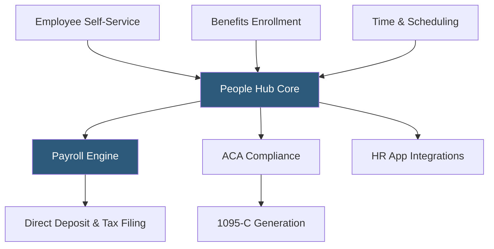

**Category:** Payroll Platforms
**Difficulty:** Intermediate
**Reading time:** 5 min read

---

TriNet Zenefits (formerly Zenefits, acquired by TriNet in 2022) is a cloud-based HR platform for small and mid-sized businesses that combines benefits administration, payroll, and HR management in a modern SaaS interface. Originally launched as a benefits-focused disruption to traditional PEOs, Zenefits became known for automating benefits enrollment and connecting it seamlessly to payroll. Under TriNet ownership, it continues to operate as a standalone brand primarily serving companies of 5–200 employees.

- **Benefits Broker Integration** — Zenefits can serve as the licensed benefits broker for clients, handling insurance carrier negotiations and plan administration
- **Open Enrollment Automation** — guided online enrollment workflows where employees compare and select plans, with elections flowing automatically to payroll deductions
- **ACA Compliance** — automated tracking of ALE (Applicable Large Employer) status, 1095-C form generation, and IRS filing
- **COBRA Administration** — automated COBRA eligibility notices, election processing, and payment collection for terminated employees
- **Time & Scheduling** — integrated time tracking and shift scheduling with payroll sync
- **People Hub** — the centralized employee record system that serves as the single source of truth for HR, benefits, and payroll data
- **App Integrations** — pre-built connectors to 40+ third-party applications including QuickBooks, Slack, Google Workspace, and Salesforce
- **Compliance Assistant** — automated state and federal compliance monitoring with alerts for HR law changes

Zenefits centers on the People Hub, a unified employee record where all HR, benefits, and payroll data is stored. When a new employee is added, the system triggers onboarding workflows covering tax forms, benefits enrollment, and direct deposit setup. Benefits elections made during onboarding or open enrollment automatically sync to payroll as deductions — no manual entry required between the benefits and payroll modules.

As a licensed benefits broker, Zenefits handles carrier negotiations, plan selection guidance, and ongoing carrier management. This is distinct from platforms like Gusto or OnPay that administer deductions but don't provide brokerage services. Zenefits can replace an external benefits broker entirely.

The ACA compliance module tracks hours worked by each employee to determine ALE status and generates 1095-C forms for applicable large employers. Automated alerts notify HR when employee hours approach measurement period thresholds that would create ACA coverage obligations.

Time and scheduling features allow managers to build shift schedules and employees to clock in via the mobile app. Overtime calculations and break rule enforcement apply automatically based on state and local labor laws, with actual hours feeding directly into the payroll run.

The integration ecosystem connects Zenefits to accounting software, productivity tools, and specialty HR applications. Payroll journal entries post to QuickBooks or other accounting systems after each run. SSO provisioning through Okta or Google creates seamless application access management.

- Small businesses wanting benefits brokerage and administration in one platform
- Companies needing automated ACA tracking and 1095-C filing
- Organizations wanting to eliminate manual data transfer between benefits and payroll systems
- HR teams managing open enrollment without an external broker
- Companies wanting COBRA administration automated without a third-party administrator

| Advantage | Disadvantage |
|-----------|--------------|
| Licensed broker capability eliminates separate insurance broker relationship | Regulatory challenges in early history raised compliance concerns (now resolved) |
| Automatic benefits-to-payroll deduction sync removes manual entry | Less feature-rich than enterprise HCM platforms for large organizations |
| Strong ACA compliance automation for applicable large employers | Customer support quality inconsistent across tiers |
| Integrated benefits brokerage, HR, and payroll in one monthly fee | Under TriNet ownership, product direction less transparent |

- [TriNet PEO Services](trinet-peo-services.md)
- [Rippling Payroll & HR](rippling-payroll-hr.md)
- [Gusto Complete Plan](gusto-complete-plan.md)

---
*Part of the [Payroll Platforms](index.md) category · [Back to Master Index](../../index.md)*
