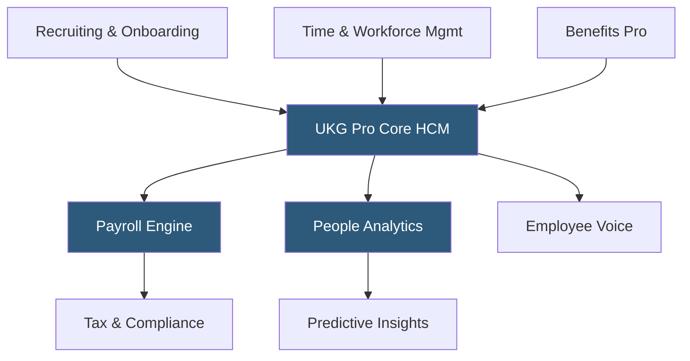

**Category:** Payroll Platforms
**Difficulty:** Advanced
**Reading time:** 6 min read

---

UKG Pro (formerly Ultimate Software UltiPro) is an enterprise HCM platform designed for large organizations with complex payroll, HR, and workforce management needs, resulting from the 2020 merger of Ultimate Software and Kronos into Ultimate Kronos Group (UKG). Pro handles payroll for organizations with 500 to 100,000+ employees, with particular strength in complex compensation structures, robust HR data management, and deep analytics capabilities. It is consistently rated among the top enterprise HCM platforms and maintains a reputation for industry-leading customer satisfaction despite its scale.

- **UKG Pro Payroll** — the core payroll engine supporting highly complex pay scenarios including multi-country, union rules, and complex deduction hierarchies
- **People Analytics** — UKG Pro's ML-powered workforce intelligence layer providing predictive attrition modeling and compensation benchmarking
- **Workforce Management Integration** — tight integration with UKG Dimensions (formerly Kronos Workforce Dimensions) for time and scheduling
- **Employee Voice** — an integrated survey and listening tool for measuring employee sentiment and engagement
- **Great Place to Work Hub** — a recognition and culture measurement feature reflecting UKG's partnership with Great Place to Work Institute
- **Benefits Pro** — benefits administration supporting complex plan structures, FSA/HSA, COBRA, and ACA compliance
- **UKG Pro Recruiting** — an integrated ATS and candidate experience platform
- **Strategic Workforce Planning** — tools for modeling headcount scenarios, succession, and organizational restructuring

UKG Pro's payroll engine is built to handle enterprise-grade complexity. It supports simultaneous processing across multiple business units, countries, and pay groups, with sophisticated rules for union contract provisions, shift differentials, retroactive pay calculations, and deduction priority hierarchies when wages are insufficient to cover all deductions.

The integration with UKG Dimensions (formerly Kronos) for time and workforce management is a key enterprise differentiator. Organizations that use both products get seamless data flow from scheduling through time capture to payroll — approved hours automatically appear in the payroll calculation without manual intervention, and labor cost data flows to finance in real time.

People Analytics uses machine learning to identify patterns predictive of employee turnover. The system scores each employee's flight risk based on factors including tenure, compensation relative to market, recent performance trends, and engagement survey scores. HR business partners receive proactive alerts for high-risk employees, enabling preventive action before resignation.

UKG's customer success model is distinctive at enterprise scale — the company consistently ranks among the highest in customer satisfaction for enterprise HCM, attributing this to a dedicated service model that includes named CSMs and an unusual practice of requiring prospects to speak with customer references before purchase.

- Large enterprises (500+ employees) needing complex multi-entity payroll processing
- Organizations using Kronos time systems wanting tight HCM integration
- Companies with unionized workforces requiring contract-specific pay rule management
- HR leaders wanting predictive attrition analytics tied to compensation benchmarking
- Organizations that prioritize HCM vendor relationship quality alongside features

| Advantage | Disadvantage |
|-----------|--------------|
| Industry-leading customer satisfaction for enterprise HCM | Premium pricing appropriate for large enterprises, not small businesses |
| People Analytics provides actionable predictive workforce intelligence | Implementation scope is extensive (6–18 months for large deployments) |
| Strong Kronos time integration for frontline workforce management | Historical merger integration complexity between UltiPro and Kronos capabilities |
| Supports complex enterprise payroll scenarios without customization | Change management required to drive employee adoption of full feature set |

- [UKG Ready](ukg-ready.md)
- [Workday HCM Payroll](workday-hcm-payroll.md)
- [ADP Vantage HCM](adp-vantage-hcm.md)

---
*Part of the [Payroll Platforms](index.md) category · [Back to Master Index](../../index.md)*
