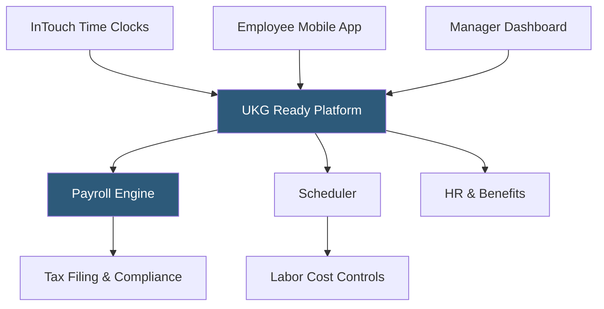

**Category:** Payroll Platforms
**Difficulty:** Intermediate
**Reading time:** 5 min read

---

UKG Ready (formerly Kronos Workforce Ready) is the mid-market tier of UKG's HCM product portfolio, designed for businesses with 100–2,500 employees that need a unified platform for payroll, HR, and workforce management. While UKG Pro targets large enterprises, UKG Ready focuses on the mid-market with particular strength in time and attendance management inherited from Kronos's heritage as the leading workforce management software provider.

- **Workforce Ready Platform** — UKG Ready's unified environment combining payroll, HR, benefits, and time management on a single database
- **Timekeeper** — UKG Ready's time and attendance module with physical time clock support (Kronos InTouch terminals)
- **Scheduler** — rules-based shift scheduling accounting for employee availability, skill requirements, and labor budget constraints
- **Employee Self-Service** — mobile-first access for employees to view pay, request time off, swap shifts, and update information
- **HR Toolkit** — compliance resources, policy templates, and HR workflow tools
- **Tax Filing** — automated federal and state payroll tax calculations, deposits, and returns
- **Workforce Intelligence** — reporting and analytics built on the unified UKG Ready dataset
- **InTouch DX** — UKG's touch-screen time clock hardware that integrates directly with UKG Ready

UKG Ready is architected on Kronos's workforce management foundation, with HR and payroll capabilities integrated around the time and attendance core. This makes it particularly strong for organizations managing large hourly workforces where precise time capture, scheduling optimization, and labor cost management are top priorities.

The physical time clock integration is a differentiator: UKG's InTouch DX terminals capture time punches with biometric verification (fingerprint or facial recognition), eliminating buddy punching. Punch data flows directly into UKG Ready in real time, visible to managers immediately and available for payroll without manual import or data transformation.

The scheduling module applies configurable rules when building shift schedules: matching employee skills and certifications to shift requirements, honoring availability preferences, enforcing rest period rules by state, and staying within defined labor budget guardrails. When managers post schedules, employees are notified via mobile app and can submit shift swap requests that flow through an approval workflow.

Payroll processing handles all standard and complex scenarios with the tax filing service managing all federal, state, and local compliance. The HR module covers onboarding, benefits enrollment, performance management, and compliance reporting. Workforce Intelligence provides role-based reporting dashboards with labor cost, overtime exposure, and scheduling compliance metrics.

- Mid-market companies managing large hourly or shift-based workforces
- Retail chains, healthcare systems, and manufacturers needing physical time clock integration
- Organizations wanting to prevent buddy punching through biometric time capture
- Companies running complex shift schedules with skill-matching and budget constraints
- Businesses transitioning from standalone Kronos workforce management to a full HCM suite

| Advantage | Disadvantage |
|-----------|--------------|
| Best-in-class time and scheduling for hourly workforce management | Less modern interface compared to cloud-native HR platforms |
| Physical time clock hardware integration for biometric verification | Mid-market focus limits features for organizations above 2,500 employees |
| Inherited Kronos scheduling depth for complex shift management | Implementation requires configuration investment for complex scheduling rules |
| Single platform for payroll, HR, and workforce management | Less recognized for white-collar / knowledge-worker HR use cases |

- [UKG Pro](ukg-pro.md)
- [Paycor Payroll & HCM](paycor-payroll-hcm.md)
- [Paycom Payroll Platform](paycom-payroll-platform.md)

---
*Part of the [Payroll Platforms](index.md) category · [Back to Master Index](../../index.md)*
