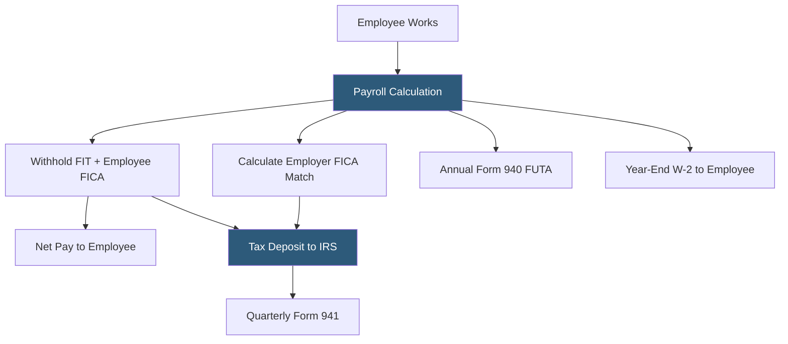

**Category:** Payroll Platforms
**Difficulty:** Beginner
**Reading time:** 5 min read

---

W-2 employee management refers to the payroll, tax, and HR processes specific to employees receiving wages subject to withholding — named for IRS Form W-2, the annual wage and tax statement employers must provide to all employees by January 31. Managing W-2 employees requires employers to withhold income taxes and FICA (Social Security and Medicare), match the employer portion of FICA, make regular tax deposits, and file quarterly and annual returns. Payroll platforms automate the majority of these obligations, but understanding the underlying requirements is essential for compliance.

- **Form W-2** — the IRS form showing an employee's annual wages and all taxes withheld; required to be distributed by January 31 each year
- **FICA Withholding** — Federal Insurance Contributions Act taxes: 6.2% Social Security (up to the annual wage base) and 1.45% Medicare withheld from employee wages, matched by the employer
- **Federal Income Tax Withholding** — income tax withheld from each paycheck based on the employee's W-4 filing status and allowances
- **Deposit Schedule** — IRS-required frequency for remitting payroll taxes (monthly or semi-weekly based on lookback period tax liability)
- **Form 941** — the quarterly federal payroll tax return reconciling wages paid and taxes withheld and deposited each quarter
- **Form 940** — the annual federal unemployment tax (FUTA) return, filed once per year
- **Employer FICA Match** — the employer's required contribution of 6.2% Social Security and 1.45% Medicare on each employee's wages (in addition to the employee withholding)
- **Additional Medicare Tax** — the extra 0.9% Medicare tax on wages exceeding $200,000 for single filers, which employers must withhold but do not match

Managing W-2 employees begins with the W-4 form, which each employee completes to indicate their filing status and any additional withholding requests. The payroll system uses W-4 data combined with current IRS withholding tables to calculate federal income tax withholding for each pay period.

FICA withholding is calculated as a percentage of gross wages: 6.2% for Social Security (up to the annual Social Security wage base, which adjusts annually) and 1.45% for Medicare with no wage cap. The employer contributes a matching 6.2% and 1.45%, making the total FICA contribution 15.3% of each employee's gross wages up to the Social Security base.

Tax deposits must be made according to the employer's designated deposit schedule. New employers start as monthly depositors, making one deposit per month for the prior month's tax liability. Employers whose lookback period liability exceeds $50,000 become semi-weekly depositors, making deposits on Wednesday or Friday depending on which days the payroll was processed.

Quarterly Form 941 reconciles all wages paid, taxes withheld, and deposits made during the quarter. Discrepancies between deposits and reported liability result in penalties. Annual Form 940 covers FUTA (Federal Unemployment Tax Act) obligations — 6.0% on the first $7,000 of each employee's wages, offset by a state unemployment tax credit reducing the effective rate to 0.6% for most employers.

Year-end processing produces W-2 forms showing the employee's total wages and all withholding for the year, distributed by January 31 and filed with the Social Security Administration by the same date.

- HR and finance teams understanding the tax obligations created by hiring W-2 employees
- Small business owners new to employer responsibilities wanting to understand compliance basics
- Payroll administrators setting up new employer tax accounts before the first hire
- Accountants explaining W-2 obligations to clients new to employment
- Businesses evaluating employee vs. contractor classification understanding both compliance profiles

| Advantage | Disadvantage |
|-----------|--------------|
| W-2 classification provides employees with benefits eligibility and legal protections | Employer FICA match adds 7.65%+ to wage cost above the employee's gross pay |
| Payroll platforms automate most compliance obligations once configured | Tax deposit schedules and quarterly filings create ongoing administrative requirements |
| Clear regulatory framework with well-established compliance standards | Penalties for late deposits and misfilings apply even to unintentional errors |
| Workers' comp and unemployment insurance obligations provide employee safety net | Multi-state employees create withholding and registration requirements in each state |

- [1099 Contractor Management](1099-contractor-management.md)
- [Multi-State Payroll Processing](multi-state-payroll-processing.md)
- [Gusto Core Plan](gusto-core-plan.md)

---
*Part of the [Payroll Platforms](index.md) category · [Back to Master Index](../../index.md)*
