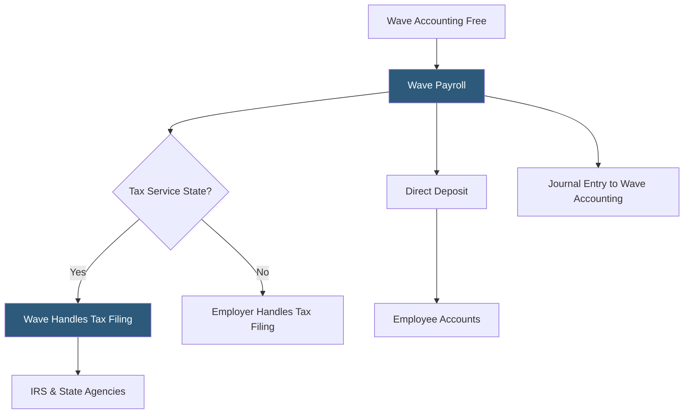

**Category:** Payroll Platforms
**Difficulty:** Beginner
**Reading time:** 5 min read

---

Wave Payroll is a low-cost payroll service from Wave Financial, designed for micro-businesses and sole proprietors that already use Wave's free accounting software. Wave offers two payroll tiers: a full-service option in tax service states (where Wave files and deposits payroll taxes automatically) and a self-service option in other states (where the business handles its own tax filings). Wave is one of the most affordable full-service payroll options available, making it attractive for businesses with very few employees on tight budgets.

- **Tax Service States** — states where Wave offers fully automated payroll tax filing and deposits on the employer's behalf; most major states are supported
- **Self-Service States** — states where Wave calculates taxes but the employer is responsible for making deposits and filing returns manually
- **Wave Accounting Integration** — payroll transactions automatically post to Wave's free accounting software as journal entries
- **Direct Deposit** — ACH transfers to employee bank accounts on standard processing timelines
- **Instant Payouts** — the ability for employees enrolled in Wave Money accounts to receive pay faster than standard ACH
- **Employee Self-Service** — employees view pay stubs and W-2s through their own Wave portal
- **Contractor Payments** — contractor payment processing with 1099-NEC generation
- **Wave Money** — Wave's business banking product that accelerates access to payroll funds when used with Wave Payroll

Wave Payroll is built to complement Wave's free accounting platform. When payroll is processed, transactions post automatically to Wave's accounting records — eliminating journal entry work for businesses using Wave as their bookkeeping system. This integration is Wave Payroll's strongest value proposition.

In tax service states, Wave handles everything: calculating federal and state withholding, making required tax deposits, and filing quarterly 941 returns, annual 940, state equivalents, and year-end W-2s. The employer simply approves the payroll run and Wave handles the rest. This full-service model is available in the majority of US states.

In self-service states, Wave still calculates the correct tax amounts and provides clear guidance on what needs to be filed and when, but the employer must log into government portals and make deposits and filings manually. This hybrid model reduces cost in exchange for employer involvement in compliance.

Running payroll involves entering hours for hourly employees (or confirming fixed salaries), reviewing the payroll summary, and approving. Standard direct deposit takes 2–3 business days. Wave Money users benefit from accelerated pay delivery within the Wave ecosystem.

For very small businesses — a local service company with 1–5 employees — Wave Payroll's combination of affordability and Wave accounting integration makes it a practical solution even with the limitation of self-service tax filing in some states.

- Micro-businesses with 1–5 employees already using Wave accounting
- Sole proprietors paying themselves and one or two part-time helpers
- Startups and new businesses on tight budgets wanting basic payroll capabilities
- Businesses in full-service states wanting low-cost automated payroll and tax filing
- Accountants serving very small clients who need Wave accounting integration

| Advantage | Disadvantage |
|-----------|--------------|
| Among the lowest cost options for full-service payroll | Self-service states require manual tax deposits and filings, adding compliance burden |
| Native Wave accounting integration for free bookkeeping platform users | Not suitable for businesses with more than ~10 employees or complex payroll needs |
| Simple interface appropriate for non-payroll specialists | Less feature-complete than Gusto or OnPay at comparable or only slightly higher price points |
| Full-service tax handling in majority of states | Limited HR features and no compliance support |

- [Patriot Payroll](patriot-payroll.md)
- [QuickBooks Payroll Core](quickbooks-payroll-core.md)
- [Gusto Core Plan](gusto-core-plan.md)

---
*Part of the [Payroll Platforms](index.md) category · [Back to Master Index](../../index.md)*
