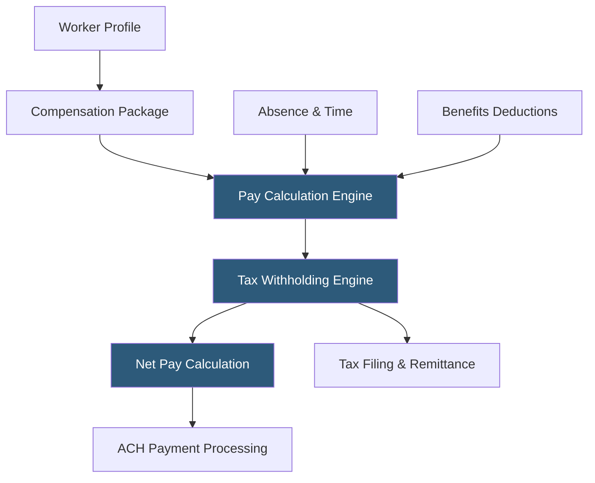

**Category:** Payroll Platforms
**Difficulty:** Advanced
**Reading time:** 7 min read

---

Workday HCM is an enterprise-grade cloud human capital management platform that delivers payroll, HR, financial management, and planning in a unified system built on a single object model. Unlike legacy ERP systems, Workday was architected from the ground up as a cloud-native application with in-memory processing, enabling real-time calculations and reporting without batch-processing delays. Its payroll module handles the most complex compensation scenarios—including multi-country payroll, equity vesting calculations, and union rules—making it the platform of choice for large global enterprises.

- **Configurable Business Process Framework** — Workday's workflow engine where administrators define approval routing, notifications, and escalation rules without code
- **Calculated Fields** — formula-driven data elements that derive payroll values dynamically from other worker attributes
- **Eligibility Rules** — logic-based filters that determine which employees qualify for specific compensation plans, benefits, or pay policies
- **Absence Management** — integrated leave tracking (FMLA, parental leave, PTO) that feeds leave pay codes directly into payroll
- **Gross-Up Calculations** — automatic calculation of additional pay needed so an employee nets a specific dollar amount after taxes
- **Workday Extend** — a low-code development platform for building custom applications on top of the Workday object model
- **Prism Analytics** — Workday's data fabric that blends Workday data with external sources for unified analytics
- **Audit Trail** — immutable, timestamped log of every change to every field, enabling forensic payroll audits

Workday's payroll engine operates through a series of calculation phases that run sequentially for each worker in a pay group. The process begins with the Pay Calculation step, which evaluates all earning and deduction elements for the period. Workday uses a "period-to-date" calculation approach, meaning each payroll run considers the cumulative earnings for the period, ensuring accuracy for tax withholding limits like FICA wage bases.

The system resolves compensation by traversing the worker's compensation package, which may include multiple components: base salary, merit adjustments, allowances, and long-term incentive awards. Each component has an eligibility rule, a frequency, and an amount driver. Workday evaluates these rules at runtime, making the calculation deterministic and auditable.

Tax withholding uses Workday's maintained tax locator, which maps each worker's home and work addresses to the correct taxing jurisdictions. Workday continuously updates its tax content (federal, state, and 7,500+ local jurisdictions) through automated content updates delivered to all customers simultaneously, eliminating the need for manual patches.

The Workday Business Process Framework orchestrates approval workflows around payroll. For example, off-cycle payments or retroactive adjustments can be routed to Finance for approval before processing. All workflow steps are logged with actor, timestamp, and comment.

For global payroll, Workday partners with third-party payroll processors via its Global Payroll Cloud Connect, passing net-to-gross instructions to in-country processors and receiving results back, maintaining a unified view across all geographies within the Workday interface.

- Fortune 500 companies requiring enterprise-grade payroll with complex compensation structures
- Global organizations needing a single platform with visibility across 50+ country payrolls
- Companies with union agreements requiring intricate pay rule calculations
- Organizations seeking to eliminate ERP-to-payroll data interfaces by running both on Workday Financials
- Public companies needing detailed payroll audit trails for SOX compliance

| Advantage | Disadvantage |
|-----------|--------------|
| Single object model eliminates HR-to-payroll data synchronization | Implementation costs typically $1M–$10M+ for large enterprises |
| Real-time reporting without batch processing delays | 12–24 month implementation timeline is standard |
| Immutable audit trail supports SOX and regulatory compliance | Annual subscription costs are significant for mid-market companies |
| Highly configurable without custom code in most scenarios | Requires certified Workday administrators to manage configuration |

- [ADP Workforce Now](adp-workforce-now.md)
- [Rippling Payroll & HR](rippling-payroll-hr.md)
- [UKG Pro Payroll](ukg-pro-payroll.md)

---
*Part of the [Payroll Platforms](index.md) category · [Back to Master Index](../../index.md)*
