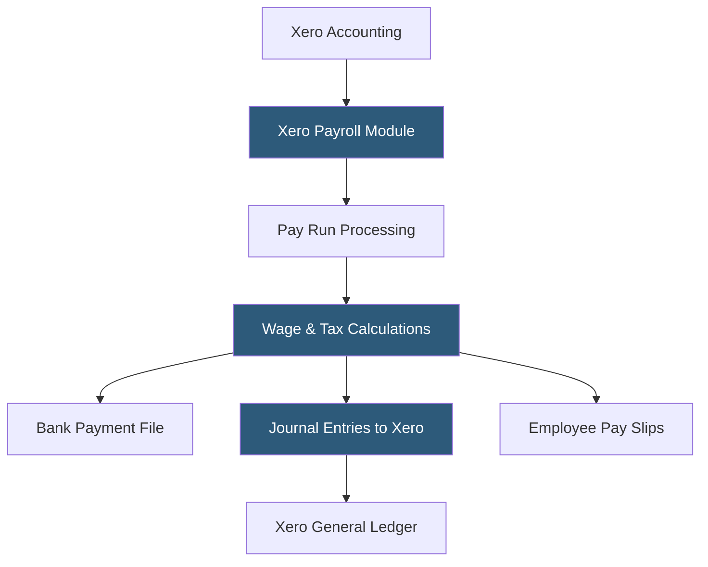

**Category:** Payroll Platforms
**Difficulty:** Beginner
**Reading time:** 5 min read

---

Xero Payroll is the payroll module integrated within Xero's cloud accounting platform, available to US, UK, Australian, and New Zealand businesses as part of the Xero subscription. Like QuickBooks Payroll's relationship with QuickBooks Online, Xero Payroll's primary value is seamless integration with Xero's accounting records, automatically posting payroll transactions to the general ledger. For businesses using Xero as their accounting system, the native payroll integration eliminates manual journal entries and maintains a single source of truth for financial data.

- **Xero Accounting Integration** — automatic posting of payroll wages, taxes, and deductions as journal entries to Xero's chart of accounts after each pay run
- **Pay Run** — Xero's term for a payroll processing cycle, covering all employees on a particular pay schedule for a pay period
- **Employee Portal** — a self-service interface where employees access pay slips, update personal details, and submit time-off requests
- **Leave Management** — configurable leave types (vacation, sick, personal) with accrual tracking and manager approval workflows
- **Multi-Currency Payroll** — support for processing payroll in local currencies for UK, Australian, and New Zealand businesses
- **Pay Templates** — reusable earnings and deduction configurations that can be applied to employee profiles
- **Payroll Reports** — payroll summaries, tax reports, and cost distribution reports accessible within Xero
- **Compliance Updates** — Xero maintains tax tables for each supported country/region and updates them automatically

Xero Payroll operates within the Xero accounting environment as an integrated module rather than a standalone product. When a pay run is completed, all financial entries post directly to Xero's accounts: wages appear in payroll expense accounts, tax withholdings record in liability accounts, and net payments record as payroll payable. This integration means the Xero profit and loss statement always reflects accurate payroll costs without bookkeeper intervention.

Setting up pay runs involves configuring pay calendars (weekly, bi-weekly, semi-monthly, monthly), assigning employees to calendars, and defining each employee's earnings items and deductions. Pay templates allow organizations with consistent pay structures to apply configurations to multiple employees simultaneously.

For US businesses, Xero Payroll handles federal and state tax calculations with automatic withholding. Xero generates and files 941 quarterly returns, 940 annual returns, and W-2s. UK businesses benefit from PAYE and National Insurance calculations with RTI (Real Time Information) submissions to HMRC. Australian and New Zealand businesses have equivalent STP (Single Touch Payroll) compliance built in.

Employees access their pay slips through the Xero Me app or browser portal. Leave requests submitted by employees flow through an approval workflow before balances are updated and any approved unpaid leave affects payroll calculations.

- Small businesses using Xero for accounting wanting payroll integrated into the same platform
- Accountants managing multiple small business clients on Xero wanting centralized payroll
- UK businesses needing PAYE and RTI compliance within their accounting software
- Australian businesses requiring Single Touch Payroll compliance
- Businesses wanting payroll journal entries posted to Xero without manual accounting work

| Advantage | Disadvantage |
|-----------|--------------|
| Native Xero integration eliminates all payroll journal entry work | US payroll features less comprehensive than QuickBooks Payroll at similar price points |
| Multi-country support (US, UK, AU, NZ) within one platform | Not available for complex multi-country scenarios beyond the supported regions |
| Available within existing Xero subscription pricing | Customer support for payroll issues can be slow through Xero's support channels |
| Accountant-friendly with multi-client access | Limited HR features beyond basic leave management |

- [QuickBooks Payroll](quickbooks-payroll.md)
- [Wave Payroll](wave-payroll.md)
- [OnPay Payroll Service](onpay-payroll-service.md)

---
*Part of the [Payroll Platforms](index.md) category · [Back to Master Index](../../index.md)*
