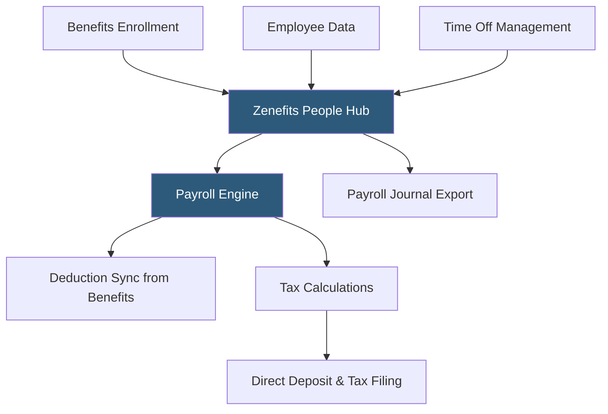

**Category:** Payroll Platforms
**Difficulty:** Beginner
**Reading time:** 5 min read

---

Zenefits Payroll (now operating under TriNet Zenefits) is the payroll module integrated within the Zenefits HR platform, processing wages, tax filings, and direct deposit for US employees as part of the broader people management suite. Zenefits Payroll is designed to work seamlessly with Zenefits's benefits administration layer, automatically syncing benefits elections to payroll deductions without manual entry. It targets small and mid-sized businesses that are already using Zenefits for HR and benefits.

- **Benefits-Payroll Sync** — the automatic synchronization of benefits enrollment decisions to payroll deduction calculations, the core value of Zenefits Payroll
- **Off-Cycle Payroll** — processing bonus, commission, or correction payments outside the standard pay schedule
- **Tax Filing** — automated federal, state, and local payroll tax calculation, deposit, and return filing
- **Contractor Payments** — 1099 contractor payment processing with year-end 1099-NEC generation
- **Pay Stubs** — digital pay stubs accessible through the employee self-service portal
- **Payroll Journal Entry Export** — export of payroll data to accounting software as journal entries
- **New Hire Reporting** — automated reporting of new employees to state agencies
- **Multi-State Withholding** — handling tax withholding for employees working in multiple states

Zenefits Payroll's primary architectural advantage is its tight coupling to the Zenefits benefits module. When employees make elections during open enrollment or qualifying life events, those elections automatically become payroll deductions on the correct effective date without HR needing to manually update the payroll system. This eliminates a common error source where benefits changes take effect in HR records but aren't reflected in payroll until someone manually updates deductions.

To run payroll, administrators confirm or adjust hours for hourly employees, review a payroll summary showing all wages and deductions, and approve the run. The system calculates taxes based on current withholding elections and tax tables, initiates ACH transfers for direct deposit, and makes tax deposits to federal and state agencies.

Contractor payments can be processed in the same interface, with Zenefits tracking year-to-date contractor payments and generating 1099-NEC forms at year-end automatically.

Payroll data exports to QuickBooks, Xero, and other accounting software as journal entries after each run. The export format maps Zenefits payroll categories to accounting chart-of-accounts, reducing bookkeeper workload.

Under TriNet's ownership since 2022, Zenefits Payroll benefits from TriNet's larger compliance infrastructure while maintaining its distinct product identity and pricing structure.

- Businesses already using Zenefits for benefits administration wanting payroll in the same platform
- Small businesses wanting automatic sync between benefits elections and payroll deductions
- Organizations processing both W-2 employees and 1099 contractors from one dashboard
- Companies that use QuickBooks or Xero and want automated payroll journal entry posting
- HR teams that want benefits enrollment and payroll operated as a single system

| Advantage | Disadvantage |
|-----------|--------------|
| Automatic benefits-to-payroll deduction sync eliminates manual transfers | Payroll features less comprehensive than dedicated payroll platforms |
| Clean modern interface appropriate for non-payroll specialists | Best value when using Zenefits for benefits; less compelling as payroll-only |
| Contractor and employee payments managed together | Limited customization for complex pay rules or multi-entity scenarios |
| QuickBooks and Xero journal entry exports reduce bookkeeper work | Customer support quality has historically been inconsistent |

- [TriNet Zenefits Platform](trinet-zenefits-platform.md)
- [Gusto Payroll Platform](gusto-payroll-platform.md)
- [BambooHR Payroll Integration](bamboohr-payroll-integration.md)

---
*Part of the [Payroll Platforms](index.md) category · [Back to Master Index](../../index.md)*
