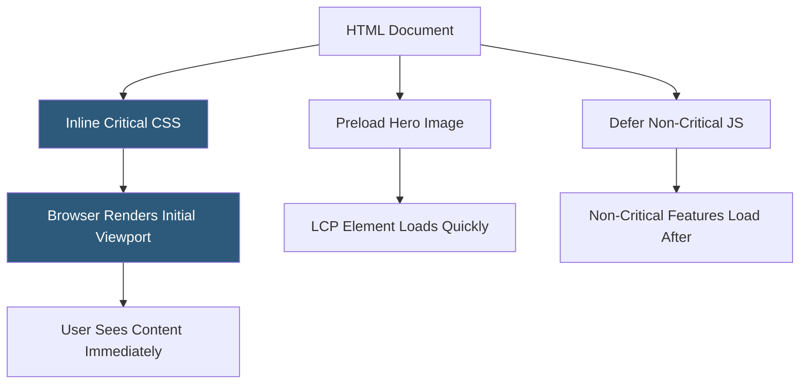

**Category:** Performance Optimization
**Difficulty:** Intermediate
**Reading time:** 5 min read

---

Above-the-fold content prioritization is the technique of ensuring the portion of a webpage visible without scrolling loads and renders as quickly as possible, even if the rest of the page takes longer to process. By identifying and front-loading only the resources critical for the initial viewport, developers reduce Largest Contentful Paint (LCP) and First Contentful Paint (FCP) scores, creating the perception of faster page loads. Resources for below-the-fold content are deferred until after the initial render completes.

- **Above the Fold** — the visible portion of a webpage before the user scrolls; historically a newspaper term, now defines the initial viewport in web performance
- **Critical CSS** — the minimal CSS rules required to style above-the-fold content, inlined in the HTML `<head>` to eliminate render-blocking stylesheet requests
- **Render-Blocking Resources** — CSS and JavaScript files that the browser must download and process before it can render any content
- **Largest Contentful Paint (LCP)** — the Core Web Vital measuring when the largest visible content element finishes rendering; above-the-fold optimization directly targets LCP
- **Inlining** — embedding CSS or small JavaScript directly in the HTML document to eliminate separate HTTP requests for critical path resources
- **Preloading** — using `<link rel="preload">` to instruct the browser to fetch high-priority resources early in the loading process
- **Deferred Loading** — using `defer` or `async` attributes on non-critical scripts, and loading non-critical CSS after the initial render
- **Viewport Units** — CSS units (vh, vw) defining sizes relative to the browser viewport, useful for ensuring critical content fits the initial view

The browser rendering pipeline processes HTML documents top-to-bottom. When it encounters a `<link rel="stylesheet">` or a blocking `<script>`, it pauses rendering to download and process the resource. This means a 100KB stylesheet blocks the page from displaying anything — even a simple text heading — until it finishes loading.

Critical CSS extraction involves analyzing the page to identify all CSS rules that apply to above-the-fold elements, then inlining those rules in a `<style>` block within the HTML `<head>`. The full stylesheet is still loaded, but asynchronously: `<link rel="stylesheet" media="print" onload="this.media='all'">` is a common technique to load stylesheets without blocking. Tools like Critical, PurgeCSS, and Webpack plugins automate extraction.

Hero images — the large banner or product images typically at the top of pages — are often the LCP element. Preloading them with `<link rel="preload" as="image" href="hero.webp">` tells the browser to start fetching the image at the highest priority as soon as HTML parsing begins, rather than waiting to discover the image in the body markup.

JavaScript that doesn't contribute to above-the-fold rendering should use `defer` (execution order preserved) or `async` (execution at download completion) attributes, or be placed before `</body>`. Third-party scripts like analytics and chat widgets should always be deferred.

- E-commerce product pages where the hero image and add-to-cart button must load instantly
- News sites where the headline and first paragraph must be visible before scripts load
- Landing pages where above-the-fold impressions determine conversion rates
- Mobile web pages where slow networks make every render-blocking resource costly
- Any page targeting Core Web Vitals score improvements for SEO ranking

| Advantage | Disadvantage |
|-----------|--------------|
| Dramatically improves LCP and FCP metrics, directly improving Core Web Vitals | Critical CSS extraction tools can miss edge cases in complex layouts |
| Creates perceived speed improvements even when total download size is unchanged | Inlined CSS cannot be cached separately; it re-downloads with every page request |
| Eliminates render-blocking resource delays for visible content | Determining "above the fold" is complex across different viewport sizes |
| Deferred scripts prevent JS from blocking initial render | Deferred scripts may cause layout shifts if they affect visible content |

- [Critical Rendering Path Optimization](critical-rendering-path-optimization.md)
- [Lazy Loading Implementation](lazy-loading-implementation.md)
- [Image Optimization Techniques](image-optimization-techniques.md)

---
*Part of the [Performance Optimization](index.md) category · [Back to Master Index](../../index.md)*
