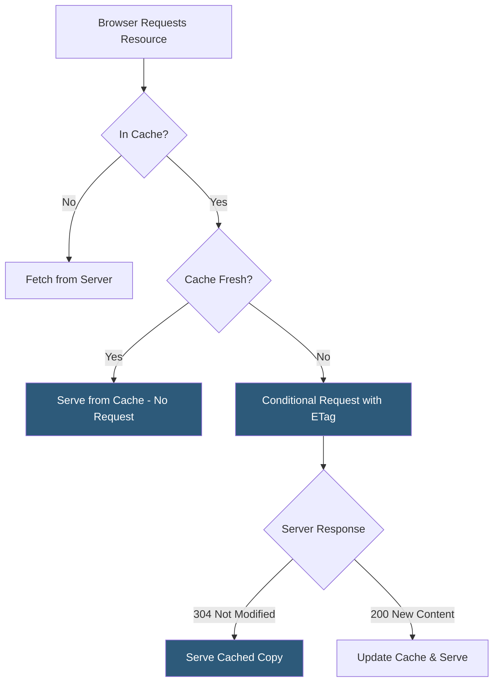

**Category:** Performance Optimization
**Difficulty:** Intermediate
**Reading time:** 6 min read

---

Browser caching allows previously downloaded resources to be stored locally and reused on subsequent visits, dramatically reducing load times and bandwidth consumption for repeat visitors. Effective caching strategies balance freshness requirements — ensuring users see updated content promptly — against performance goals of minimizing network requests. The combination of `Cache-Control` headers, ETags, and cache-busting via content hashing forms the foundation of modern web caching architecture.

- **Cache-Control** — the primary HTTP response header for caching directives; controls max-age, public/private scope, and revalidation behavior
- **max-age** — a Cache-Control directive specifying how many seconds a response is considered fresh; during this period the browser serves the cached copy without any network request
- **ETag** — an opaque identifier (typically a hash of the file content) that servers include in responses; browsers send it in `If-None-Match` headers for conditional requests
- **Last-Modified / If-Modified-Since** — a date-based conditional request mechanism; less precise than ETags but widely supported
- **stale-while-revalidate** — a Cache-Control directive allowing browsers to serve a stale cached response immediately while fetching a fresh version in the background
- **Cache Busting** — a technique where asset filenames include a content hash (e.g., `app.a3b4c5d.js`) so new deployments automatically bypass cached old versions
- **Service Worker Cache** — programmatic browser-side cache managed by JavaScript; enables offline capabilities and fine-grained cache strategies beyond HTTP headers
- **CDN Cache** — edge server caches shared across all users; distinct from the per-user browser cache but governed by the same Cache-Control headers

When a browser receives an HTTP response, it inspects the `Cache-Control` header to determine caching behavior. A header like `Cache-Control: public, max-age=31536000, immutable` instructs both browsers and CDNs to cache the resource for one year and never revalidate it — appropriate for content-hashed static assets that change only when their content changes.

For dynamic content that changes unpredictably, `Cache-Control: no-cache` instructs the browser to revalidate with the server on every request but use the cached copy if the server responds with `304 Not Modified`. This is efficient because only headers are exchanged; the full body isn't retransmitted if the content hasn't changed.

Cache busting solves the classic deployment problem: if a stylesheet is cached with a long `max-age`, users won't receive updates until the cache expires. By embedding a content hash in the filename during the build process (Webpack, Vite, and similar tools do this automatically), each new version gets a unique URL. The old URL never needs to expire because new deployments use different URLs.

The `stale-while-revalidate` directive enables a useful pattern: `Cache-Control: max-age=60, stale-while-revalidate=3600` means the resource is served from cache instantly for up to 60 seconds, then for up to an hour it's served from cache while the browser refreshes it in the background. This eliminates perceptible latency while keeping content reasonably fresh.

Service workers provide programmatic control beyond HTTP headers, enabling cache-first strategies for offline support, network-first strategies for always-fresh data, and stale-while-revalidate patterns with custom fallback logic.

- Static website assets (scripts, stylesheets, images) that should be cached indefinitely until updated
- API responses where stale data is acceptable for short periods to improve performance
- Single-page applications where shell HTML and assets need different caching strategies
- E-commerce sites where product data needs rapid cache invalidation after price changes
- Applications needing offline functionality via service worker cache strategies

| Advantage | Disadvantage |
|-----------|--------------|
| Long max-age for hashed assets eliminates network requests for repeat visitors | Incorrect cache headers can cause users to see stale content after deployments |
| ETags ensure bandwidth is only used when content actually changes | Cache invalidation is complex; purging CDN caches requires additional tooling |
| stale-while-revalidate delivers instant responses with background freshness | Service worker cache management adds application code complexity |
| CDN caching reduces origin server load by 80–95% for static assets | Private data must use `Cache-Control: private` to avoid CDN caching sensitive responses |

- [Page Load Time Optimization](page-load-time-optimization.md)
- [Service Worker Caching](service-worker-caching.md)
- [Cache-Control Headers](cache-control-headers.md)

---
*Part of the [Performance Optimization](index.md) category · [Back to Master Index](../../index.md)*
