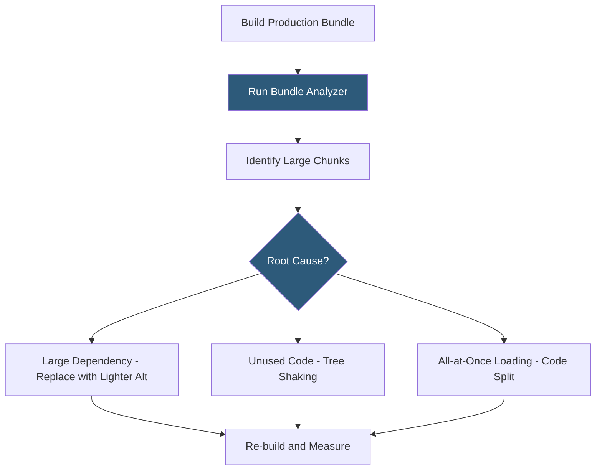

**Category:** Performance Optimization
**Difficulty:** Intermediate
**Reading time:** 6 min read

---

Bundle size optimization is the practice of reducing the total size of JavaScript and CSS files delivered to browsers, directly improving page load speed, Time to Interactive, and Core Web Vitals scores. Large bundles require more download time, more parse time, and more memory — all of which degrade user experience, particularly on mobile devices. Bundle optimization combines tree shaking, code splitting, dependency auditing, and compression to deliver only what is needed.

- **Bundle Analyzer** — tools (webpack-bundle-analyzer, Vite's rollup-plugin-visualizer, source-map-explorer) that visualize bundle composition as treemaps
- **Dependency Audit** — reviewing `node_modules` to identify large packages that can be replaced with smaller alternatives
- **Import Cost** — the size overhead each import adds to the bundle; VS Code's Import Cost extension shows this inline
- **Bundlephobia** — a web tool (bundlephobia.com) that shows the minified+gzipped size of any npm package before installation
- **Light Alternatives** — replacing heavy libraries with purpose-built lightweight alternatives (e.g., `dayjs` instead of `moment.js`)
- **Polyfill Budgeting** — auditing and minimizing polyfills for modern browsers that no longer require them
- **Differential Serving** — serving modern ES2017+ bundles to modern browsers and legacy bundles to older browsers using `<script type="module">`
- **Compression Efficiency** — minified bundles compress better with Gzip/Brotli; combination achieves maximum transfer size reduction

Bundle optimization starts with measurement. Running a production build with bundle analysis enabled — `ANALYZE=true npm run build` for Webpack, or adding `rollup-plugin-visualizer` to Vite — produces a treemap showing each module's contribution to the final bundle. This immediately surfaces which dependencies dominate the output.

The most common optimization targets:

**Moment.js** (~232KB minified) is notorious for including all locales. Replacing it with `dayjs` (2KB) or `date-fns` (tree-shakeable) with only needed locales can save 200KB in a single change.

**Lodash** (~68KB) is rarely used entirely. Switching to `lodash-es` with tree shaking, or replacing individual functions with native ES equivalents, eliminates unused utilities. Array methods like `_.map`, `_.filter`, and `_.reduce` have native equivalents that add zero bundle bytes.

**Icons libraries** like FontAwesome can reach 1MB when imported globally. Switching to individual icon imports — `import { FaHome } from 'react-icons/fa'` — and enabling tree shaking reduces this to the bytes for only used icons.

Differential serving delivers different bundles to different browsers. Modern browsers loading `<script type="module">` receive ES2017+ code that doesn't require transpilation for modern syntax features. Legacy browsers loading `<script nomodule>` receive the transpiled bundle. Modern browsers get 10–20% smaller bundles because they don't need transpiled arrow functions, async/await, classes, etc.

- React/Vue/Angular SPAs where initial bundle size impacts Time to Interactive
- Performance audits before major releases
- Mobile-first applications where 3G download speed makes every KB matter
- Applications targeting Google PageSpeed/Lighthouse performance scoring
- Development teams establishing bundle size budgets to prevent regression

| Advantage | Disadvantage |
|-----------|--------------|
| Directly reduces Time to Interactive and improves Core Web Vitals | Bundle analysis and optimization requires dedicated time investment |
| Dependency replacements often permanent improvements with no ongoing cost | Light alternatives may have fewer features or API compatibility issues |
| Differential serving serves smaller bundles to majority of users | Maintaining two bundles (module + nomodule) increases build complexity |
| Establishes performance budgets preventing future regression | Tree shaking effectiveness varies by library; some dependencies resist optimization |

- [Tree Shaking Optimization](tree-shaking-optimization.md)
- [Code Splitting Strategies](code-splitting-strategies.md)
- [JavaScript Minification](javascript-minification.md)

---
*Part of the [Performance Optimization](index.md) category · [Back to Master Index](../../index.md)*
