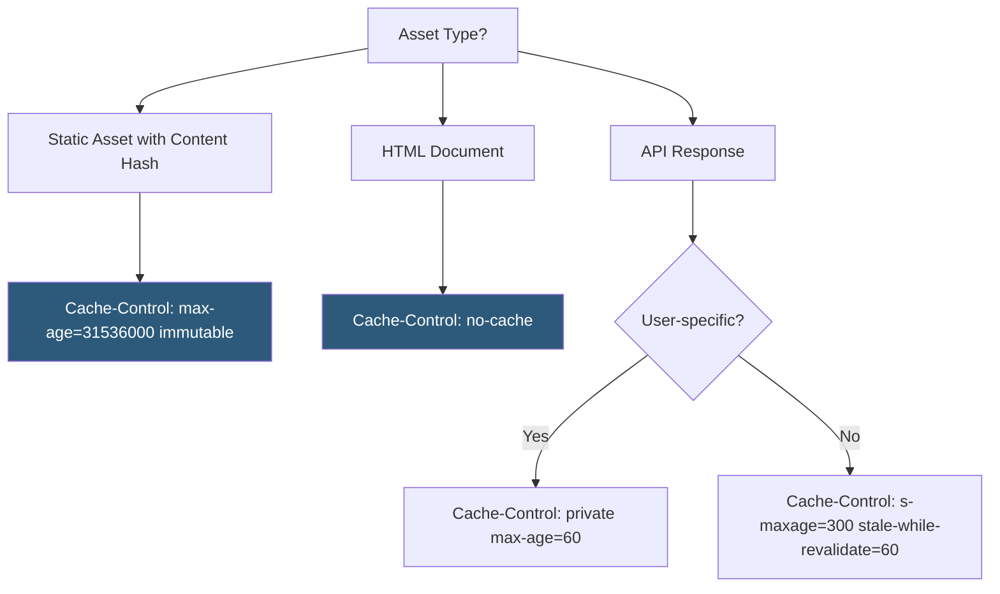

**Category:** Performance Optimization
**Difficulty:** Intermediate
**Reading time:** 6 min read

---

Cache-Control HTTP response headers direct browsers, CDNs, and intermediate proxies on how long and in what manner to cache resources, making them the primary mechanism for implementing browser and edge caching strategies. Correct Cache-Control configuration enables browsers to skip network requests entirely for static assets on repeat visits and allows CDNs to serve cached responses from edge nodes close to users. Misconfigured Cache-Control can cause stale content delivery or excessive network requests.

- **`max-age`** — the number of seconds a resource can be served from cache after the initial response; `max-age=31536000` caches for one year
- **`s-maxage`** — equivalent to `max-age` but applies only to shared caches (CDNs), while browsers use `max-age`
- **`no-cache`** — instructs caches to always revalidate with the origin before serving a cached response (not the same as no caching)
- **`no-store`** — prevents any caching; every request fetches a fresh response; appropriate for sensitive user data
- **`immutable`** — signals that the resource will never change at this URL; browsers skip revalidation even after the cache expires
- **`must-revalidate`** — once the max-age expires, the cache must revalidate with the origin before serving; prevents stale-while-revalidate behavior
- **`stale-while-revalidate`** — serves stale cached content immediately while fetching a fresh version in the background
- **`private`** — indicates the response is user-specific and should only be cached by the user's browser, not CDNs

Cache-Control strategy differs fundamentally between static assets and dynamic responses.

**Static assets** (JavaScript, CSS, images with content-hash filenames) should use `Cache-Control: public, max-age=31536000, immutable`. The content hash in the filename (`app.a3f2b9c.js`) ensures cache-busting when content changes — the URL changes, so the old cached version is never served. The `immutable` directive tells modern browsers not to even attempt revalidation when the cache entry appears stale (browser heuristics sometimes revalidate early).

**HTML documents** should use `Cache-Control: no-cache, must-revalidate`. HTML contains references to hashed asset filenames; if the HTML itself were cached, updated asset URLs wouldn't reach users. `no-cache` doesn't mean no caching — it means "validate before serving." Combined with ETags or Last-Modified headers, the browser checks whether the HTML has changed. If unchanged, the server responds with `304 Not Modified` and no body, consuming only a tiny bit of bandwidth.

**API responses** vary by sensitivity and staleness tolerance. Public data with short validity: `Cache-Control: public, s-maxage=60, stale-while-revalidate=30` tells CDNs to cache for 60 seconds and serve stale for 30 more seconds while fetching a fresh copy. User-specific data: `Cache-Control: private, max-age=0, must-revalidate`.

`stale-while-revalidate` is powerful for performance: users receive a cached response immediately (no network wait) while the cache refreshes in the background. The next request gets fresh content. This eliminates the latency of revalidation for most users at the cost of serving one stale response after cache expiry.

CDN cache behavior also responds to Cache-Control. CDN cache-bypass and purge APIs allow manual invalidation when content changes outside the max-age window.

- Static site deployment where CDN caching is the primary delivery mechanism
- SPAs with content-hashed assets wanting long-term caching without stale content risk
- APIs with public data that multiple users request simultaneously
- Dynamic pages that change infrequently and benefit from CDN edge caching
- Authenticated applications needing to prevent CDN caching of user-specific content

| Advantage | Disadvantage |
|-----------|--------------|
| Long cache TTLs eliminate repeat network requests entirely for static assets | Incorrect max-age on HTML can trap users on stale versions for hours or days |
| `stale-while-revalidate` provides instant responses with background freshness | CDN purge APIs must be called on deployment if max-age hasn't expired |
| `immutable` reduces unnecessary revalidation requests for hashed assets | Cache strategies must be coordinated between CDN configuration and HTTP headers |
| Fine-grained control per resource type and audience (CDN vs browser) | `no-store` on wrong resources prevents beneficial caching and increases origin load |

- [Browser Caching Strategies](browser-caching-strategies.md)
- [ETags Implementation](etags-implementation.md)
- [Service Worker Caching](service-worker-caching.md)

---
*Part of the [Performance Optimization](index.md) category · [Back to Master Index](../../index.md)*
