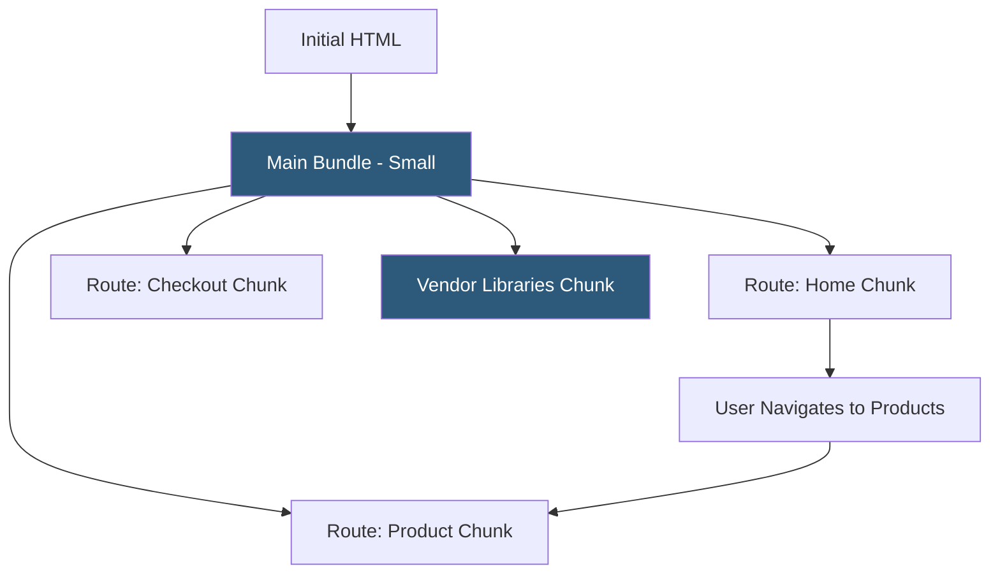

**Category:** Performance Optimization
**Difficulty:** Intermediate
**Reading time:** 6 min read

---

Code splitting divides a JavaScript application's bundle into smaller chunks that load on demand, rather than forcing users to download the entire application before any code runs. This technique is critical for large single-page applications where a single monolithic bundle can reach megabytes in size. Code splitting can be implemented at route boundaries (loading page-specific code only when visiting that route), at component level (loading heavy components only when rendered), or by separating vendor libraries from application code.

- **Route-Based Splitting** — dividing bundles at URL route boundaries so only the code for the current page downloads on navigation
- **Component-Level Splitting** — dynamically importing heavy UI components (modals, charts, editors) only when they are first rendered
- **Vendor Chunking** — separating third-party library code into a separate bundle that can be cached independently from application code
- **Dynamic Import** — ES module syntax `import('./module')` that signals the bundler to create a separate chunk loaded asynchronously
- **React.lazy / Suspense** — React's built-in code splitting mechanism using dynamic imports with loading fallback UIs
- **Prefetching** — preloading likely-needed chunks in background after the initial page loads, reducing delay when they're needed
- **Chunk Naming** — using named imports (`import(/* webpackChunkName: "checkout" */ './Checkout')`) to create predictable chunk filenames for caching
- **Waterfall Problem** — chains of dynamic imports where each requires the previous to complete; architectural patterns minimize this



Webpack, Vite, and Rollup all support code splitting through dynamic imports. When a bundler encounters `import('./Checkout')`, it creates a separate chunk file for the Checkout module and all its unique dependencies. The main bundle contains a small loader that fetches the chunk when the import executes.

Route-based splitting in React Router with React.lazy follows this pattern:

```javascript
const Checkout = React.lazy(() => import('./pages/Checkout'));

function App() {
  return (
    <Suspense fallback={<LoadingSpinner />}>
      <Routes>
        <Route path="/checkout" element={<Checkout />} />
      </Routes>
    </Suspense>
  );
}
```

When users navigate to `/checkout`, React triggers the dynamic import, fetches the chunk, and renders the component. The `<Suspense>` fallback displays during the load. The Checkout module and its dependencies are absent from the initial bundle.

Vendor splitting separates `node_modules` packages into a separate chunk. Since libraries change less frequently than application code, the vendor chunk gets long browser cache TTLs while the application chunk gets a short TTL or content-hash-based URL invalidation. Users returning to the site don't re-download React, Lodash, or other stable dependencies on every deployment.

Webpack's `SplitChunksPlugin` and Vite's `manualChunks` configuration control chunk boundaries. Common patterns: separate each route into its own chunk, create shared chunks for modules used by 3+ routes, and isolate very large third-party libraries (Monaco Editor, PDF.js) into their own chunk.

- Single-page applications with 5+ distinct routes and substantial per-route functionality
- Admin dashboards where most features are rarely used and shouldn't penalize initial load
- Applications with rich text editors, chart libraries, or other heavy components
- E-commerce apps where checkout flow code should only load when users reach checkout
- Public-facing sites with logged-in app functionality that non-authenticated users shouldn't download

| Advantage | Disadvantage |
|-----------|--------------|
| Reduces initial bundle size; users only download what they need | Navigation to unloaded routes has a loading delay on first visit |
| Vendor chunk caching improves returning user performance | Waterfall imports (A imports B which imports C) create sequential load delays |
| Fine-grained caching invalidation; app code changes don't bust vendor cache | Chunk boundary decisions require analysis of dependency graph |
| Route-level splitting often achievable with minimal code changes | Too-granular splitting creates overhead from many small HTTP requests |

- [Bundle Size Optimization](bundle-size-optimization.md)
- [Tree Shaking Optimization](tree-shaking-optimization.md)
- [JavaScript Minification](javascript-minification.md)

---
*Part of the [Performance Optimization](index.md) category · [Back to Master Index](../../index.md)*
