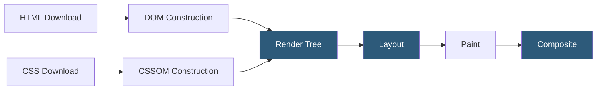

**Category:** Performance Optimization
**Difficulty:** Advanced
**Reading time:** 7 min read

---

The critical rendering path (CRP) is the sequence of steps a browser must complete before it can display the first visible pixels to a user: constructing the DOM from HTML, building the CSSOM from stylesheets, combining them into a render tree, running layout to compute element dimensions and positions, and finally painting pixels to screen. Optimizing the CRP means minimizing the number of critical resources, reducing their size, and shortening the critical path length (the minimum latency before first render).

- **DOM (Document Object Model)** — the browser's tree-structured representation of HTML elements, constructed incrementally as HTML is parsed
- **CSSOM (CSS Object Model)** — the browser's representation of all CSS rules; must be fully constructed before the render tree can be built, making CSS render-blocking by default
- **Render Tree** — the combination of DOM and CSSOM containing only visible nodes with their computed styles
- **Layout (Reflow)** — the process of computing each element's exact size and position on the page; triggered by DOM changes, resize events, or reading certain layout properties
- **Composite** — the final step where the browser draws layer contents to the screen; GPU-accelerated properties (transform, opacity) skip layout and paint, enabling smoother animations
- **Render-Blocking CSS** — any stylesheet in `<head>` that blocks rendering until fully downloaded and parsed; use media queries to make non-critical CSS non-blocking
- **Parser-Blocking JavaScript** — synchronous `<script>` tags that halt HTML parsing until the script downloads and executes; eliminated with `defer` or `async` attributes
- **Preload Scanner** — the browser's background thread that scans ahead in HTML source to initiate downloads of critical resources before the parser reaches them

Browser rendering begins the moment the first byte of HTML arrives. The HTML parser processes markup incrementally, building DOM nodes. When it encounters a `<link rel="stylesheet">` tag, it dispatches a network request and suspends rendering (but not parsing) until the CSS downloads and the CSSOM is fully built. This render-blocking behavior exists because CSS can change the display of any already-parsed DOM element, so the browser must know all styles before painting.

JavaScript is more disruptive: a synchronous `<script>` tag both blocks HTML parsing and may trigger CSSOM construction if scripts query computed styles. The `defer` attribute delays execution until after HTML parsing completes without blocking it; `async` loads the script in parallel but executes it as soon as it's available, potentially during parsing.

The render tree is built by traversing the DOM and attaching computed styles from the CSSOM to each visible node. `display: none` nodes are excluded from the render tree entirely. Pseudo-elements like `::before` are included even though they don't exist in the DOM.

Layout (or reflow) computes the geometric properties of every render tree node. This is an expensive operation because layout changes can cascade — changing a parent element's width potentially reflows all its children. Developers should batch DOM writes and reads to avoid triggering multiple reflows per frame (a performance anti-pattern called "layout thrashing").

The paint phase converts the render tree into actual pixels in layers. Modern browsers use the GPU compositor to combine layers, enabling properties like `transform` and `opacity` to animate at 60fps without triggering layout or paint — only the compositor step.

Critical path length is defined as the number of round trips required before first render. Inlining critical CSS (above-the-fold styles) in `<head>` eliminates one round trip for stylesheet fetching, enabling faster first paint at the cost of increased HTML size.

- Diagnosing why a page's First Contentful Paint score is poor in Lighthouse
- Eliminating render-blocking resources identified in Core Web Vitals reports
- Optimizing single-page application (SPA) initial load performance
- Building high-performance landing pages where every millisecond affects conversion
- Auditing third-party script impact on rendering performance

| Advantage | Disadvantage |
|-----------|--------------|
| Eliminating render-blocking resources can halve FCP time | Inlining critical CSS increases HTML payload and reduces cacheability |
| Deferring non-critical JavaScript dramatically improves parsing speed | Async scripts require careful dependency management to prevent race conditions |
| GPU compositing enables 60fps animations without layout cost | Over-promoting elements to compositor layers increases GPU memory usage |
| Preloading critical resources reduces round trips to first paint | Incorrect preload priorities can delay actually critical resources |

- [Page Load Time Optimization](page-load-time-optimization.md)
- [JavaScript Minification](javascript-minification.md)
- [Resource Hints Preload Prefetch](resource-hints-preload-prefetch.md)

---
*Part of the [Performance Optimization](index.md) category · [Back to Master Index](../../index.md)*
