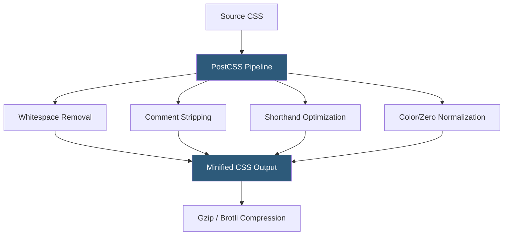

**Category:** Performance Optimization
**Difficulty:** Beginner
**Reading time:** 5 min read

---

CSS minification removes unnecessary characters from stylesheet files — whitespace, comments, redundant semicolons, and verbose shorthand properties — to reduce file sizes without changing visual rendering. CSS files are typically render-blocking, meaning the browser cannot display content until they download and parse, making CSS minification particularly impactful for initial page render speed. Tools like cssnano, CleanCSS, and PostCSS automate minification as part of build pipelines.

- **Render-Blocking CSS** — stylesheets linked in the `<head>` that the browser must download and parse before rendering any page content
- **cssnano** — the most widely used CSS minifier, integrated with PostCSS and used by Webpack, Vite, and other build tools
- **CleanCSS** — an alternative CSS minifier with configurable optimization levels used in many Node.js build pipelines
- **Duplicate Rule Removal** — merging identical selectors and eliminating redundant declarations within the stylesheet
- **Shorthand Properties** — combining verbose CSS declarations (`margin-top`, `margin-right`, etc.) into shorthand (`margin`) reducing byte count
- **Zero-Unit Removal** — removing units from zero values: `0px` → `0` (valid and equivalent in CSS)
- **Color Shortening** — converting color values to their shortest representation: `#ffffff` → `#fff`, `rgb(255,255,255)` → `#fff`
- **PostCSS** — a JavaScript tool for transforming CSS with plugins; serves as the pipeline through which most modern CSS minification runs



CSS minification transforms source code through a series of safe transformations that preserve visual rendering while reducing byte count. A typical source CSS block like:

```css
/* Button styles */
.button {
    background-color: #ffffff;
    margin-top: 0px;
    padding: 10px 20px 10px 20px;
    color: rgba(0, 0, 0, 1);
}
```

becomes in minified form:

```css
.button{background:#fff;margin-top:0;padding:10px 20px;color:#000}
```

Transformations applied: comment removal, whitespace elimination, color shortening (`#ffffff` → `#fff`, `rgba(0,0,0,1)` → `#000`), zero-unit removal (`0px` → `0`), and padding shorthand collapsing (four equal side values merge to two).

Modern CSS minifiers integrated into build tools like Vite (via LightningCSS or cssnano) run automatically in production builds with no configuration required. The `postcss-cli` tool can be added to npm build scripts for projects not using a bundler.

Critical CSS — the subset of styles needed for above-the-fold rendering — can be extracted and inlined in HTML as a `<style>` block after minification, eliminating the render-blocking stylesheet request for initial page display. Tools like `critical` and `penthouse` automate extraction.

CSS file sizes range from 10KB to 500KB+ in complex applications. Minification alone typically saves 20–40%, and Brotli compression on minified CSS achieves overall 80–90% size reduction compared to uncompressed source.

- All production deployments where CSS files contribute to render-blocking page load delay
- Large single-page applications with many component-scoped stylesheets concatenated
- Design systems distributing CSS files for integration by downstream teams
- E-mail HTML templates where embedded CSS byte count affects deliverability
- CDN-cached stylesheets where smaller files improve cache efficiency across edge locations

| Advantage | Disadvantage |
|-----------|--------------|
| Directly reduces render-blocking resource size for faster First Contentful Paint | Minified CSS is unreadable; source maps recommended for production debugging |
| Zero runtime overhead; minification is a build-time process | Very aggressive optimization can occasionally introduce subtle rendering differences |
| Integrates seamlessly into all major build tools with no extra effort | Duplicate/dead rule elimination requires careful testing to avoid removing rules in use |
| Compounds with Brotli compression for maximum bandwidth savings | Does not address structural CSS issues like unused selectors or overly specific rules |

- [HTML Minification](html-minification.md)
- [JavaScript Minification](javascript-minification.md)
- [Critical Rendering Path Optimization](critical-rendering-path-optimization.md)

---
*Part of the [Performance Optimization](index.md) category · [Back to Master Index](../../index.md)*
