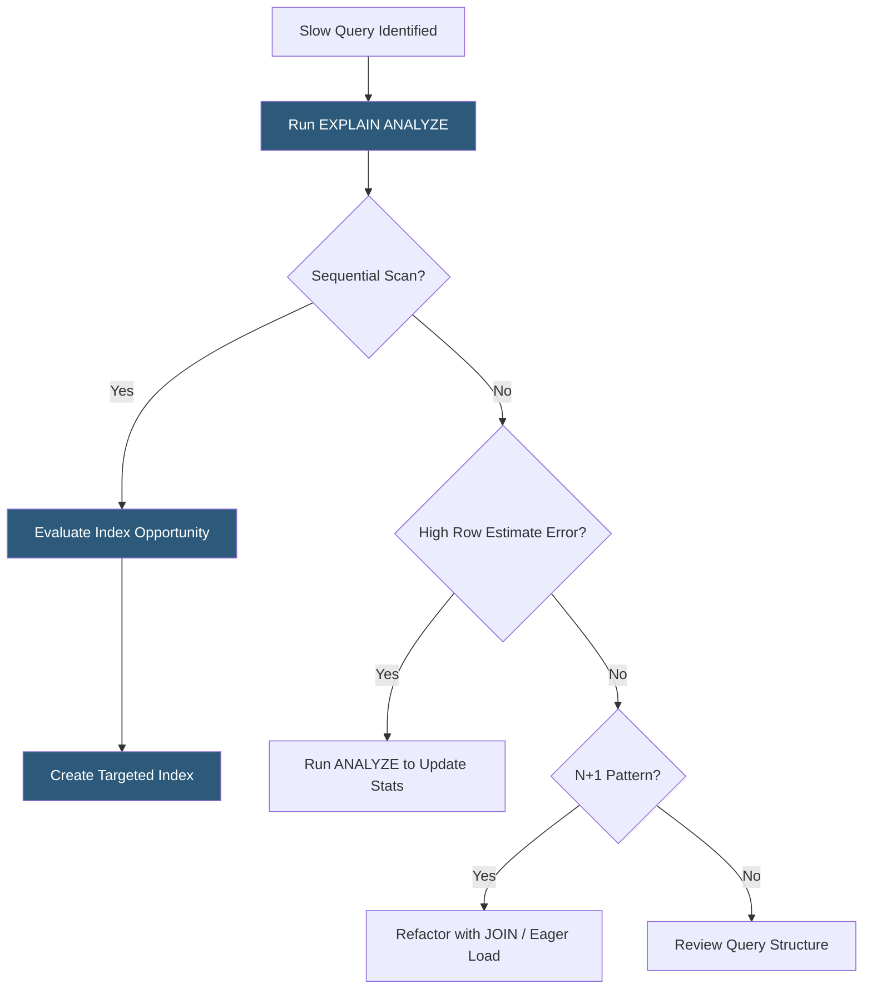

**Category:** Performance Optimization
**Difficulty:** Advanced
**Reading time:** 7 min read

---

Database query optimization is the practice of improving the speed and efficiency of database queries through indexing strategies, query rewriting, execution plan analysis, and schema design. Slow database queries are among the most common causes of poor application performance, as a single unindexed query on a large table can take seconds while a properly indexed equivalent takes milliseconds. Optimization requires understanding how query planners work, what execution plans reveal about query costs, and how data access patterns should drive index design.

- **Query Execution Plan** — the database's step-by-step plan for executing a query; revealed by `EXPLAIN` or `EXPLAIN ANALYZE` (PostgreSQL) or `EXPLAIN` (MySQL); shows index usage and estimated costs
- **Index Scan vs Sequential Scan** — an index scan traverses a B-tree index to locate rows; a sequential scan reads the entire table; sequential scans on large tables indicate missing indexes
- **Covering Index** — an index that contains all columns needed to satisfy a query, eliminating the need to fetch the actual row from the heap
- **N+1 Query Problem** — a common ORM anti-pattern where fetching a list of N records triggers N additional queries for associated data; solved with eager loading (`JOIN` or `INCLUDE`)
- **Query Plan Cache** — a mechanism where databases cache query execution plans to avoid re-planning repeated queries; parameterized queries are essential to leveraging this
- **Composite Index** — an index on multiple columns; column order matters because the index is only usable when the leftmost prefix of columns appears in the query
- **Index Selectivity** — the proportion of distinct values in an indexed column; high-selectivity columns (many distinct values) benefit most from indexing
- **VACUUM / ANALYZE** — PostgreSQL maintenance operations that reclaim dead row storage and update table statistics that the query planner uses to generate optimal plans

Query optimization starts with measurement. Tools like `pg_stat_statements` in PostgreSQL or the slow query log in MySQL identify which queries consume the most total time across all executions, not just which individual queries are slow. A query taking 50ms that runs 10,000 times per hour is a higher priority than a 5-second query that runs twice a day.

Once a problematic query is identified, `EXPLAIN ANALYZE` shows the actual execution plan with real timing data. Key signals to look for: sequential scans on large tables (rows in millions), high row estimate errors indicating stale statistics, nested loop joins where hash joins would be more efficient, and sort operations without supporting indexes.

Index creation requires careful analysis of query predicates. An index on `user_id` helps queries filtering by user, but a composite index on `(user_id, created_at)` also satisfies queries filtering by both fields and sorting by date. Column order in composite indexes follows the "leftmost prefix" rule — the index `(a, b, c)` supports queries filtering on `a`, `a AND b`, or `a AND b AND c`, but not `b` or `c` alone.

The N+1 problem is the most pervasive ORM-related performance issue. When code fetches a list of 100 orders and then accesses `order.customer` for each one, the ORM issues 100 separate `SELECT` statements. Rewriting with a `JOIN` or ORM eager loading (`includes` in Rails, `select_related` in Django) replaces 101 queries with one.

Partial indexes dramatically improve performance for common query patterns. An index `WHERE status = 'pending'` only indexes pending records, making the index smaller and faster than a full index when most records have status = 'completed'.

- Web applications experiencing API response times above 500ms due to slow database queries
- SaaS platforms scaling to millions of records where previously adequate queries become bottlenecks
- Reporting applications running complex aggregations that need materialized views or read replicas
- E-commerce sites with product search queries requiring multi-column index strategies
- Applications migrating to new ORMs where N+1 query patterns need systematic identification

| Advantage | Disadvantage |
|-----------|--------------|
| Well-placed indexes can reduce query time by 99% | Each index slows INSERT/UPDATE/DELETE operations and consumes storage |
| Query plan analysis reveals exactly where time is spent | Reading and interpreting execution plans requires expertise |
| N+1 elimination often reduces database load by orders of magnitude | Eager loading can over-fetch data if not scoped carefully |
| Covering indexes eliminate heap access for hot query paths | Too many indexes create write overhead and complicate schema maintenance |

- [Page Load Time Optimization](page-load-time-optimization.md)
- [API Response Time Reduction](api-response-time-reduction.md)
- [Browser Caching Strategies](browser-caching-strategies.md)

---
*Part of the [Performance Optimization](index.md) category · [Back to Master Index](../../index.md)*
