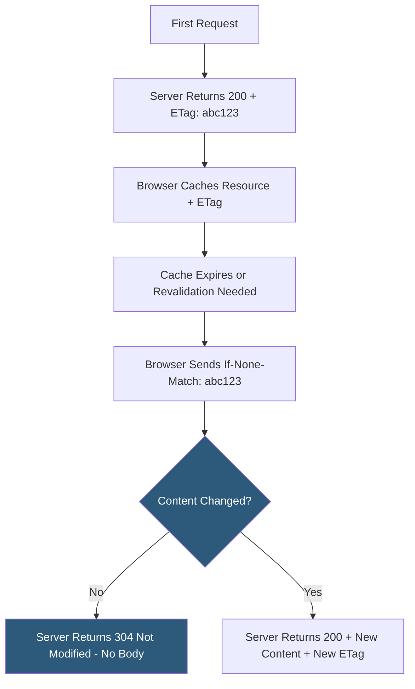

**Category:** Performance Optimization
**Difficulty:** Intermediate
**Reading time:** 5 min read

---

ETags (Entity Tags) are HTTP response headers containing a unique identifier for a specific version of a resource, enabling conditional HTTP requests that avoid re-downloading content that hasn't changed. When a browser has a cached resource with an ETag, it can send a conditional request (`If-None-Match`) to the server; if the resource hasn't changed, the server responds with `304 Not Modified` and no body, saving bandwidth while keeping the cache fresh. ETags are the most precise cache validation mechanism, complementing time-based `Cache-Control: max-age` headers.

- **ETag** — a unique token (hash, version number, or timestamp) representing a specific version of a resource's content
- **Strong ETag** — a value where equal ETags guarantee byte-for-byte identical content (`"abc123"`)
- **Weak ETag** — a value indicating semantically equivalent content that may differ in bytes (`W/"abc123"`); used when byte-exact matching is impractical
- **`If-None-Match`** — the request header sending a cached ETag back to the server; server responds 304 if the ETag still matches
- **`If-Match`** — a request header used in PUT/DELETE operations to prevent lost updates when concurrent modification may occur
- **Conditional Request** — an HTTP request including `If-None-Match` or `If-Modified-Since` headers that allows servers to respond 304 instead of 200
- **Last-Modified** — an alternative cache validation mechanism using timestamps instead of opaque ETags; ETags are more reliable
- **Cache Invalidation** — the challenge of knowing when to serve fresh content; ETags shift the decision to the server without requiring time-based expiration



Web servers generate ETags automatically for most static file types. Nginx generates ETags from the file's last-modified time and content length. Apache uses inode, modification time, and size. These server-generated ETags are reliable for single-server deployments but can differ across servers in a cluster — the same file served from two different Nginx servers may have different inode numbers, generating different ETags even for identical content.

Content-hash ETags solve the multi-server problem. By computing an MD5 or SHA hash of the response body and using it as the ETag value, the tag is content-addressable and identical regardless of which server serves the response. Many CDNs and object stores (S3, GCS) use content-hash ETags by default.

For API responses, application code generates ETags from response data:

```javascript
app.get('/api/user/:id', (req, res) => {
  const user = getUserFromDB(req.params.id);
  const etag = crypto.createHash('md5').update(JSON.stringify(user)).digest('hex');
  
  if (req.headers['if-none-match'] === `"${etag}"`) {
    return res.status(304).end();
  }
  
  res.setHeader('ETag', `"${etag}"`);
  res.json(user);
});
```

The 304 response contains no body, saving all bandwidth consumed by the response content — significant for large JSON payloads or images. The connection and headers still consume minimal bandwidth, but for large resources, 304 responses reduce bandwidth by 95%+.

ETags work alongside `Cache-Control`: `max-age` controls how long the browser waits before revalidating; ETags control what happens when it does revalidate.

- Frequently-visited pages where HTML documents change occasionally and bandwidth savings matter
- Large API responses where clients should receive 304 when data hasn't changed
- Image servers serving the same assets with varying request patterns
- REST APIs implementing conditional reads to support efficient mobile clients
- Single-page applications where index.html should be validated on each visit

| Advantage | Disadvantage |
|-----------|--------------|
| Eliminates unnecessary content transfer; 304 responses save response body bandwidth | ETag generation adds server-side computation for dynamically generated responses |
| More precise than Last-Modified timestamps, which have 1-second resolution | Multi-server deployments require content-hash ETags; default server ETags break across cluster nodes |
| Enables cache-validation without expiration time guessing | Requires round trip to server for revalidation; not as fast as serving from local cache within max-age |
| Essential for ensuring HTML documents never serve stale without server confirmation | ETags in secure contexts can theoretically enable tracking; private browsing may avoid them |

- [Cache-Control Headers](cache-control-headers.md)
- [Browser Caching Strategies](browser-caching-strategies.md)
- [Service Worker Caching](service-worker-caching.md)

---
*Part of the [Performance Optimization](index.md) category · [Back to Master Index](../../index.md)*
